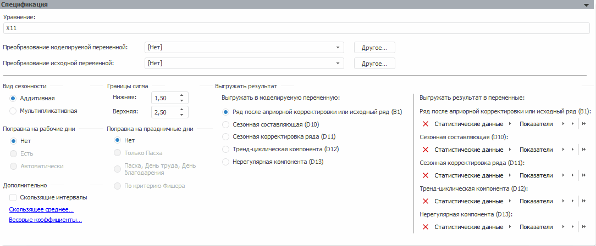
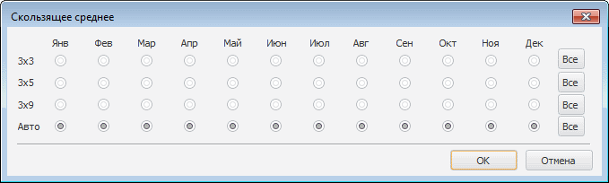
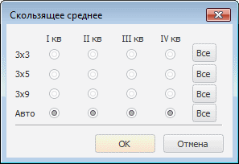
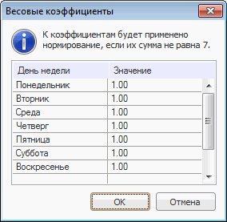

# X11

X11
-

# X11

[X11](Lib.chm::/02_Time_series_analysis/UiModelling_Census2.htm)
 - метод сезонной декомпозиции и корректировки. Производит разложение исходного
 ряда на сезонную, тренд-циклическую и нерегулярную составляющие, проводит
 сезонную корректировку.

Метод доступен только на месячной или квартальной динамике.

Примечание.
 Метод поддерживается только в ОС Windows.

Панель «Спецификация» метода:

В строке «Уравнение» выводится
 наименование метода.

[Для преобразования
 моделируемой/исходной переменной](javascript:TextPopup(this))

	По умолчанию над моделируемой/исходной переменной не выполняются
	 дополнительные преобразования перед расчетом модели.

	Для задания [дополнительного
	 преобразования](../../UiModelling_work_Changes.htm) моделируемой/исходной переменной перед расчетом
	 модели используйте раскрывающий список «Преобразование
	 моделируемой/исходной переменной». По умолчанию преобразование
	 входной переменной совпадает с преобразованием моделируемой переменной.

[Для задания
 вида сезонности](javascript:TextPopup(this))

	Временной ряд разлагают на систематическую (d)
	 и случайную составляющие (e).

	Для выбора модели, применяемой для выделения сезонной составляющей
	 исходного ряда, используйте группу переключателей «Вид
	 сезонности»:

		- Аддитивная: ŷ = d + e;

		- Мультипликативная:
		 ŷ = de.

[Для задания
 поправки на рабочие дни](javascript:TextPopup(this))

	Поправка на рабочие дни применяется только для месячных данных.
	 Используйте группу переключателей «Поправка
	 на рабочие дни»:

		- Нет. Поправка на
		 рабочие дни не делается. Используется по умолчанию;

		- Есть. Делается поправка
		 на рабочие дни;

		- Автоматически. Определяется
		 автоматически: делать ли поправку на рабочие дни.

[Для задания
 границ сигма](javascript:TextPopup(this))

	Большинство реальных временных рядов содержит выбросы. Они могут
	 исказить оценки сезонности и тренда. Метод «X11»
	 дает возможность уменьшить влияние выбросов, исключив из рассмотрения
	 значения, выходящие за определённый диапазон, либо преобразовав такие
	 значения.

	Ширина диапазона задаётся нижней и верхней границей сигма в группе
	 параметров «Границы сигма».
	 Ввод значений осуществляется с помощью редактора вещественных чисел
	 или ввода значения вручную. По умолчанию нижняя граница равна «1,5»,
	 верхняя - «2,5». Задание нижней и верхней границ сигма даёт возможность
	 уменьшить влияние выбросов на оценки, исключив из рассмотрения значения,
	 выходящие за заданный диапазон, либо преобразовав такие значения.

[Для задания
 скользящих интервалов](javascript:TextPopup(this))

	Для использования скользящих интервалов при расчете метода установите
	 флажок «Скользящие интервалы».
	 По умолчанию скользящие интервалы не применяются.

[Для
 использования скользящего среднего](javascript:TextPopup(this))

	Скользящее среднее применяется для расчета значений на основе среднего
	 значения переменной для указанного числа предшествующих периодов.
	 Для задания скользящего среднего нажмите гиперссылку «Скользящее
	 среднее». В зависимости от периода сезонности, будет открыт
	 диалог «Скользящее среднее»,
	 позволяющий установить различный режим сглаживания для каждого элемента
	 периода.

	Период сезонности - месяц:

	

	Период сезонности - квартал:

	

	Независимо от периода сезонности диалог «Скользящее
	 среднее» содержит следующие переключатели:

		- 3х3. Представляет
		 собой ряд, который получен путём двукратного применения скользящего
		 среднего по трём наблюдениям к заданному ряду. Эта процедура эквивалента
		 взвешенному скользящему среднему по 5 наблюдениям;

		- 3х5. Процедура сглаживания
		 временного ряда, при которой исходный ряд сначала сглаживается
		 по 5 соседним точкам, а затем к полученному ряду применяется процедура
		 трехточечного скользящего среднего. Это эквивалентно сглаживанию
		 по 7 точкам;

		- 3х9. Процедура сглаживания
		 временного ряда, при которой исходный ряд сначала сглаживается
		 по 9 соседним точкам, а затем к полученному ряду применяется процедура
		 трехточечного скользящего среднего.

	Нажатие кнопки «Все» устанавливает все переключатели соответствующего
	 значения.

[Для
 задания весовых коэффициентов](javascript:TextPopup(this))

	Месяцы содержат различное число рабочих дней, это может повлиять
	 на окончательный результат анализа временного ряда. Метод «X11»
	 даёт возможность учесть это обстоятельство введением весовых коэффициентов
	 для дней недели.

	Для задания весового коэффициента для каждого дня недели нажмите
	 гиперссылку «Весовые коэффициенты».
	 Будет открыт диалог:

	

	Ввод значений осуществляется с помощью редактора вещественных чисел
	 или вручную. По умолчанию весовые коэффициенты равны единице. Если
	 сумма всех коэффициентов не равна семи, то к коэффициентам будет применено
	 нормирование по формуле: Wi=Wi*7/S, где Wi - вес коэффициента,
	 а S - ненормированная сумма.

[Для задания
 поправки на праздничные дни](javascript:TextPopup(this))

	Поправка на праздничные дни позволяет повысить точность расчетов.
	 Доступна только для мультипликативной модели сезонности, рассчитываемой
	 на месячных данных.

	Для задания поправки используйте группу переключателей «Поправка
	 на праздничные дни»:

		- Нет. Поправка не
		 производится. Используется по умолчанию;

		- Только Пасха;

		- Пасха, День труда, День
		 благодарения;

		- По [критерию
		 Фишера](lib.chm::/05_statistics/uimodelling_f_test.htm).

[Для выбора выгружаемой
 компоненты](javascript:TextPopup(this))

	Для выбора компоненты, выгружаемую в моделируемую переменную после
	 расчёта метода, используйте группу переключателей «Выгружать
	 результат». Выбранная компонента становится недоступна в группе
	 параметров «Выгружать результат в
	 переменные» и её нельзя выгрузить в какую-либо еще переменную.

	Доступные компоненты:

		- ряд после априорной корректировки или исходный ряд ([B1](Lib.chm::/02_Time_series_analysis/UiModelling_Census1.htm#b01));

		- сезонная составляющая ([D10](Lib.chm::/02_Time_series_analysis/UiModelling_Census1.htm#d10));

		- сезонная корректировка ряда ([D11](Lib.chm::/02_Time_series_analysis/UiModelling_Census1.htm#d11));

		- тренд-циклическая компонента ([D12](Lib.chm::/02_Time_series_analysis/UiModelling_Census1.htm#d12));

		- нерегулярная компонента ([D13](Lib.chm::/02_Time_series_analysis/UiModelling_Census1.htm#d13)).

[Для задания
 переменных для выгрузки результатов](javascript:TextPopup(this))

	Для задания переменных, в которые будут выгружены результаты расчета
	 используйте группу параметров «Выгружать
	 результат в переменные».

	Компоненты, доступные для выгрузки совпадают с компонентами, которые
	 могут быть выгружены в моделируемую переменную.

См. также:

Метод «[X11](Lib.chm::/02_Time_series_analysis/UiModelling_Census2.htm)»
 | Анализ временных рядов: [выделение
 сезонности](UiDw.chm::/Workbook/CalculatedSeries/Smoothing/UiDw_cs_Seasonality_Month.htm) | [IModelling.X11](KeMs.chm::/Interface/IModelling/IModelling.X11.htm)

		Справочная
		 система на версию 10.9
		 от 18/08/2025,
		 © ООО «ФОРСАЙТ»,
