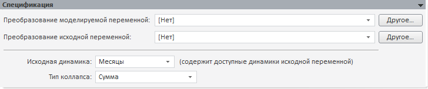

# Коллапс: векторный расчет (настольное приложение)

Коллапс: векторный расчет (настольное приложение)
-

# Коллапс (векторный расчет)

Модель «Коллапс (векторный расчет)»
 осуществляет агрегацию данных с нижнего уровня на верхний. Данная модель
 необходима при расчете задачи, требующей агрегации данных. Например, данные,
 рассчитанные по месяцам, необходимо просуммировать для квартальной динамики.

Данный метод использует векторный расчет, поэтому данные агрегируются
 сразу для всех точек сценария, даже если расчет задачи идет поточечно.
 Также при поточечном расчете задачи сначала рассчитываются векторные методы,
 а затем поточечные. В этом заключается отличие данной модели от модели
 «[Коллапс
 (поточечный расчет)](UiModelling_Specification_Collaps_point.htm)», производящей агрегацию поточечно в каждой точке
 сценария.

Панель «Спецификация» для данной
 модели:

[Для преобразования
 моделируемой/исходной переменной](javascript:TextPopup(this))

	По умолчанию над моделируемой/исходной переменной не выполняются
	 дополнительные преобразования перед расчетом модели.

	Для задания [дополнительного
	 преобразования](../../UiModelling_work_Changes.htm) моделируемой/исходной переменной перед расчетом
	 модели используйте раскрывающий список «Преобразование
	 моделируемой/исходной переменной». По умолчанию преобразование
	 входной переменной совпадает с преобразованием моделируемой переменной.

[Для задания
 исходной динамики](javascript:TextPopup(this))

	Используйте раскрывающийся список «Исходная
	 динамика». Список содержит все доступные динамики входной переменной.
	 Выберите динамику, данные которой будут агрегироваться для указанной
	 динамики модели. Динамика модели определяется на панели «[Периоды расчета](../Standart_Model/UiModelling_Model_2.htm)».

	Раскрывающийся список «Исходная
	 динамика» содержит только существующие динамики входной переменной,
	 которые меньше динамики модели. Например, во входной переменной присутствуют
	 динамики: «Годовая», «Полугодовая», «Квартальная».
	 Для модели в качестве динамики указана «Годовая».
	 Таким образом, в раскрывающемся списке «Исходная
	 динамика» будут доступны только варианты «Полугодовая»
	 и «Квартальная».

	Если не существует динамик, которые можно поместить в список «Исходная динамика», то на панели
	 «[Ошибки](../Standart_Model/UiModelling_Model_Error.htm)» будет отображено сообщение:
	 «Невозможно подобрать исходную динамику
	 - выберите другую исходную переменную или добавьте ей нужную динамику».

[Для задания типа коллапса](javascript:TextPopup(this))

	Используйте раскрывающийся список «Тип
	 коллапса» и укажите метод агрегации, который необходимо применить
	 к данным входной переменной. Доступные методы:

		- Сумма. Сумма значений
		 элементов динамики. Установлен по умолчанию.

		- Среднее. [Среднее
		 значение](Lib.chm::/05_Statistics/UiModelling_Avg.htm) элементов динамики.

		- Минимум. Минимальное
		 значение элементов динамики.

		- Максимум. Максимальное
		 значение элементов динамики.

		- Первое значение.
		 Первое имеющееся значение элементов динамики.

		- Последнее значение.
		 Последнее имеющееся значение элементов динамики.

		- Размах. Разность
		 между максимальным и минимальным значениями элементов динамики.

		- Стандартное отклонение.
		 [Стандартное
		 отклонение](Lib.chm::/05_Statistics/UiModelling_Stddev.htm) по динамике.

См. также:

[Стандартная модель](../Standart_Model/Standart_Model.htm)
 | Анализ временных рядов: [агрегация](UiDw.chm::/Workbook/CalculatedSeries/Aggregation/UiDw_cs_TotalCollapseFrequency.htm) |
 [IModelling.Collapse](KeMs.chm::/Interface/IModelling/IModelling.Collapse.htm)

		Справочная
		 система на версию 10.9
		 от 18/08/2025,
		 © ООО «ФОРСАЙТ»,
