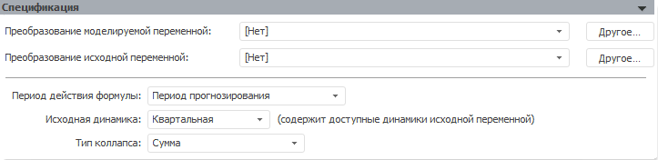

# Коллапс: поточечный расчет (настольное приложение)

Коллапс: поточечный расчет (настольное приложение)
-

# Коллапс (поточечный расчет)

Модель «Коллапс (поточечный расчет)»
 осуществляет агрегацию данных с нижнего уровня на верхний. Данная модель
 необходима при расчете задачи, требующей агрегации данных. Например, данные,
 рассчитанные по месяцам, необходимо просуммировать для квартальной динамики.

При поточечном расчете данные с нижнего уровня на верхний агрегируются
 последовательно в каждой точке сценария. Сначала будут рассчитываться
 точки модели, дающей входные значения для n
 первых значений нижнего уровня модели коллапса. После этого происходит
 агрегация данных для первой точки верхнего уровня по n
 значениям нижнего уровня. Затем происходит расчет модели, получающей входные
 данные первой точки верхнего уровня от модели коллапс и т.д.

Например, есть модели:

	- модель 1: Y1 = a1*X1[t]+c1 - месячная модель;

	- модель 2: Y2 = Collpase(Y1) - агрегация с месяцев
	 на кварталы;

	- модель 3: Y3 = a1* Y2[t]+c2 - квартальная модель.

Расчет моделей с 2000 по 2005 год будет идти следующим образом:

	- рассчитывается модель Y1
	 на 01.01.2000, 01.02.2000, 01.03.2000;

	- модель Y2 агрегирует
	 данные первых трех месяцев, получаем значение на первый квартал 2000
	 года;

	- модель Y3 рассчитывается
	 на первый квартал 2000 года;

	- рассчитывается модель Y1
	 на 01.04.2000, 01.05.2000, 01.06.2000;

	- модель Y2 агрегирует
	 данные следующих трех месяцев, получаем значение на второй квартал
	 2000 года;

	- модель Y3 рассчитывается
	 на второй квартал 2000 года и т.д.

Модель «[Коллапс
 (векторный расчет)](UiModelling_Specification_Collaps.htm)», в отличие от данной модели, производит агрегацию
 сразу для всех точек сценария, даже если расчет задачи идет поточечно.

Панель «Спецификация» для модели
 с поточечным расчетом:

[Для преобразования
 моделируемой/исходной переменной](javascript:TextPopup(this))

	По умолчанию над моделируемой/исходной переменной не выполняются
	 дополнительные преобразования перед расчетом модели.

	Для задания [дополнительного
	 преобразования](../../UiModelling_work_Changes.htm) моделируемой/исходной переменной перед расчетом
	 модели используйте раскрывающий список «Преобразование
	 моделируемой/исходной переменной». По умолчанию преобразование
	 входной переменной совпадает с преобразованием моделируемой переменной.

[Для задания
 периода действия формулы](javascript:TextPopup(this))

	Используйте раскрывающийся список «Период
	 действия формулы» и укажите период, на котором будут произведены
	 расчеты:

		- Период идентификации.
		 Формула применяется для значений, расположенных в периоде идентификации.
		 Период задается в панели «[Периоды
		 расчета](../Standart_Model/UiModelling_Model_2.htm)»;

		- Период прогнозирования.
		 Формула применяется для значений, расположенных в периоде прогнозирования.
		 Период задается в панели «[Периоды
		 расчета](../Standart_Model/UiModelling_Model_2.htm)»;

		- Весь период. Расчет
		 по формуле ведется для значений, расположенных в периоде идентификации
		 и прогнозирования.

	Примечание.
	 Задание периода действия формулы доступно если, источник данных моделируемой
	 переменной содержит календарное измерение.

[Для задания
 исходной динамики](javascript:TextPopup(this))

	Используйте раскрывающийся список «Исходная
	 динамика». Список содержит все доступные динамики входной переменной.
	 Выберите динамику, данные которой будут агрегироваться для указанной
	 динамики модели. Динамика модели определяется на панели «[Периоды расчета](../Standart_Model/UiModelling_Model_2.htm)».

	Раскрывающийся список «Исходная
	 динамика» содержит только существующие динамики входной переменной,
	 которые меньше динамики модели. Например, во входной переменной присутствуют
	 динамики: «Годовая», «Полугодовая», «Квартальная».
	 Для модели в качестве динамики указана «Годовая».
	 Таким образом, в раскрывающемся списке «Исходная
	 динамика» будут доступны только варианты «Полугодовая»
	 и «Квартальная».

	Если не существует динамик, которые можно поместить в список «Исходная динамика», то на панели
	 «[Ошибки](../Standart_Model/UiModelling_Model_Error.htm)» будет отображено сообщение:
	 «Невозможно подобрать исходную динамику
	 - выберите другую исходную переменную или добавьте ей нужную динамику».

[Для задания типа коллапса](javascript:TextPopup(this))

	Используйте раскрывающийся список «Тип
	 коллапса» и укажите метод агрегации, который необходимо применить
	 к данным входной переменной. Доступные методы:

		- Сумма. Сумма значений
		 элементов динамики. Установлен по умолчанию.

		- Среднее. [Среднее
		 значение](Lib.chm::/05_Statistics/UiModelling_Avg.htm) элементов динамики.

		- Минимум. Минимальное
		 значение элементов динамики.

		- Максимум. Максимальное
		 значение элементов динамики.

		- Первое значение.
		 Первое имеющееся значение элементов динамики.

		- Последнее значение.
		 Последнее имеющееся значение элементов динамики.

		- Размах. Разность
		 между максимальным и минимальным значениями элементов динамики.

		- Стандартное отклонение.
		 [Стандартное
		 отклонение](Lib.chm::/05_Statistics/UiModelling_Stddev.htm) по динамике.

См. также:

[Стандартная модель](../Standart_Model/Standart_Model.htm)
 | Анализ временных рядов: [агрегация](UiDw.chm::/Workbook/CalculatedSeries/Aggregation/UiDw_cs_TotalCollapseFrequency.htm) |
 [IModelling.Collapse](KeMs.chm::/Interface/IModelling/IModelling.Collapse.htm)

		Справочная
		 система на версию 10.9
		 от 18/08/2025,
		 © ООО «ФОРСАЙТ»,
