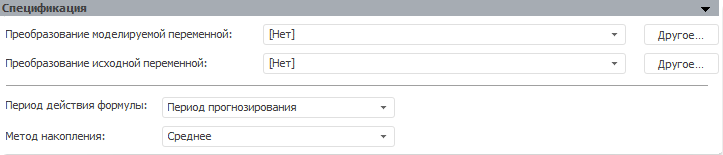

# Методы накопления

Методы накопления
-

# Методы накопления

Модель «Методы накопления» осуществляет
 преобразование данных, с использованием различных методов накопления.

Накопление представляет собой метод расчета, при котором расчет значения
 элемента моделируемого ряда с порядковым номером n
 происходит на диапазоне значений входного ряда: [Первый элемент ряда;
 n элемент ряда].

Панель «Спецификация» для данной
 модели:

[Для преобразования
 моделируемой/исходной переменной](javascript:TextPopup(this))

	По умолчанию над моделируемой/исходной переменной не выполняются
	 дополнительные преобразования перед расчетом модели.

	Для задания [дополнительного
	 преобразования](../../UiModelling_work_Changes.htm) моделируемой/исходной переменной перед расчетом
	 модели используйте раскрывающий список «Преобразование
	 моделируемой/исходной переменной». По умолчанию преобразование
	 входной переменной совпадает с преобразованием моделируемой переменной.

[Для задания
 периода действия формулы](javascript:TextPopup(this))

	Используйте раскрывающийся список «Период
	 действия формулы» и укажите период, в рамках которого
	 будет происходить накопление:

		- Период идентификации.
		 Накопление применяется для значений, расположенных в периоде идентификации.
		 Период задается на панели «[Периоды
		 расчета](../Standart_Model/UiModelling_Model_2.htm)»;

		- Период прогнозирования.
		 Накопление применяется для значений, расположенных в периоде прогнозирования.
		 Период задается на панели «[Периоды
		 расчета](../Standart_Model/UiModelling_Model_2.htm)»;

		- Весь период. Расчет
		 по формуле ведется для значений, расположенных в периоде идентификации
		 и прогнозирования.

[Для задания
 метода накопления](javascript:TextPopup(this))

	Используйте раскрывающийся список «Метод
	 накопления» и укажите метод, с помощью которого будет происходить
	 вычисление значений элементов моделируемого ряда на диапазоне значений
	 входного ряда:

		- Максимум. Определяется
		 максимальное значение элементов диапазона;

		- Медиана. Определяется
		 [медиана](Lib.chm::/05_Statistics/UiModelling_Median.htm) значений
		 элементов диапазона;

		- Минимум. Определяется
		 минимальное значение элементов диапазона;

		- Произведение. Определяется
		 произведение значений элементов диапазона;

		- Среднее. Определяется
		 [среднее
		 значение](Lib.chm::/05_Statistics/UiModelling_Avg.htm) элементов диапазона;

		- Среднеквадратическое отклонение.
		 Определяется [среднеквадратическое
		 отклонение](Lib.chm::/05_Statistics/UiModelling_ArgSqDev.htm) значений элементов диапазона;

		- Сумма. Определяется
		 сумма значений элементов диапазона.

См. также:

[Стандартная модель](../Standart_Model/Standart_Model.htm)
 | Анализ временных рядов: [методы
 накопления](UiDw.chm::/Workbook/CalculatedSeries/Transformations/UiDw_cs_CumulativeMinimum.htm) | [IModelling.Cumulative](KeMs.chm::/Interface/IModelling/IModelling.Cumulative.htm)
 | [IModelling.Cumulativeytd](KeMs.chm::/Interface/IModelling/IModelling.Cumulativeytd.htm)

		Справочная
		 система на версию 10.9
		 от 18/08/2025,
		 © ООО «ФОРСАЙТ»,
