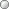

# Модель коррекции ошибок (настольное приложение)

Модель коррекции ошибок (настольное приложение)
-

# Модель коррекции ошибок

Панель «Спецификация» для метода
 «Модель коррекции ошибок»:

[Для преобразования
 моделируемой/исходной переменной](javascript:TextPopup(this))

	По умолчанию над моделируемой/исходной переменной не выполняются
	 дополнительные преобразования перед расчетом модели.

	Для задания [дополнительного
	 преобразования](../../UiModelling_work_Changes.htm) моделируемой/исходной переменной перед расчетом
	 модели используйте раскрывающий список «Преобразование
	 моделируемой/исходной переменной». По умолчанию преобразование
	 входной переменной совпадает с преобразованием моделируемой переменной.

[Для выбора типа
 модели коррекции ошибок](javascript:TextPopup(this))

	Используйте раскрывающийся список «Тип
	 модели коррекции ошибок»:

		- без тренда в авторегрессии, без константы в коинтеграционном
		 уравнении;

		- без тренда в авторегрессии, с константой в коинтеграционном
		 уравнении;

		- с константой в авторегрессии и в коинтеграционном уравнении
		 (тренд в исходных данных).

[Для задания
 порядка авторегрессии эндогенной/экзогенных переменных](javascript:TextPopup(this))

	Используйте поля «Порядок авторегрессии
	 эндогенной переменной»/«Порядок
	 авторегрессии экзогенных переменных». По умолчанию порядок
	 авторегрессии эндогенной переменной равен 1, экзогенных переменных
	 - 0.

	Для изменения порядка авторегрессии в соответствующем поле введите
	 номера или диапазоны порядка авторегрессии, разделенные запятыми.
	 Диапазон порядка авторегрессии указывается через знак «-».

	Для модели будет задан порядок авторегрессии и будут рассчитаны
	 верхняя и нижняя динамические доверительные границы прогнозного ряда.

[Для задания
 экзогенных переменных](javascript:TextPopup(this))

	Для расчета модели добавьте экзогенные (объясняющие) переменные.
	 Используйте группу параметров «Экзогенные
	 переменные».

	Число объясняющих переменных (m)
	 должно удовлетворять неравенству: 0 < m
	 < n-1 для модели с константой
	 и 0 < m < n
	 для модели без константы в коинтеграционном уравнении, где n
	 - число наблюдений в объясняемой переменной.

	Основные принципы работы с экзогенными переменными совпадают с принципами
	 работы с факторами и приведены в разделе «[Работа
	 с факторами (входными переменными)](../Standart_Model/UiModelling_Model_Factor_work.htm)».

[Для задания
 типа коинтеграционной связи экзогенной переменной](javascript:TextPopup(this))

	Для каждой экзогенной переменной можно задать группу, определяющую
	 тип коинтеграционной связи: долгосрочная или краткосрочная. Для этого
	 в контекстном меню переменной установите соответствующий флажок:

		- Группа 1 (Уравнение долгосрочной
		 динамики). Переменная относится к группе, описывающей долгосрочные
		 коинтеграционные связи;

		- Группа 2 (Регрессионное
		 уравнение). Переменная относится к группе, описывающей
		 краткосрочные коинтеграционные связи.

	Если переменная входит в две группы одновременно, то тип связи для
	 нее считается неопределенным. Если переменная не входит ни в одну
	 из групп, то она исключается из расчета модели.

	В зависимости от группы экзогенной переменной изменяется её пиктограмма:

		-  - переменная входит в обе
		 группы;

		-  - переменная входит
		 в группу 1;

		-  - переменная входит
		 в группу 2;

		-  - переменная не входит ни
		 в одну из групп.

[Для корректировки
 прогноза](javascript:TextPopup(this))

		- Установите флажок «Корректировка
		 прогноза».

		- Задайте переменную, которая будет использоваться для корректировки
		 прогноза. Данная переменная не включаются в идентифицированное
		 уравнение модели.

	В модели будет применяться корректировка прогноза.

	При работе моделирования и прогнозирования в [режиме
	 на переменных](../../../../1_Modelling/Start_Modelling.htm) учитывайте следующие особенности:

		- при выборе переменной, количество измерений которой не совпадает
		 с количеством измерений моделируемой переменной, будет открыт
		 диалог «[Изменение размерности](../../UiModelling_ChangeDimension.htm)».
		 В данном диалоге выполните фиксацию по измерениям, отсутствующим
		 у моделируемой переменной;

		- доступны следующие кнопки для работы с переменной корректировки
		 прогноза:

			- Создать. Создает
			 переменную (без данных), используемую для корректировки прогноза. Динамика
			 переменной соответствует динамике модели. Созданная переменная
			 располагается в корне контейнера моделирования, имеет наименование
			 «Фактор корректировки прогноза»
			 и автоматически будет открыта для редактирования;

			- Зафиксировать.
			 Осуществляет фиксацию переменной. Открывает диалог «[Изменение размерности](../../UiModelling_ChangeDimension.htm)». Если
			 размерности фактора корректировки прогноза и моделируемой
			 переменной совпадают, то кнопка недоступна.

См. также:

[Работа
 с входными переменными](../Standart_Model/UiModelling_Model_Factor_work.htm) | Метод расчёта [модели
 коррекции ошибок](Lib.chm::/02_Time_series_analysis/UiModelling_ErrCorrModel.htm) |Анализ временных рядов: [Модель
 коррекции ошибок](UiDw.chm::/Workbook/CalculatedSeries/Regression/UiDw_cs_ErrorCorrectionModel.htm) | [IModelling.Ecm](KeMs.chm::/Interface/IModelling/IModelling.Ecm.htm)

		Справочная
		 система на версию 10.9
		 от 18/08/2025,
		 © ООО «ФОРСАЙТ»,
