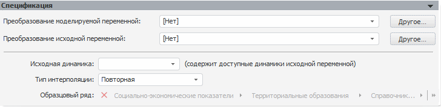

# Интерполяция (настольное приложение)

Интерполяция (настольное приложение)
-

# Интерполяция

Модель «Интерполяция» осуществляет
 дезагрегацию данных с верхнего уровня на нижний. Данная модель необходима
 при расчете задачи, требующей дезагрегации данных. Например, данные квартальной
 динамики необходимо распределить по месяцам.

При выборе данного вида модели появляется только панель «Спецификация»,
 никаких других дополнительных панелей не появляется.

Панель «Спецификация»:

[Для преобразования
 моделируемой/исходной переменной](javascript:TextPopup(this))

	По умолчанию над моделируемой/исходной переменной не выполняются
	 дополнительные преобразования перед расчетом модели.

	Для задания [дополнительного
	 преобразования](../../UiModelling_work_Changes.htm) моделируемой/исходной переменной перед расчетом
	 модели используйте раскрывающий список «Преобразование
	 моделируемой/исходной переменной». По умолчанию преобразование
	 входной переменной совпадает с преобразованием моделируемой переменной.

[Для задания
 исходной динамики](javascript:TextPopup(this))

	Используйте раскрывающийся список «Исходная
	 динамика». Список содержит все доступные динамики входной переменной.
	 Выберите динамику, данные которой будут дезагрегироваться для указанной
	 динамики модели. Динамика модели определяется на панели «[Периоды расчета](../Standart_Model/UiModelling_Model_2.htm)».

	Раскрывающийся список «Исходная
	 динамика» содержит только существующие динамики входной переменной,
	 которые больше динамики модели. Например, во входной переменной присутствуют
	 следующие динамики: «Годовая»,
	 «Полугодовая», «Квартальная».
	 Для модели в качестве динамики указана «Квартальная».
	 Таким образом, в раскрывающемся списке «Исходная
	 динамика» будут доступны только варианты «Годовая»
	 и «Полугодовая».

	Если не существует динамик, которые можно поместить в список «Исходная динамика», то на панели
	 «[Ошибки](../Standart_Model/UiModelling_Model_Error.htm)»
	 будет отображено сообщение: «Динамика,
	 на которую интерполируются данные, должна быть меньше динамики, с
	 которой интерполируются данные».

[Для задания
 типа интерполяции](javascript:TextPopup(this))

	Используйте раскрывающийся список «Тип
	 интерполяции» и укажите метод интерполяции, который необходимо
	 применить ко входной переменной. Если у метода есть параметры, будет
	 доступно поле для ввода их значений. Доступные методы:

		- Геометрическая.
		 Значения моделируемой динамики пропорциональны значению инкремента
		 и обратно пропорциональны фактору, вычисленному на основе инкремента.
		 Инкремент экспоненциально зависит от логарифма относительного
		 прироста исходной динамики, умноженного на длину периода моделируемой
		 динамики. Метод без параметров;

		- Кубическими сплайнами.
		 Значения моделируемой динамики будут рассчитываться по уравнению
		 кривой, проходящей через набор точек таким образом, что первые
		 и вторые производные кривой непрерывны в каждой точке. Эта кривая
		 образуется путем создания ряда кубических полиномов, проходящих
		 через наборы из трех смежных точек. Кубические полиномы затем
		 состыковываются друг с другом, чтобы образовать одну кривую. Метод
		 без параметров;

		- Линейная. Значения
		 моделируемой динамики будут рассчитываться по уравнению прямой,
		 соединяющей имеющиеся точки исходной динамики. Метод без параметров;

		- Многочленом Лагранжа.
		 Основная идея этого метода состоит в том, чтобы найти многочлен,
		 который принимает значение «1» в одной узловой точке и «0» во
		 всех других. Метод без параметров;

		- Первое значение.
		 Значение первой точки результирующей динамики будет совпадать
		 со значением точки на исходной динамике. Значения в остальных
		 точках результирующей динамики остаются пустыми;

		- По шаблону. Для
		 моделирования будет использована интерполяция по шаблону. Для
		 данного метода необходимо задать параметры «Вид
		 шаблона» и «Образцовый
		 ряд». В раскрывающемся списке «Вид
		 шаблона» определяется шаблон, по которому будет производиться
		 интерполяция. Доступны следующие шаблоны:

			- Среднее по элементам;

			- По первому элементу;

			- По последнему элементу;

	В раскрывающемся иерархическом списке
	 «Образцовый ряд» укажите переменную,
	 представляющую собой образцовый ряд данных. Если контейнер моделирования
	 работает в [режиме
	 на переменных](../../../../1_Modelling/Start_Modelling.htm) и указанная переменная содержит дополнительные измерения,
	 то их необходимо зафиксировать в диалоге «[Изменение
	 размерности](../../UiModelling_ChangeDimension.htm)», которое будет отображено при добавлении такой переменной.
	 Для того чтобы повторно вызвать диалог «[Изменение
	 размерности](../../UiModelling_ChangeDimension.htm)», необходимо нажать кнопку «Фиксировать»;

		- Повторная. Значения
		 моделируемой динамики будут повторять имеющиеся значения динамики
		 исходной переменной. Метод без параметров;

		- Полиномиальная.
		 Для моделирования будет использована интерполяция полиномом указанной
		 степени. Степень полинома задается в редакторе чисел «Степень».
		 Минимальное значение степени полинома - единица;

		- Последнее значение.
		 Значение последней точки результирующей динамики будет совпадать
		 со значением точки на исходной динамике. Значения в остальных
		 точках результирующей динамики остаются пустыми;

		- Равномерная. Для
		 моделирования будет использована равномерная интерполяция. Каждая
		 точка исходной динамики будет равномерно разложена на соответствующие
		 точки моделируемой динамики. Например, квартальные за 2008 год
		 будут получены путем разложения годовых данных за 2008 год на
		 четыре равные части. Метод без параметров.

См. также:

[Методы
 интерполяции](Lib.chm::/03_Transformations/UiModelling_Interpolation.htm) |Анализ временных рядов: [Интерполяция](UiDw.chm::/Workbook/CalculatedSeries/Aggregation/UiDw_cs_ProportionalInterpolation.htm)
 | [IModelling.Interpolate](KeMs.chm::/Interface/IModelling/IModelling.Interpolate.htm)
 | [IModelling.InterpolateP](KeMs.chm::/Interface/IModelling/IModelling.InterpolateP.htm)

		Справочная
		 система на версию 10.9
		 от 18/08/2025,
		 © ООО «ФОРСАЙТ»,
