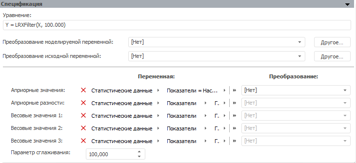

# LRX-фильтр

LRX-фильтр
-

# LRX-фильтр

LRX-фильтр - это метод сглаживания
 временного ряда, который используется для выделения длительных тенденций
 временного ряда и является более общим случаем фильтра Ходрика-Прескотта.

Панель «Спецификация» для данного
 метода:

В строке «Уравнение» выводится
 уравнение модели, отражающее в сокращенном виде преобразование над моделируемой
 переменной и параметры метода.

[Для преобразования
 моделируемой/исходной переменной](javascript:TextPopup(this))

	По умолчанию над моделируемой/исходной переменной не выполняются
	 дополнительные преобразования перед расчетом модели.

	Для задания [дополнительного
	 преобразования](../../UiModelling_work_Changes.htm) моделируемой/исходной переменной перед расчетом
	 модели используйте раскрывающий список «Преобразование
	 моделируемой/исходной переменной». По умолчанию преобразование
	 входной переменной совпадает с преобразованием моделируемой переменной.

[Для задания
 переменных, необходимых для расчета метода](javascript:TextPopup(this))

	Используйте группу параметров «Переменная».
	 Для корректного расчета необходимо задать все переменные. Набор атрибутов
	 данных переменных должен совпадать с набором атрибутов моделируемой
	 переменной.

	Если моделирование и прогнозирование работает в [режиме
	 на переменных](../../../../1_Modelling/Start_Modelling.htm) и количество измерений выбранной переменной не совпадает
	 с количеством измерений моделируемой переменной, будет автоматически
	 открыт диалог «[Изменение
	 размерности](../../UiModelling_ChangeDimension.htm)».

[Для задания
 преобразования переменных, необходимых для расчета метода](javascript:TextPopup(this))

	По умолчанию над переменными, необходимыми для расчета метода, не
	 выполняются ни какие дополнительные преобразования перед расчетом
	 модели.

	Для задания [дополнительного
	 преобразования](../../UiModelling_work_Changes.htm) переменной используйте соответствующий раскрывающийся
	 список из группы параметров «Преобразование».

[Фиксация переменных,
 необходимых для расчета метода](javascript:TextPopup(this))

	Фиксация переменных доступна, если моделирование и прогнозирование
	 работает в [режиме
	 на переменных](../../../../1_Modelling/Start_Modelling.htm).

	Фиксация переменной требуется, если количество измерений переменной
	 не совпадает с количеством измерений моделируемой переменной. Для
	 фиксации переменной нажмите соответствующую ей кнопку «Фиксировать».
	 Будет открыт диалог «[Изменение размерности](../../UiModelling_ChangeDimension.htm)».

[Изменение лага
 переменных, необходимых для расчета метода](javascript:TextPopup(this))

	Изменение лага доступно, если моделирование и прогнозирование работает
	 в [режиме на
	 переменных](../../../../1_Modelling/Start_Modelling.htm).

	Для редактирования лага переменной нажмите соответствующую ей кнопку
	 «Фиксировать». Будет открыт
	 диалог для задания лага переменной.

[Для задания
 параметра сглаживания ряда](javascript:TextPopup(this))

	Параметр сглаживания управляет мерой гладкости ряда. Чем больше
	 значение, тем более «гладкий» получается ряд.

	Для задания параметра сглаживания используйте поле «Параметр
	 сглаживания». Диапазон допустимых значений: [0,001; 100000].

См. также:

[Спецификация](UiModelling_Model_Specification.htm)
 | Метод «[LRX-фильтр](Lib.chm::/02_Time_series_analysis/UiModellling_LRX.htm)» |
 Метод «[Фильтр
 Ходрика-Прескотта](Lib.chm::/02_Time_series_analysis/UiModelling_HodrickPrescottFilter.htm)» | [IModelling.Lrxf](KeMs.chm::/Interface/IModelling/IModelling.Lrxf.htm)

		Справочная
		 система на версию 10.9
		 от 18/08/2025,
		 © ООО «ФОРСАЙТ»,
