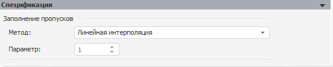

# Заполнение пропусков

Заполнение пропусков
-

# Заполнение пропусков

Данная модель заполняет пустые значения ряда с помощью различных методов.

Панель «Спецификация»:

Для задания метода заполнения пропусков используйте раскрывающийся список
 «Метод». Если у метода есть параметры,
 будет доступно поле для их определения, расположенное ниже.

[Доступные методы
 обработки пропусков](javascript:TextPopup(this))

		- Геометрическая интерполяция.
		 Для вычисления пустых значений ряда используется геометрическая
		 [интерполяция](Lib.chm::/03_Transformations/UiModelling_Interpolation.htm).
		 Метод без параметров.

		- Значениями заданного ряда.
		 Пустые значения моделируемого ряда будут заменены значениями из
		 ряда, указанного в параметре «Ряд
		 со значениями».

		- Интерполяция кубическим
		 сплайном. Для вычисления пустых значений ряда используется
		 [интерполяция](Lib.chm::/03_Transformations/UiModelling_Interpolation.htm)
		 кубическим сплайном. Метод без параметров.

		- Линейная интерполяция.
		 Для вычисления пустых значений ряда используется линейная [интерполяция](Lib.chm::/03_Transformations/UiModelling_Interpolation.htm)
		 по двум соседним точкам. Метод без параметров.

		- Линейный тренд.
		 Для вычисления пустых значений ряда используется линейный тренд.
		 Метод без параметров.

		- По шаблону. Для
		 вычисления пустых значений ряда используется интерполяция по шаблону.
		 Для указания шаблона необходимо задать параметр «Шаблонный
		 ряд». В поле «Шаблонный
		 ряд» укажите атрибуты переменной, представляющей шаблонный
		 ряд данных.

		- Предыдущее значение.
		 Пустые значения ряда заменяются предыдущим непустым значением.
		 Метод без параметров.

		- Произвольное значение.
		 Пустые значения ряда заменяются случайным числом из интервала
		 [минимальное значение ряда; максимальное значение ряда]. Метод
		 без параметров.

		- Следующее значение.
		 Пустые значения ряда заменяются следующим непустым значением.
		 Метод без параметров.

		- Среднее значение по выборке.
		 Пустые значения ряда вычисляются как [среднее](Lib.chm::/05_Statistics/UiModelling_Avg.htm)
		 по выборке. Метод без параметров.

		- Среднее по N соседним точкам.
		 Пустые значения ряда вычисляются как [среднее](Lib.chm::/05_Statistics/UiModelling_Avg.htm)
		 по N соседним точкам.
		 Количество соседних точек (N)
		 можно задать в редакторе чисел «Параметр».
		 Минимальное значение N:
		 1; значение по умолчанию: 5.

		- Темп роста к предыдущему
		 периоду. Пустые значения ряда вычисляются исходя из темпа
		 роста существующих значений к предыдущему периоду. Число
		 периодов указывается в редакторе чисел «Параметр».
		 Значение по умолчанию - 1.

		- Темп роста к следующему
		 периоду. Пустые значения ряда вычисляются исходя из темпа
		 роста существующих значений к следующему периоду. Число периодов
		 указывается в редакторе чисел «Параметр».
		 Значение по умолчанию - 1.

		- Указанное значение.
		 Пустые значения ряда будут заменены числом, указанным в редакторе
		 чисел «Значение». Значение
		 по умолчанию - нуль.

	Примечание.
	 Если моделирование и прогнозирование работает в [режиме
	 на переменных](../../../../1_Modelling/Start_Modelling.htm) и переменная, указанная в списке «Шаблонный
	 ряд» или «Ряд со значениями»,
	 содержит дополнительные измерения, то их необходимо зафиксировать
	 в окне «[Изменение
	 размерности](../../UiModelling_ChangeDimension.htm)», которое будет отображено при добавлении такой переменной.
	 Для повторного вызова диалога «[Изменение
	 размерности](../../UiModelling_ChangeDimension.htm)», нажмите кнопку «Фиксировать».

	Если размерности указанной и моделируемой переменной совпадают, то
	 кнопка «Фиксировать» недоступна.

См. также:

[Методы
 обработки пропусков](Lib.chm::/03_Transformations/UiModelling_Fill_Gaps.htm) | Анализ временных рядов: [методы
 обработки пропусков](UiDw.chm::/Workbook/CalculatedSeries/Transformations/UiDw_cs_MissingData_Geometric.htm) | [IModelling.Fill](KeMs.chm::/Interface/IModelling/IModelling.Fill.htm)

		Справочная
		 система на версию 10.9
		 от 18/08/2025,
		 © ООО «ФОРСАЙТ»,
