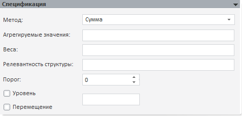

# Агрегация (базовая)

Агрегация (базовая)
-

# Агрегация (базовая)

Данный метод применяется, только если для базы данных временных рядов,
 которая является источником данных, задана группа агрегации. Группа, для
 которой будет рассчитана агрегация, указывается на панели «[Параметры](../../Standart_Model/UiModelling_Panel_Param_Attr.htm)» в отметке атрибута, по которому
 выполняется агрегация.

[Для создания
 группы агрегации](javascript:TextPopup(this))

		- В навигаторе объектов репозитория перейдите к справочнику
		 НСИ, на котором построен атрибут БДВР, по которому требуется провести
		 агрегацию.

		- Создайте [группу
		 элементов](UiNavObj.chm::/reference_book/look-and-feel_Reference_book/UiMd_reference_book_look-and-feel_Group.htm) в данном справочнике НСИ. В группе
		 должны быть те элементы, по которым требуется выполнить агрегацию.

		- [Добавьте
		 целочисленный атрибут](UiNavObj.chm::/reference_book/Master_RDS_reference_book/Attributes/Attribute.htm) с идентификатором «GROUPKEY»
		 в справочник НСИ.

		- Создайте в справочнике НСИ [неуникальный
		 ключ](UiNavObj.chm::/reference_book/Master_RDS_reference_book/Non_Unique_Keys.htm) с идентификатором «GROUP_MAP», в который
		 входит только атрибут «GROUPKEY».

		- Создайте [новый
		 элемент](UiNavObj.chm::/reference_book/Work/Work_Elements.htm#addelement) в справочнике НСИ. В значении атрибута
		 «GROUPKEY» укажите ключ группы элементов, созданной во втором
		 шаге.

	В результате будет создана группа агрегации. Наименование группы
	 агрегации будет совпадать с наименованием созданного элемента в справочнике
	 НСИ.

Примечание.
 Модель «Агрегация (базовая)»
 является устаревшей. Используйте модель «[Агрегация (расширенная)](UiModelling_Aggregation_Attr_CrossDim.htm)».

Панель «Спецификация»:

[Для задания
 метода расчета агрегации](javascript:TextPopup(this))

	Используйте раскрывающийся список «Метод».
	 Выберите метод агрегации данных переменных:

		- Дисперсия. Рассчитывается
		 [дисперсия](Lib.chm::/05_Statistics/UIModelling_dispers.htm) для
		 элементов рядов;

		- Исправленная дисперсия.
		 Рассчитывается исправленная [дисперсия](Lib.chm::/05_Statistics/UIModelling_dispers.htm) для
		 элементов рядов;

		- Исправленное стандартное
		 отклонение. Рассчитывается исправленное [стандартное
		 отклонение](Lib.chm::/05_Statistics/UiModelling_Stddev.htm)
		 для элементов рядов;

		- Квадрат отклонений.
		 Рассчитывается сумма квадратов отклонений (в абсолютных показателях)
		 всех элементов рядов от их средней арифметической;

		- Коэффициент асимметрии.
		 Рассчитывается [показатель
		 асимметрии](Lib.chm::/05_Statistics/UiModelling_Asymmetry.htm) для элементов рядов;

		- Максимум. Из элементов
		 рядов выбирается максимальное значение;

		- Медиана. Рассчитывается
		 [медиана](Lib.chm::/05_Statistics/UiModelling_Median.htm)
		 для элементов ряда;

		- Минимум. Из элементов
		 рядов выбирается минимальное значение;

		- Среднее. Рассчитывается
		 [среднее
		 значение](Lib.chm::/05_Statistics/UiModelling_Avg.htm)
		 элементов рядов;

		- Среднее гармоническое.
		 Рассчитывается [среднее гармоническое](Lib.chm::/05_Statistics/UiModelling_Avg_harm.htm)
		 элементов рядов;

		- Среднее геометрическое.
		 Рассчитывается [среднее геометрическое](Lib.chm::/05_Statistics/UiModelling_Avg_geometr.htm)
		 элементов рядов;

		- Среднее отклонений.
		 Рассчитывается среднее арифметическое отклонений (в абсолютных
		 показателях) всех элементов ряда от среднего арифметического ряда;

		- Стандартное отклонение.
		 Рассчитывается [стандартное отклонение](Lib.chm::/05_Statistics/UiModelling_Stddev.htm)
		 для элементов рядов;

		- Сумма. Суммируются
		 элементы рядов;

		- Сумма квадратов.
		 Рассчитывается сумма квадратов элементов рядов;

		- Эксцесс. Рассчитывается
		 [показатель
		 эксцесса](Lib.chm::/05_Statistics/UiModelling_Excess.htm) для элементов рядов.

[Для задания
 агрегируемых значений](javascript:TextPopup(this))

	Используйте поле «Агрегируемые
	 значения». Все допустимые выражения для агрегации отображаются
	 в списке, для вызова которого нажмите CTRL+ПРОБЕЛ.

[Для задания
 весов агрегации](javascript:TextPopup(this))

	Используйте поле «Веса».
	 Все допустимые выражения для весов отображаются в списке, для вызова
	 которого нажмите CTRL+ПРОБЕЛ.

	Параметр «Веса» не является
	 обязательным.

[Для задания
 параметров релевантности агрегации](javascript:TextPopup(this))

	Используйте поле «Релевантность
	 структуры». Задайте выражение, используемое для расчета
	 порога агрегации. При расчете модели учитывается значение параметра
	 «Порог». Если сумма агрегируемых
	 значений, разделенная на сумму значений «Релевантность
	 структуры», меньше значения заданного параметром «Порог»,
	 то агрегация не будет рассчитываться.

	Параметры «Релевантность структуры»
	 и «Порог» не являются обязательными.

[Для сглаживания
 полученных данных](javascript:TextPopup(this))

	Установите флажок «Уровень» и при расчете агрегации будет
	 использоваться функция «Level»,
	 сглаживающая данные.

[Для перемещения
 данных с одной календарной динамики на другую](javascript:TextPopup(this))

	Установите флажок «Перемещение»
	 и при расчете агрегации будет использоваться функция «Rebase»,
	 «перебазирующая» данные с одной календарной динамики на другую.

Примечание.
 В полях «Агрегируемые значения»,
 «Веса» и Релевантность
 структуры» значения атрибутов указываются в фигурных скобках. Например,
 выражение для агрегации показателей «BCI» для стран, входящий в группу
 «World»: {World|BCI}.

Если для базы данных временных рядов не задана группа агрегации, то
 модель не сможет быть рассчитана. Будет отображена панель «[Ошибки](../../Standart_Model/UiModelling_Model_Error.htm)» с текстом: «Не
 задана группа агрегации».

При сохранении модели, если в каком-либо выражении содержатся ошибки
 (недопустимые знаки операций, указано несуществующее значение атрибута
 и т.д.), то будет отображено соответствующее сообщение, содержащее номер
 позиции с ошибкой. После закрытия
 сообщения курсор будет перемещен в указанную позицию выражения.

См. также:

[Спецификация](../UiModelling_Model_Specification.htm)
 | [Методы
 расчёта агрегации](Lib.chm::/03_Transformations/UiModelling_Aggr.htm)

		Справочная
		 система на версию 10.9
		 от 18/08/2025,
		 © ООО «ФОРСАЙТ»,
