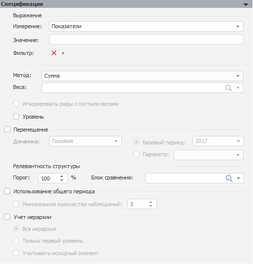

# Агрегация (расширенная)

Агрегация (расширенная)
-

# Агрегация (расширенная)

Панель «Спецификация» для данного
 вида модели:

[Для
 задания выражение агрегации](javascript:TextPopup(this))

	Используйте группу параметров «Выражение»:

		- Измерение. Измерение,
		 по которому нужно выполнить агрегацию. Раскрывающийся список содержит
		 все измерения базы, кроме календарного, единиц измерения, ревизий
		 и мнемоник;

		- Значение. Выражение
		 агрегации. Наименования атрибутов указываются в фигурных скобках,
		 например: {BCI}+{BCA}.
		 Все допустимые выражения для агрегации отображаются в списке,
		 для вызова которого нажмите CTRL+Пробел;

		- Фильтр. Ограничение
		 на ряды, по которым будет выполнена агрегация. Работа с полем
		 ведется аналогично работе с полем «Моделируемая
		 переменная» на панели «[Параметры](../../Standart_Model/UiModelling_Panel_Param_Attr.htm)».

[Для
 задания метода расчета агрегации и его параметров](javascript:TextPopup(this))

	Используйте следующие параметры:

		- Метод.
		 В раскрывающемся списке укажите один из доступных методов агрегации;

		- Веса.
		 Задайте выражение для веса агрегации. Раскрывающийся список доступен,
		 если выбран метод взвешенной агрегации (например, взвешенная сумма).
		 В списке содержатся элементы измерения, выбранного в поле «Измерение». По умолчанию отметка
		 элементов отсутствует;

		- Игнорировать
		 ряды с пустыми весами. Установка флажка определяет, игнорировать
		 ли ряды, для которых веса пустые. Если ряды игнорируются, то расчет
		 агрегации занимает меньше времени. Флажок по умолчанию снят и
		 доступен, если выбран метод взвешенной агрегации (например, взвешенная
		 сумма);

		- Уровень.
		 Установка флажка определяет, будет ли при расчете агрегации использоваться
		 функция «Level», сглаживающая
		 полученные данные.

	Флажок доступен, если выбраны следующие
	 методы или их «взвешенные» аналоги:

		-

			- веса;

			- взвешенное среднее геометрическое;

			- количество наблюдений;

			- количество пропусков;

			- сумма;

			- среднее;

			- медиана;

			- мода;

			- процентиль;

			- релевантность структуры.

	Флажок установлен автоматически и недоступен
	 для снятия, когда выбраны следующие методы или их «взвешенные» аналоги:

		-

			- среднее, рассчитанное по процентному изменению;

			- среднее, рассчитанное по логарифмической разности;

			- медиана, рассчитанная по процентному изменению.

[Для
 задания параметров перемещения данных с одной календарной динамики на
 другую](javascript:TextPopup(this))

	Для применения функции «Rebase»,
	 позволяющей «перебазировать» данные с одной динамики на другую установите
	 флажок «Перемещение».

	Примечание.
	 Флажок «Перемещение» доступен
	 в тех же случаях, что и флажок «Уровень»,
	 задающий [параметры метода расчета агрегации](#method).

	Задайте дополнительные параметры перемещения:

		- Динамика. Календарная
		 динамика для расчета функции «Rebase».
		 Доступна для изменения, если динамика расчета модели отлична от
		 годовой.

		Функция «Rebase» может
		 быть применена для годовой динамики или динамик с более низкой
		 частотой, но не меньше динамики расчета модели. Например, модель
		 рассчитывается по квартальной динамике. Таким образом, в раскрывающемся
		 списке «Динамика» будут
		 доступны только варианты «Годовая»,
		 «Полугодовая» и «Квартальная»;

		- Базовый период.
		 Если переключатель установлен, то поле определяет период для расчета
		 функции «Rebase». Формат
		 задания периода зависит от указанной динамики расчета. Например,
		 если выбрана годовая динамика, то задать можно будет только год,
		 в случае если выбрана полугодовая динамика, то необходимо задать
		 полугодие и год и т.д. Если поле «Динамика»
		 в группе «Перемещение»
		 недоступно, то формат периода зависит от поля «Динамика»
		 на панели «[Периоды расчета](../../Standart_Model/UiModelling_Model_2.htm)»;

		- Параметр. Если переключатель
		 установлен, то период для расчета функции «Rebase»
		 определяется через указанный параметр метамодели, содержащей данную
		 модель в цепочке расчета. В списке содержится список параметров,
		 ссылающихся на календарный справочник. Переключатель «Параметр»
		 доступен, если для модели имеются соответствующие параметры.

[Для
 задания параметров релевантности агрегации](javascript:TextPopup(this))

	Для задания релевантности агрегации с учетом пропусков в данных
	 используйте группу параметров «Релевантность
	 структуры»:

		- Порог. Определяет
		 значение порога для расчета релевантности агрегации. Диапазон
		 допустимых значений: [0, 100]. Если порог равен нулю, то это приводит
		 к расчету агрегации без учета пропусков. Если порог равен ста,
		 то при расчете агрегации все пропуски учитываются. Значение больше
		 нуля, но меньше ста означает, что пропуски учитываются согласно
		 установленному порогу;

		- Блок сравнения.
		 Блок сравнения для расчета релевантности агрегации. Содержит список
		 элементов измерения, выбранного в поле «Измерение»
		 при настройке [выражения агрегации](#expression).

	Релевантность рассчитывается следующим образом: если сумма значений
	 элемента «Блок сравнения»,
	 разделенная на сумму всех значений, меньше значения «Порог»,
	 то агрегация не будет рассчитываться.

[Для
 задания параметров использования общего периода данных](javascript:TextPopup(this))

	Общий период - это период, на котором у всех агрегируемых рядов
	 есть данные. Для расчета агрегации на общем периоде данных установите
	 флажок «Использование общего периода»
	 и задайте следующий параметр:

		- Минимальное количество
		 наблюдений. Флажок определяет, накладывается ли ограничение
		 на минимальное количество наблюдений в общем периоде. По умолчанию
		 флажок снят и ограничение не накладывается.

		Если флажок установлен, то задайте минимальное число наблюдений
		 в соответствующем редакторе значений. По умолчанию общий период
		 должен содержать минимум три наблюдения.

	По умолчанию флажок «Использование
	 общего периода» снят и агрегация рассчитывается на периоде
	 модели.

[Для
 задания параметров расчета агрегации с учетом иерархии данных](javascript:TextPopup(this))

	Для расчета агрегации с учетом иерархии данных установите флажок
	 «Учет иерархии» и задайте
	 следующие параметры:

		- Вся иерархия. Используется
		 по умолчанию. Агрегация рассчитывается по всем уровням иерархии;

		- Только первый уровень.
		 Агрегация рассчитывается только на один уровень вниз по иерархии;

		- Учитывать исходный элемент.
		 По умолчанию флажок снят и исходный элемент не учитывается в агрегации.
		 Если флажок установлен, то исходный элемент учитывается в агрегации.

	Примечание.
	 В расчете агрегации с учетом иерархии принимают участие все иерархические
	 измерения.

	По умолчанию флажок «Учет иерархии»
	 снят и расчет ведется без учета иерархии.

Если какие-либо параметры заданы некорректно, то модель не будет рассчитана.
 Будет отображена панель «[Ошибки](../../Standart_Model/UiModelling_Model_Error.htm)» с текстом
 ошибки.

При сохранении модели если в каком-либо выражении на данной панели содержатся
 ошибки (недопустимые знаки операций, указано несуществующее значение атрибута
 и т.д.), то будет отображено соответствующее сообщение, содержащее номер
 позиции с ошибкой. После закрытия
 сообщения курсор будет перемещен в указанную позицию выражения.

См. также:

[Спецификация](../UiModelling_Model_Specification.htm)
 | [Методы
 расчёта агрегации](Lib.chm::/03_Transformations/UiModelling_Aggr.htm) | Анализ временных рядов: [Агрегация
 (расширенная)](UiDw.chm::/Workbook/CalculatedSeries/Aggregation/UiDw_cs_Aggregation.htm)

		Справочная
		 система на версию 10.9
		 от 18/08/2025,
		 © ООО «ФОРСАЙТ»,
