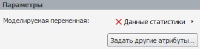
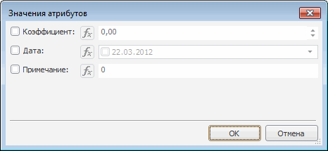
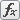

# Задание значений дополнительных атрибутов

Задание значений дополнительных атрибутов
-

# Задание значений дополнительных атрибутов

Дополнительные атрибуты - это атрибуты ряда, присутствующие в базе данных
 временных рядов, но не являющиеся обязательными для однозначной идентификации
 переменной.

Примечание.
 Работа с дополнительными атрибутами доступна, если источником данных моделируемой
 переменной является база данных временных рядов.

Если база данных временных рядов, которой принадлежит моделируемая переменная,
 содержит дополнительные атрибуты, то на панели «[Параметры](UiModelling_Panel_Param_Attr.htm)» отображается
 кнопка «Задать другие атрибуты»:

Нажатие данной кнопки открывает диалог «Значения
 атрибутов», предназначенный для редактирования параметров расчёта
 дополнительных атрибутов. Например:

Диалог содержит список дополнительных атрибутов. Каждому атрибуту соответствует
 флажок и поля для ввода значения атрибута. Для использования атрибута
 в расчете установите флажок, расположенный рядом с его наименованием и
 задайте значение атрибута.

Примечание.
 Дополнительные атрибуты рассчитываются только в [задаче
 трансформации](../../2_3_4_Problem/uimodelling_problem_2.htm).

Доступны следующие способы задания значения атрибута:

	- значение, заданное пользователем.
	 Используется по умолчанию. В качестве значения атрибута используется
	 значение, указанное пользователем. Для ввода значения атрибута используйте
	 поле, расположенное рядом с наименованием атрибута;

	- значение, рассчитанное по формуле.
	 В качестве значения атрибута используется значение, рассчитанное по
	 формуле, заданной пользователем. Для ввода формулы нажмите на кнопку
	 , расположенную рядом
	 с соответствующим атрибутом, и укажите формулу. В формуле допускается
	 использование функций, знаков операций, знаков сравнения. Если в формуле
	 используется ряд из базы данных временных рядов, то его наименование
	 обязательно нужно указывать в фигурных скобках. Например: {Afghanistan|LP}.

	Если формула содержит ошибки (недопустимые знаки операций, указан несуществующий
	 элемент и так далее), то поле ввода формулы будет подсвечено и будет
	 отображено сообщение, содержащее номер позиции с ошибкой.

См. также:

[Параметры
 модели](UiModelling_Panel_Param_Attr.htm)

		Справочная
		 система на версию 10.9
		 от 18/08/2025,
		 © ООО «ФОРСАЙТ»,
