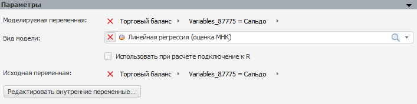
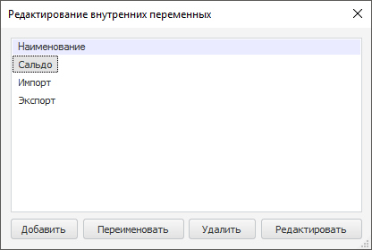

# Параметры внутренней модели

Параметры внутренней модели
-

# Параметры внутренней модели

Внутренняя модель - это модель, существующая и доступная для использования
 только внутри [метамодели](../../2_3_3_MetaModel/uimodelling_metamodel.htm).
 Внутренняя модель может содержать внутренние переменные - переменные,
 существующие и доступные для использования только среди внутренних моделей,
 принадлежащих одной метамодели. Для хранения внутренних переменных в метамодели
 автоматически создаётся внутренняя база данных временных рядов.

Работа с внутренней моделью аналогична работе со стандартной [моделью](../UiModelling_Model.htm).
 Настройка параметров внутренней модели также выполняется с помощью панели
 «[Параметры](UiModelling_Panel_Param_Attr.htm)».
 В качестве источника данных отображается наименование метамодели, содержащей
 внутреннюю переменную, а в качестве атрибута - наименование внутренней
 базы данных временных рядов, содержащей внутренние переменные. Например:

Для редактирования внутренних переменных нажмите кнопку «Редактировать
 внутренние переменные». Будет открыт диалог «Редактирование
 внутренних переменных»:

Операции с внутренними переменными:

	- добавление
	 переменной. Нажмите кнопку «Добавить».
	 Будет создана внутренняя переменная, не содержащая данных;

	- изменение данных переменной.
	 Выберите переменную и нажмите кнопку «Редактировать».
	 Данные переменной будут открыты в инструменте «[Аналитические
	 запросы (OLAP)](UIExpress.chm::/purpose/UiExpress_Purpose.htm)» в виде таблицы. Отредактируйте
	 данные. Для сохранения данных нажмите кнопку «Сохранить
	 изменения» на вкладке «Данные»
	 на ленте инструментов;

	- переименование переменной.
	 Выберите переменную и нажмите кнопку «Переименовать»,
	 или клавишу F2, или дважды щёлкните по переменной. Название переменной будет переведено в режим редактирования.
	 Отредактируйте название и нажмите клавишу ENTER или щёлкните основной
	 кнопкой мыши за пределами наименования переменной;

	- удаление переменной.
	 Выберите одну или несколько переменных и нажмите кнопку «Удалить»
	 или клавишу DELETE. Внутренняя переменная будет удалена с запросом
	 подтверждения выполняемого действия.

Примечание.
 Внутренняя переменная не может быть удалена, если она используется в текущей
 или какой-либо другой модели.

См. также:

[Параметры
 модели](UiModelling_Panel_Param_Attr.htm) | [Цепочка
 расчета](../../2_3_3_MetaModel/uimodelling_metamodel_2.htm)

		Справочная
		 система на версию 10.9
		 от 18/08/2025,
		 © ООО «ФОРСАЙТ»,
