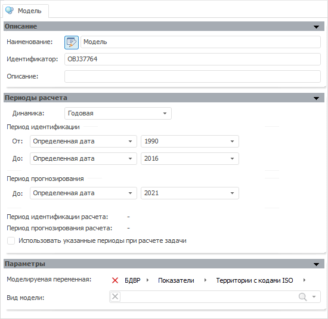

# Стандартная модель (настольное приложение)

Стандартная модель (настольное приложение)
-

# Стандартная модель

Вкладка «Модель» предназначена
 для редактирования различных параметров модели:

Изначально каждая стандартная модель содержит панели:

	- [Описание](UiModelling_Model_1.htm);

	- [Периоды расчета](UiModelling_Model_2.htm);

	- [Параметры](UiModelling_Panel_Param_Attr.htm);

В зависимости от метода, выбранного на панели «Параметры»,
 отображается набор дополнительных панелей:

	- [АКФ и ЧАКФ](UiModelling_Model_AKF.htm);

	- [Спецификация](../Specification/UiModelling_Model_Specification.htm);

	- [Идентифицированное уравнение](identified_equation.htm);

	- [Статистические характеристики](statistical_features.htm);

	- [Просмотр результатов](uimodelling_model_view.htm);

	- [Графики и диаграммы](UiModelling_Model_Fact.htm);

	- [Ряды (числовые значения)](UiModelling_Model_Serie.htm);

	- [Дополнительные параметры](UiModelling_Model_Extra.htm);

	- [Факторы](uimodelling_model_Factor.htm);

	- [Корреляция факторов](uimodelling_model_correlation.htm);

	- [Обобщенные результаты
	 модели](UiModelling_Model_CommonResult.htm);

	- [Начальные значения](UiModelling_Init_Vals.htm);

	- [Качество модели](UiModelling_Model_Quality.htm);

	- [Матрица весов](UiModelling_Bpf_Weight_Matrix.htm);

	- [Ошибки](UiModelling_Model_Error.htm);

	- [Предупреждения](UiModelling_Model_Warning.htm).

См. также:

[Объект «Модель»](../UiModelling_Model.htm)

		Справочная
		 система на версию 10.9
		 от 18/08/2025,
		 © ООО «ФОРСАЙТ»,
