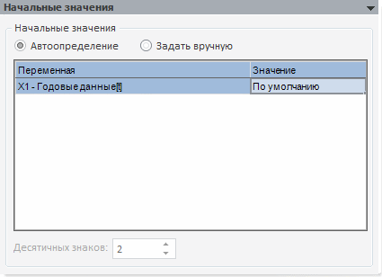

# Начальные значения

Начальные значения
-

# Начальные значения

Панель отображается для методов «[Модель бинарного выбора](../Specification/Binary_regression/UiModelling_Spec_Binary_regression.htm) (оценка методом
 максимального правдоподобия)» и «[Модель на панельных данных](../PooledModel/UiModelling_Pooled_Specification_binary.htm) (бинарная
 регрессия)».

На данной панели устанавливаются следующие параметры:

	- Начальные значения.
	 Позволяет определить начальные значения факторов. В данной группе
	 расположены переключатели, определяющие режим задания начальных значений,
	 таблица, отображающая начальные значения и редактор чисел «Десятичных
	 знаков», определяющий разрядность чисел в таблице.

	Возможны следующие режимы:

		- Автоопределение.
		 Начальные значения определяются автоматически. В качестве начального
		 значения фактора принимается последняя точка идентификационного
		 периода. Данный режим используется по умолчанию;

		- Задать вручную.
		 Начальные значения определяются пользователем путем ввода значений
		 в таблице. Разрядность значений можно задать в редакторе чисел
		 «Десятичных знаков». Значение
		 по умолчанию - нуль.

Примечание.
 Таблица значений факторов и редактор чисел «Десятичных
 знаков» недоступны для редактирования при автоопределении начальных
 значений.

См. также:

[Стандартная модель](Standart_Model.htm) |
 Метод расчёта [бинарной
 регрессии](Lib.chm::/01_Regression_models/UiModelling_BinaryModel.htm)

		Справочная
		 система на версию 10.9
		 от 18/08/2025,
		 © ООО «ФОРСАЙТ»,
