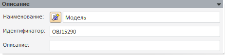
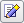
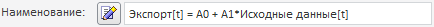

# Описание (модель)

Описание (модель)
-

# Описание

Панель «Описание» для всех моделей
 выглядит одинаково:

	- Наименование. Укажите
	 наименование модели, несущее смысловую нагрузку: функциональность
	 модели или её содержание.

Если наименование стандартной модели не редактировалось,
 то при указании моделируемой переменной на панели «[Параметры](UiModelling_Panel_Param_Attr.htm)»,
 наименование модели будет изменено на наименование выбранной переменной.

По умолчанию наименование модели задается
 пользователем, но оно может генерироваться автоматически в зависимости
 от метода расчета модели и состава ее переменных. Для этого отожмите кнопку
  («Ручное
 редактирование наименования»). Модель перейдет в режим автоматической
 генерации наименования, текст в поле «Наименование»
 будет содержать сгенерированное наименование и станет недоступен для редактирования.
 Пример автоматически сгенерированного наименования модели:

Для возврата к ручному вводу наименования
 модели нажмите кнопку «Ручное редактирование
 наименования».

	- Идентификатор.
	 Последовательность букв латинского алфавита, цифр и знака `_`, представляющих
	 собой уникальный идентификатор объекта. Идентификатор должен начинаться
	 с буквы.

	- Описание.
	 Строка, содержащая любой комментарий к модели.

См. также:

[Объект «Модель»](../UiModelling_Model.htm)

		Справочная
		 система на версию 10.9
		 от 18/08/2025,
		 © ООО «ФОРСАЙТ»,
