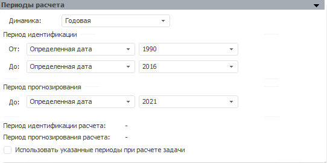

# Периоды расчета (настольное приложение)

Периоды расчета (настольное приложение)
-

# Периоды расчета

Панель «Периоды расчета» для
 всех моделей выглядит одинаково:

На данной панели определяются следующие параметры:

	- Динамика. Определяет
	 динамику, по которой будет производиться расчет модели.

	От выбранной динамики расчета зависит формат задания периодов идентификации
	 и прогнозирования. Например, если выбрана годовая динамика, то необходимо
	 задать только год, если выбрана полугодовая динамика, то необходимо
	 задать полугодие и год и т.д. При использовании недельной динамики
	 необходимо задать дату (день, месяц и год), по которой будет определена
	 неделя, причем параметры недели (первый день и число дней) берутся
	 из моделируемой переменной;

	- Период идентификации.
	 Определяет границы периода идентификации. На периоде идентификации
	 рассчитывается модельный ряд, используемый в дальнейшем для расчета
	 прогноза и различных показателей;

	-

		- От. Начало периода
		 идентификации. В раскрывающемся списке укажите способ расчета
		 даты начала периода:

		-

			- Начало данных +/-.
			 Дата равна первой фактической дате входного ряда плюс число
			 периодов, указанных в редакторе чисел, расположенном справа;

			- Определенная дата.
			 Дата указывается в редакторе дат, расположенном справа;

			- Сегодня +/-.
			 Дата равна текущему числу плюс число периодов, указанных в
			 редакторе чисел, расположенном справа;

			- От окончания идентификации.
			 Дата начала периода идентификации равна дате окончания периода
			 идентификации минус число периодов, указанных в редакторе
			 чисел, расположенном справа;

			- От родителя.
			 Дата начала периода идентификации равна дате начала периода
			 идентификации владельца модели плюс число периодов, указанных
			 в редакторе чисел, расположенном справа;

		- До. Окончание периода
		 идентификации. В раскрывающемся списке укажите способ расчета
		 даты окончания периода:

		-

			- Начало данных +/-.
			 Дата равна первой фактической дате входного ряда плюс число
			 периодов, указанных в редакторе чисел, расположенном справа;

			- Окончание данных +/-.
			 Дата равна последней фактической дате входного ряда плюс число
			 периодов, указанных в редакторе чисел, расположенном справа;

			- Определенная дата.
			 Дата указывается в редакторе дат, расположенном справа;

			- Сегодня +/-.
			 Дата равна текущему числу плюс число периодов, указанных в
			 редакторе чисел, расположенном справа;

			- От начала идентификации.
			 Дата окончания периода идентификации равна дате начала периода
			 идентификации плюс число периодов, указанных в редакторе чисел,
			 расположенном справа;

			- От родителя.
			 Дата окончания периода идентификации равна дате окончания
			 периода идентификации владельца модели плюс число периодов,
			 указанных в редакторе чисел, расположенном справа.

Примечание.
 Выбор дат периодов влияет на возможность выбора других дат периода в следующем
 порядке: начало периода идентификации влияет на его окончание, окончание
 периода идентификации влияет на начало периода прогнозирования, начало
 периода прогнозирования влияет на его окончание.

	- Период прогнозирования.
	 Определяет границы периода прогнозирования модели. На периоде прогнозирования
	 рассчитываются значения показателей, с учетом данных на периоде идентификации
	 с помощью выбранного метода расчета. Дата начала периода равна дате
	 окончания периода идентификации плюс один период. Дата окончания периода
	 устанавливается пользователем. В раскрывающемся списке укажите
	 способ расчета даты начала периода:

	-

		- Окончание данных +/-.
		 Дата равна последней фактической дате факторов модели плюс число
		 периодов, указанных в редакторе чисел, расположенном справа;

		- Определенная дата.
		 Дата указывается в редакторе дат, расположенном справа;

		- От окончания идентификации.
		 Дата окончания периода прогнозирования равна дате окончания периода
		 идентификации плюс число периодов, указанных в редакторе чисел,
		 расположенном справа;

		- Сегодня +/-. Дата
		 равна текущему числу плюс число периодов, указанных в редакторе
		 чисел, расположенном справа;

		- От родителя. Дата
		 окончания прогнозирования равна дате окончания периода прогнозирования
		 владельца модели плюс число периодов, указанных в редакторе чисел,
		 расположенном справа.

Необходимо помнить, что при расчете задачи
 используется период прогнозирования, который задан для задачи;

Примечание.
 Если используется способ «Сегодня +/-»,
 то даты окончания идентификации и прогнозирования смещаются на конец периода.
 Актуально для динамик от месячной и выше.

Например, дата окончания идентификации - апрель 2012, а дата окончания
 расчёта равняется дате окончания идентификации. Таким образом, при вычислении
 ряда дата окончания расчёта - 30.04.2012.

	- Период идентификации расчета.
	 Отображает текущие границы периода идентификации;

	- Период прогнозирования расчета.
	 Отображает текущие границы периода прогнозирования;

	- Использовать указанные периоды
	 при расчете задачи. Если установлен данный флажок, расчет модели
	 будет производиться с использованием периодов, которые указаны выше.
	 Если флажок снят, то используются [периоды](../../2_3_4_Problem/uimodelling_problem_5.htm),
	 которые указаны для всей задачи.

При создании модели периоды формируются следующим образом:

	- Для периода идентификации:

	-

		- начало периода идентификации берется из начала календаря
		 контейнера моделирования;

		- окончание периода идентификации устанавливается на текущую
		 дату;

	- Для периода прогнозирования:

	-

		- начало периода прогнозирования
		 устанавливается на следующий день после текущей даты;

		- окончание периода прогнозирования
		 берется из окончания календаря контейнера моделирования.

Начало и окончание календаря контейнера
 моделирования определяется в мастере создания контейнера моделирования
 на странице «[Параметры
 календаря](../../../2_1_Create_Cont_Modeling/UiModelling_Create_Container.htm)».

См. также:

[Объект «Модель»](../UiModelling_Model.htm)

		Справочная
		 система на версию 10.9
		 от 18/08/2025,
		 © ООО «ФОРСАЙТ»,
