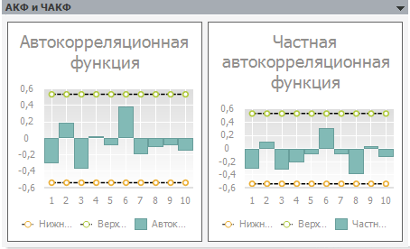

# АКФ и ЧАКФ: модель (настольное приложение)

АКФ и ЧАКФ: модель (настольное приложение)
-

# АКФ и ЧАКФ

Данная панель появляется только для метода «ARIMA»:

На данной панели отображаются результаты [автокорреляционного
 анализа](Lib.chm::/05_Statistics/UiModelling_Autocorrelation.htm): значения автокорреляционной функции и частной
 автокорреляционной функции по объясняемому ряду. Пунктиром отображаются
 границы доверительного интервала.

См. также:

[Параметры](UiModelling_Panel_Param_Attr.htm)
 | [Стандартная
 модель](Standart_Model.htm) | Метод «[ARIMA](Lib.chm::/02_Time_series_analysis/UiModelling_ARIMA.htm)»

		Справочная
		 система на версию 10.9
		 от 18/08/2025,
		 © ООО «ФОРСАЙТ»,
