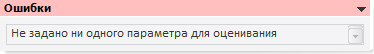

# Ошибки (настольное приложение)

Ошибки (настольное приложение)
-

# Ошибки

Панель «Ошибки» появляется,
 если во время расчёта модели возникают внутренние ошибки, либо неверно
 заданы параметра метода, например:

Панель содержит текст возникшей ошибки.

См. также:

[Объект «Модель»](../UiModelling_Model.htm)
 | [Стандартная
 модель](Standart_Model.htm)

		Справочная
		 система на версию 10.9
		 от 18/08/2025,
		 © ООО «ФОРСАЙТ»,
