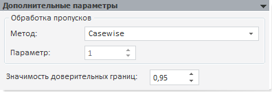
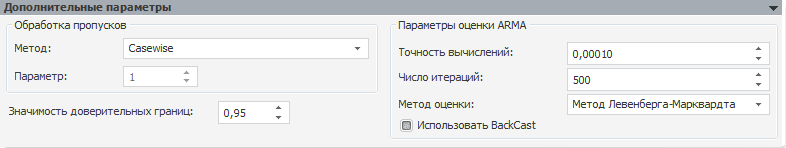
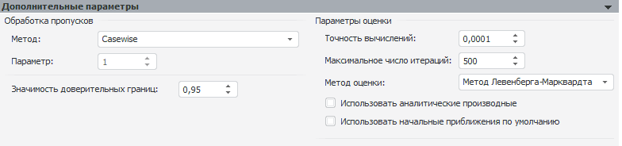

# Дополнительные параметры (модель)

Дополнительные параметры (модель)
-

# Дополнительные параметры

Панель «Дополнительные параметры»
 отображается после выбора метода расчета модели на панели «[Параметры](UiModelling_Panel_Param_Attr.htm)»:

Набор доступных параметров зависит от вида настраиваемой модели. Доступна
 настройка следующих параметров модели:

[Метод
 обработки пропусков](javascript:TextPopup(this))

	В раскрывающемся списке «Метод»
	 укажите метод [обработки
	 пропусков](Lib.chm::/03_Transformations/UiModelling_Fill_Gaps.htm) в значениях переменной. Методы аналогичны
	 методам модели «[Заполнение
	 пропусков](../Specification/UiModelling_Specification_Working_Lost.htm)». Также доступны дополнительные методы:

		- Нет. Обработка пропусков
		 не используется;

		- Casewise. Используется
		 по умолчанию. Пустые значения исключаются из ряда. Расчеты ведутся
		 без их учета;

		- Пользовательский.
		 Доступен только для модели «[Агрегация
		 (расширенная)](../Specification/aggregation/UiModelling_Aggregation_Attr_CrossDim.htm)». Пользовательский метод обработки пропусков
		 задаётся с помощью языка Fore (свойство [IMsCrossDimensionAggregationOptions.FillGapsUserMethod](KeMs.chm::/Interface/IMsCrossDimensionAggregationOptions/IMsCrossDimensionAggregationOptions.FillGapsUserMethod.htm)).
		 Если пользовательский метод был заменён на системный и изменения
		 сохранены, то выбрать пользовательский метод обработки пропусков
		 в раскрывающемся списке невозможно.

	Особенности обработки пропусков в моделях «[Линейная
	 регрессия (оценка МНК)](../Specification/8_Linear_regression/uimodelling_model_specification_linaer_reg.htm)» и «[Линейная
	 регрессия (оценка методом инструментальных переменных)](../Specification/8_Linear_regression/uimodelling_model_specification_linaer_reg2.htm)»:

		- если для какой-либо переменной не используется метод обработки
		 пропусков, заданный для модели, то в группе «Обработка
		 пропусков» дополнительно присутствует раскрывающийся список
		 «Применить к». Он содержит
		 перечень объектов, для которых возможно установить метод обработки
		 пропусков. Список состоит из:

			- Модель. Значение
			 по умолчанию. Метод обработки пропусков устанавливается для
			 моделируемой переменной и для факторов/инструментальных переменных,
			 для которых установлен флажок «Применить
			 обработку пропусков модели»;

			- Факторы/инструментальные переменные модели, для которых
			 снят флажок «Применить обработку
			 пропусков модели»;

	Примечание.
	 Флажок «Применить обработку пропусков
	 модели» содержится в контекстном меню фактора/инструментальной
	 переменной.

		- если в списке «Применить
		 к» выбраны несколько объектов, для которых ранее были заданы
		 разные методы обработки пропусков, то будет запрошено подтверждение
		 применения единого метода.

[Параметры
 доверительных границ](javascript:TextPopup(this))

	Уровень значимости доверительных границ - это вероятность того,
	 что неизвестное значение будет «накрыто» доверительным интервалом.
	 Значимость доверительных границ задается величиной 1-alpha,
	 где в качестве alpha берут
	 один из стандартных уровней значимости 0.1, 0.05 или 0.01. Например,
	 для alpha=0.05 доверительный
	 уровень равен 1-0.05=0.95, что соответствует 95%. Данное значение
	 используется по умолчанию.

	Для задания уровня значимости доверительных границ прогнозного ряда
	 используйте поле «Значимость доверительных
	 границ». Диапазон допустимых значений: (0, 1).

	В моделях «[Линейная регрессия (оценка
	 МНК)](../Specification/8_Linear_regression/uimodelling_model_specification_linaer_reg.htm)» и «[Линейная регрессия (оценка
	 методом инструментальных переменных)](../Specification/8_Linear_regression/uimodelling_model_specification_linaer_reg2.htm)» по умолчанию при расчете
	 доверительных границ учитывается, что коэффициенты найдены приближенно,
	 то есть установлен флажок «Учитывать
	 неопределенность коэффициентов». Для расчета доверительных
	 границ без учета того, что коэффициенты найдены приближенно, снимите
	 флажок «Учитывать неопределенность
	 коэффициентов».

[Параметры
 оценки ARMA](javascript:TextPopup(this))

	Для моделей «[Линейная регрессия
	 (оценка МНК)](../Specification/8_Linear_regression/uimodelling_model_specification_linaer_reg.htm)», «[Линейная регрессия
	 (оценка методом инструментальных переменных)](../Specification/8_Linear_regression/uimodelling_model_specification_linaer_reg2.htm)», «[ARIMA](../Specification/1_Arima/uimodelling_model_specification_arima.htm)»
	 и «[Модель
	 на панельных данных](../PooledModel/UiModelling_PooledModel_Main.htm)» на панели «Дополнительные
	 параметры» присутствует группа «Параметры
	 оценки ARMA»:

	

	Группа доступна, если для модели задан
	 порядок авторегрессии и/или скользящего среднего. Задайте следующие
	 параметры оценки ARMA:

		- Точность вычислений.
		 Укажите точность вычислений модели. Минимальное значение: 0.00001;
		 значение по умолчанию: 0.0001;

		- Число итераций.
		 Задайте максимальное число итераций, за которое должен осуществляться
		 поиск оптимального решения модели. Если оптимальное решение не
		 найдено за отведенное число итераций, на панели «[Ошибки](UiModelling_Model_Error.htm)»
		 будет отображено сообщение: «За
		 заданное число итераций удовлетворительное решение получено не
		 было». В этом случае необходимо увеличить максимальное
		 число итераций. При большом числе итераций достигается наибольшая
		 точность вычислений, но затрачивается больше времени.

		Минимальное значение: 1; значение по умолчанию: 500;

		- [Метод оценки](Lib.chm::/02_Time_series_analysis/Lib_ARIMA_Coef.htm).
		 Из раскрывающегося списка выберите метод оценки коэффициентов авторегрессии
		 и сезонного среднего.

		- Использовать BackCast.
		 Параметр доступен, если для модели задан порядок скользящего среднего.
		 Если флажок установлен, то для оценивания коэффициентов скользящего
		 среднего используется ретрополяция (построение графика для прошлого
		 периода на базе тенденций и данных ближайшего прошлого или текущего
		 периода).

	Примечание.
	 Для модели на панельных данных доступны только параметры «Точность
	 вычислений» и «Число итераций».

[Параметры
 оценки модели](javascript:TextPopup(this))

	Для модели «[Нелинейная регрессия
	 (оценка нелинейным МНК)](../Specification/7_Nonlinear_regression/7_nonlinear_regression.htm)» на панели «Дополнительные
	 параметры» присутствует группа «Параметры
	 оценки»:

	

	Задайте параметры оценки модели:

		- Точность вычислений.
		 Укажите точность вычислений уравнения. Минимальное значение: 0.00001;
		 значение по умолчанию: 0.0001;

		- Максимальное число итераций.
		 Укажите максимальное число итераций для расчета модели. Минимальное
		 значение: 1; значение по умолчанию: 500;

		- [Метод оценки](Lib.chm::/02_Time_series_analysis/Lib_ARIMA_Coef.htm).
		 Из раскрывающегося списка выберите метод оценки коэффициентов нелинейной
		 регрессии;

		- Использовать аналитические
		 производные. Установка данного флажка повышает точность
		 расчетов, путем расчета аналитических производных для уравнения
		 нелинейной регрессии;

		- Использовать начальные
		 приближения по умолчанию. По умолчанию флажок установлен
		 и для расчета используются начальные приближения коэффициентов
		 уравнения, заданные по умолчанию. Если флажок снят, то используются
		 начальные приближения, заданные пользователем. Для просмотра и
		 редактирования начальных приближений используйте панель «[Идентифицированное
		 уравнение](identified_equation.htm#initvalues)».

См. также:

[Стандартная модель](Standart_Model.htm)

		Справочная
		 система на версию 10.9
		 от 18/08/2025,
		 © ООО «ФОРСАЙТ»,
