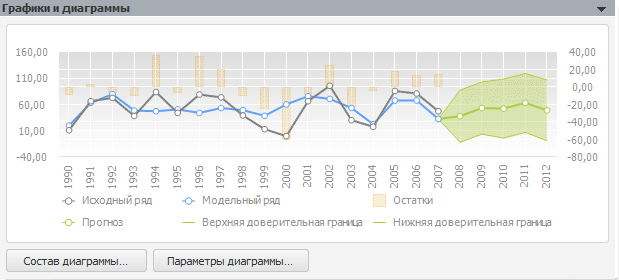

# Графики и диаграммы (модель)

Графики и диаграммы (модель)
-

# Графики и диаграммы

Панель «Графики и диаграммы»
 отображает графики значений исходных, смоделированных и прогнозных данных.
 Если были рассчитаны прогнозные значения, то отображаются доверительные
 границы с уровнем значимости, заданным на панели «[Дополнительные
 параметры](UiModelling_Model_Extra.htm)»:

Ряд «Остатки» отражает разницу
 между исходными и смоделированными данными.

Числовые значения, по которым построены графики, можно посмотреть на
 панели «[Ряды
 (числовые значения)](UiModelling_Model_Serie.htm)».

При нажатии кнопки «Параметры диаграммы»
 открывается диалог для [настройки
 диаграммы](UiDiagrams.chm::/UiDiagrams_basic_concept.htm).

При нажатии кнопки «Состав диаграммы» открывается
 окно для редактирования состава диаграммы:

Установите флажки напротив тех рядов данных, которые необходимо отобразить
 на диаграмме.

Для установки и снятия флажков:

	- для выделенных рядов.
	 Используйте команды «Отметить»
	 и «Снять отметку» в контекстном
	 меню;

	- для всех рядов. Используйте
	 кнопки «Отметить все» и «Снять отметку со всех».

## Операции с диаграммой

Ниже приведено краткое описание основных операций с диаграммой. Для
 получения полного описания обратитесь к разделу «[Настройка компонентов
 диаграммы](UiDiagrams.chm::/UiDiagrams_basic_concept.htm)».

С помощью контекстного меню диаграммы можно выполнить следующие действия:

	- настроить [компоненты
	 диаграммы](uidiagrams.chm::/UiDiagrams_basic_concept.htm);

	- настроить [параметры
	 диаграммы](UiDiagrams.chm::/Params_diagram/UiDiagrams_params_diagram.htm);

	- выбрать [тип
	 диаграммы](UiDiagrams.chm::/Type_diagrams/UiDiagrams_Type_diagrams.htm);

	- добавить [коридоры
	 диаграммы](uidiagrams.chm::/UiDiagrams_corridors.htm) и прочее.

См. также:

[Объект «Модель»](../UiModelling_Model.htm)

		Справочная
		 система на версию 10.9
		 от 18/08/2025,
		 © ООО «ФОРСАЙТ»,
