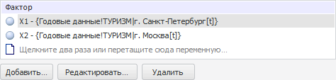
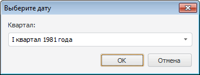

# Работа с факторами (входными переменными)

Работа с факторами (входными переменными)
-

# Работа с факторами (входными переменными)

Факторы (входные переменные) моделей отображаются в списке. Панель,
 на которой расположен данный список может отличаться в зависимости от
 настраиваемого объекта контейнера моделирования.

Набор кнопок для работы с факторами отличается в зависимости от типа
 модели.

Примечание.
 Если источник данных фактора не содержит календарного измерения, то фактор
 будет рассматриваться как константа.

[Добавление
 фактора](javascript:TextPopup(this))

	Для добавления фактора в модель:

		- нажмите кнопку «Добавить»
		 или выполните одноименную команду контекстного меню;

		- нажмите клавишу INSERT;

		- дважды щёлкните по свободному месту в списке факторов;

		- перетащите необходимую переменную из панели «[Объекты контейнера](../../../2_2_Window_container/uimodelling_window_object.htm)» в список переменных.
		 Способ доступен, если моделирование и прогнозирование работает
		 в [режиме
		 на переменных](../../../../1_Modelling/Start_Modelling.htm).

	Будет открыт диалог «[Редактирование
	 переменной](../Specification/UiModelling_Atributes_fix.htm)», в котором задайте все атрибуты переменной.

	Совет. Также
	 в качестве факторов доступно использование [временны́х
	 и фиктивных переменных](../Specification/UiModelling_TempVar.htm).

	Если моделирование и прогнозирование работает в [режиме
	 на переменных](../../../../1_Modelling/Start_Modelling.htm), то при добавлении фактора, количество измерений
	 которого не совпадает с количеством измерений моделируемой переменной,
	 будет открыто окно «[Изменение размерности](../../UiModelling_ChangeDimension.htm)»,
	 в котором выполните фиксацию измерений, отсутствующих у моделируемой
	 переменной.

[Редактирование
 формулы фактора](javascript:TextPopup(this))

	Для редактирования формулы фактора:

		- дважды щелкните по фактору мышью;

		- нажмите кнопку «Редактировать»;

		- выполните одноименную команду в контекстном меню фактора.

	Будет открыт [редактор выражения](UiNav.Chm::/GUI/ExpressionEditor.htm).

[Редактирование
 значений атрибутов фактора](javascript:TextPopup(this))

	Для редактирования значений атрибутов фактора:

		- нажмите кнопку «Фиксация»
		 или выполните одноименную команду в контекстном меню фактора;

		- дважды щёлкните по фактору.

	Будет открыт диалог «[Редактирование
	 переменной](../Specification/UiModelling_Atributes_fix.htm)».

[Фиксация
 фактора](javascript:TextPopup(this))

	Фиксация фактора доступна, если моделирование и прогнозирование
	 работает в [режиме
	 на переменных](../../../../1_Modelling/Start_Modelling.htm).

	Для фиксации фактора:

		- нажмите кнопку «Фиксация»
		 или выполните одноименную команду в контекстном меню фактора;

		- дважды щёлкните по фактору.

	Если размерности фактора и моделируемой переменной совпадают, то
	 будет открыто окно «Редактирование
	 лага», в котором укажите значение временного лага. Если количество
	 измерений не совпадает, то откроется окно «[Изменение
	 размерности](../../UiModelling_ChangeDimension.htm)».

[Удаление
 фактора](javascript:TextPopup(this))

	Для удаления фактора:

		- нажмите кнопку «Удалить»
		 или выполните одноименную команду в контекстном меню фактора;

		- нажмите на клавишу DELETE.

	Будет запрошено подтверждение выполняемого действия.

[Изменение
 лага фактора](javascript:TextPopup(this))

	Для изменения лага фактора выполните команду «Лаг»
	 контекстного меню фактора. Будет отображено меню, в котором выберите
	 действие с лагом:

		- Увеличить. Увеличивает
		 лаг на один период;

		- Уменьшить. Уменьшает
		 лаг на один период.

	Примечание.
	 Изменение лага доступно только для факторов, источник данных которых
	 содержит календарное измерение.

[Задание
 начального преобразования фактора](javascript:TextPopup(this))

	Для настройки [преобразования](../../UiModelling_work_Changes.htm),
	 которое будет выполняться над фактором перед расчётом модели, выполните
	 команду «Преобразование» в
	 контекстном меню фактора и выберите требуемый тип [преобразования](../../UiModelling_work_Changes.htm).

	Примечание.
	 Задание начального преобразования доступно только для факторов, источник
	 данных которых содержит календарное измерение.

[Настройка
 режима передачи фактора в уравнение](javascript:TextPopup(this))

	Настройка режима передачи фактора в уравнение доступна при редактировании
	 формулы [детерминированного
	 уравнения](../Specification/4_Deterministic_equation/uimodelling_model_specification_deter.htm), [нелинейной
	 регрессии (оценка нелинейным МНК)](../Specification/7_Nonlinear_regression/7_nonlinear_regression.htm) и [целевой
	 функции](../../2_3_4_Problem/UiModelling_Problem_CriterionFunction.htm) задачи оптимального управления.

	Примечание.
	 Настройка режима передачи в уравнение доступна только для факторов,
	 источник данных которых содержит календарное измерение.

	Для настройки режима выполните команду «Тип»
	 в контекстном меню фактора и в отобразившемся меню укажите режим:

		- Передавать поточечно.
		 Используется по умолчанию. Используемая в формуле точка ряда будет
		 зависеть от даты, для которой производятся расчеты. Переменная
		 будет представлена в виде X[t],
		 где t - это дата расчета.

		Например, модель имеет годовую динамику, период расчета с 2000
		 по 2010 годы. При поточечной передаче переменной в расчете формулы
		 для 2000 года будет использоваться значение переменной за 2000
		 год, в расчете формулы для 2001 года - значение переменной за
		 2001 год и так далее;

		- Передавать как ряд.
		 Передает в формулу все значения ряда в виде массива, а не точки,
		 и поэтому при вставке в уравнение переменной данного типа следует
		 использовать обработчик, преобразующий ряд к одному значению.
		 Обработчиком может выступать статистическая, математическая или
		 пользовательская функция.

		Например, в формуле необходимо использовать минимальное значение
		 ряда «X2». Для этого
		 следует использовать функцию нахождения минимума: Min(X2);

		- Выбрать значение на дату.
		 Позволяет определить конкретную точку ряда, которую необходимо
		 использовать в формуле. Будет открыто окно для ввода даты, например:

	

См. также:

[Объект «Модель»](../UiModelling_Model.htm)

		Справочная
		 система на версию 10.9
		 от 18/08/2025,
		 © ООО «ФОРСАЙТ»,
