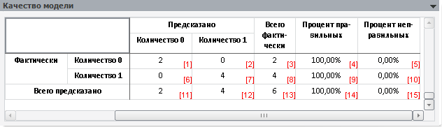

# Качество модели

Качество модели
-

# Качество модели

Панель отображается для [модели бинарного выбора](../Specification/Binary_regression/UiModelling_Spec_Binary_regression.htm) (оценка методом максимального правдоподобия) и для [модели на панельных данных](../PooledModel/UiModelling_Pooled_Specification_binary.htm) (бинарная регрессия).

В панели отображается таблица, описывающая качество подбора бинарной модели:

-
Количество правильно предсказанных нулей;

-
Количество неправильно предсказанных нулей;

-
Фактическое количество нулей;

-
Процент правильно предсказанных нулей;

-
Процент неправильно предсказанных нулей;

-
Количество правильно предсказанных единиц;

-
Количество неправильно предсказанных единиц;

-
Фактическое количество единиц;

-
Процент правильно предсказанных единиц;

-
Процент неправильно предсказанных единиц;

-
Количество предсказанных нулей;

-
Количество предсказанных единиц;

-
Фактическое число наблюдений;

-
Процент правильно предсказанных значений (всего);

-
Процент неправильных предсказанных значений (всего).

См. также:

[Стандартная модель](Standart_Model.htm) | Метод расчёта [бинарной регрессии](Lib.chm::/01_Regression_models/UiModelling_BinaryModel.htm)

		Справочная
		 система на версию 10.9
		 от 18/08/2025,
		 © ООО «ФОРСАЙТ»,
