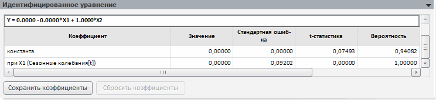
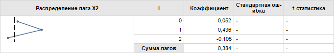
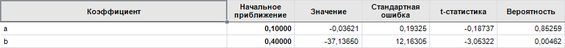

# Идентифицированное уравнение

Идентифицированное уравнение
-

# Идентифицированное уравнение

На панели «Идентифицированное уравнение»
 представлены идентифицированное уравнение с оцененными коэффициентами
 и таблица коэффициентов.

Примечание.
 Для каждой модели идентифицированное уравнение и набор коэффициентов различаются.

[Модели, для
 которых доступна панель «Идентифицированное уравнение»](javascript:TextPopup(this))

		- [Линейная
		 регрессия (оценка МНК)](../Specification/8_Linear_regression/uimodelling_model_specification_linaer_reg.htm).

		- [Линейная
		 регрессия (оценка методом инструментальных переменных)](../Specification/8_Linear_regression/uimodelling_model_specification_linaer_reg2.htm).

		- [Модель
		 бинарного выбора (оценка методом максимального правдоподобия)](../Specification/Binary_regression/UiModelling_Spec_Binary_regression.htm).

		- [Нелинейная
		 регрессия (оценка нелинейным МНК)](../Specification/7_Nonlinear_regression/7_nonlinear_regression.htm).

		- [Тренд
		 с подбором функциональной зависимости](../Specification/9_Universal_graph/9_universal_graph.htm).

		- [ARIMA](../Specification/1_Arima/uimodelling_model_specification_arima.htm).

		- [Модель
		 коррекции ошибок](../Specification/UiModelling_Specification_Error_control.htm).

		- [Регрессия
		 на панельных данных](../PooledModel/UiModelling_PooledModel_Main.htm).

		- [Векторная модель
		 коррекции ошибок (ECM)](../error_control/error_control.htm).

В таблице коэффициентов содержатся:

	- Коэффициент. Наименование
	 фактора, при котором оценивался коэффициент;

	- Значение. Оцененное
	 значение коэффициента;

	- Стандартная ошибка.
	 Приближённая величина отклонения (вызванного случайностью выборки)
	 оценки коэффициента от истинного значения. Чем больше значение [стандартной
	 ошибки](Lib.chm::/05_Statistics/UiModelling_StdError.htm), тем менее достоверной является оценка коэффициента;

	- t-статистика. Вычисляется
	 как отношение оценки коэффициента к его стандартной ошибке. Используется
	 для проверки нулевой гипотезы о том, что коэффициент равен нулю, то
	 есть не значим в рассматриваемой модели регрессии. Гипотеза проверяется
	 в предположении, что остатки имеют нормальное распределение. Проводить
	 интерпретацию значения [t-статистики](Lib.chm::/05_Statistics/UiModelling_t_stat.htm)
	 легче с помощью значения вероятности, которое приводится рядом;

	- Вероятность. Значение
	 вероятности для t-статистики. Нулевая гипотеза о равенстве нулю оценки
	 коэффициента отклоняется на выбранном уровне значимости (как правило,
	 0,1, 0,05, 0,01), если вероятность меньше, чем уровень значимости.

## Особенности работы

При работе с рядом моделей на панели «Идентифицированное
 уравнение» доступны дополнительные возможности:

[Сохранение/сброс
 значений коэффициентов](javascript:TextPopup(this))

	Возможность доступна для моделей «[Линейная
	 регрессия (оценка МНК)](../Specification/8_Linear_regression/uimodelling_model_specification_linaer_reg.htm)», «[Линейная
	 регрессия (оценка методом инструментальных переменных)](../Specification/8_Linear_regression/uimodelling_model_specification_linaer_reg2.htm)»,
	 «[Нелинейная
	 регрессия (оценка нелинейным МНК)](../Specification/7_Nonlinear_regression/7_nonlinear_regression.htm)» и «[Регрессия
	 на панельных данных](../PooledModel/UiModelling_Pooled_Specification.htm)».

	Для данных моделей на панели «Идентифицированное
	 уравнение» присутствуют дополнительные кнопки:

		- Сохранить коэффициенты.
		 Сохраняет значения коэффициентов, которые затем используются при
		 [расчете
		 задачи](../../2_3_4_Problem/uimodelling_problem_run.htm). При использовании сохраненных коэффициентов незначительно
		 сокращается время расчета задачи, поскольку идентификационные
		 коэффициенты уже указаны пользователем и не рассчитываются для
		 модели заново.

	Примечание.
	 Если моделируемая переменная содержит дополнительные измерения и используется
	 одна спецификация для всех элементов данных измерений, то коэффициенты
	 сохраняются для каждой точки. Если используются различные спецификации,
	 то коэффициенты сохраняются только на текущую точку. Подробнее о спецификации
	 стандартной модели см. раздел «[Параметры](UiModelling_Panel_Param_Attr.htm)».

	Если коэффициенты модели сохранены, то
	 будет отображено соответствующее сообщение;

		- Сбросить коэффициенты.
		 Сбрасывает сохраненные коэффициенты модели. При этом модель будет
		 перевычислена.

[Отображение
 бета-коэффициентов с графиком распределения лага](javascript:TextPopup(this))

	Возможность доступна для модели «[Линейная
	 регрессия (оценка МНК)](../Specification/8_Linear_regression/uimodelling_model_specification_linaer_reg.htm)», если в ней содержатся [лаговые
	 переменные](Lib.chm::/02_Time_series_analysis/UiModelling_Polinimial_Distributed_Lags.htm).

	На панели «Идентифицированное
	 уравнение» ниже таблицы коэффициентов выводятся бета-коэффициенты
	 с графиком распределения лага:

	

[Редактирование
 значений начальных приближений коэффициентов](javascript:TextPopup(this))

	Возможность доступна для модели «[Нелинейная
	 регрессия (оценка нелинейным МНК)](../Specification/7_Nonlinear_regression/7_nonlinear_regression.htm)». Для данной модели на
	 панели «Идентифицированное уравнение»
	 отображаются значения начальных приближений коэффициентов уравнения:

	

	Для редактирования значений начальных приближений коэффициентов:

		- Введите требуемые значения начальных приближений в столбец
		 «Начальное приближение».

		- Пересчитайте модель с новыми значениями начальных приближений
		 коэффициентов.

	Примечание.
	 Для возврата начальных приближений, заданных по умолчанию, установите
	 флажок «Использовать начальные приближения
	 по умолчанию» на панели «[Дополнительные
	 параметры](UiModelling_Model_Extra.htm)». Флажок автоматически снимается при редактировании
	 значений начальных приближений.

См. также:

[Стандартная модель](Standart_Model.htm) |
 [Параметры](UiModelling_Panel_Param_Attr.htm)

		Справочная
		 система на версию 10.9
		 от 18/08/2025,
		 © ООО «ФОРСАЙТ»,
