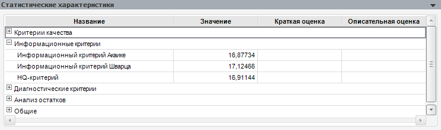

# Статистические характеристики (настольное приложение)

Статистические характеристики (настольное приложение)
-

# Статистические характеристики

На панели «Статистические характеристики»
 отображаются различные статистические характеристики:

На данной панели можно [определить
 собственный перечень](statistical_features_tuning.htm) отображаемых характеристик.

[Особенности
 отображения панели](javascript:TextPopup(this))

	Для модели на панели отображаются не все возможные характеристики,
	 а только те, которые были рассчитаны для данной модели.

	Панель «Статистические характеристики»
	 отображается для всех моделей, кроме:

		- [X11](../Specification/UiModelling_Specification_Census2.htm);

		- [Агрегация](../Specification/aggregation/aggregation.htm);

		- [Агрегация (базовая)](../Specification/aggregation/UiModelling_Aggregation_Attr.htm);

		- [Агрегация (расширенная)](../Specification/aggregation/UiModelling_Aggregation_Attr_CrossDim.htm);

		- [Методы накопления](../Specification/UiModelling_Specification_Cumulative.htm);

		- [Коллапс
		 (векторный расчет)](../Specification/UiModelling_Specification_Collaps.htm);

		- [Коллапс
		 (поточечный расчет)](../Specification/UiModelling_Specification_Collaps_point.htm);

		- [Заполнение
		 пропусков](../Specification/UiModelling_Specification_Working_Lost.htm);

		- [Интерполяция](../Specification/UiModelling_Specification_Interpolation.htm);

		- [Детерминированное
		 уравнение](../Specification/4_Deterministic_equation/uimodelling_model_specification_deter.htm);

		- [R](../Specification/R.htm);

		- [Межотраслевой
		 баланс](../interindustry_balance/interindustry_balance.htm);

		- [Модель
		 Value-At-Risk](../Value-At-Risk/UiModelling_ValueAtRisk_Main.htm).

## Критерии качества

	- [Коэффициент
	 детерминации](Lib.chm::/05_Statistics/UiModellind_DetermCoeff_R2.htm).
	 Определяет долю вариации зависимой переменной, обусловленную изменением
	 экзогенных переменных.

	- [Скорректированный
	 коэффициент детерминации](Lib.chm::/05_Statistics/UiModellind_DetermCoeff_AdjR2.htm).
	 Коэффициент детерминации не чувствительный к числу регрессоров. Предпочтительней
	 модель с наибольшим значением критерия.

	- [Коэффициент
	 детерминации (нецентрированный)](Lib.chm::/05_Statistics/UiModellind_DetermCoeff_R2.htm).
	 Коэффициент детерминации с учётом константы в модели.

	- [Скорректированный
	 коэффициент детерминации (нецентрированный)](Lib.chm::/05_Statistics/UiModellind_DetermCoeff_AdjR2.htm). Скорректированный коэффициент
	 детерминации с учётом константы в модели.

	- [Коэффициент детерминации Макфаддена](lib.chm::/05_Statistics/determcoeff_McFadden.htm#mcfadden).
	 Аналог обычного [коэффициента
	 детерминации](Lib.chm::/05_Statistics/UiModellind_DetermCoeff_R2.htm) (R^2) для бинарной регрессии. Рассчитывается
	 только для модели «[Модель
	 бинарного выбора (оценка методом максимального правдоподобия)](../Specification/Binary_regression/UiModelling_Spec_Binary_regression.htm)».

	- [Статистика
	 Фишера](Lib.chm::/05_Statistics/UiModelling_Fisher.htm). Данная статистика используется для проверки
	 гипотезы о связи между объясняемым рядом и регрессорами. Используется
	 нулевая гипотеза в том, что коэффициенты при всех регрессорах равны
	 нулю.

	- [Вероятность
	 статистики Фишера](Lib.chm::/05_Statistics/UiModelling_Fisher.htm). Значение вероятности для статистики
	 Фишера. Нулевая гипотеза о равенстве нулю коэффициентов при всех регрессорах
	 отклоняется, если вероятность меньше, чем уровень значимости (0.1,
	 0.05, 0.01).

	- [Статистика Фишера (нецентрированная)](Lib.chm::/05_Statistics/UiModelling_Fisher.htm).
	 Статистика Фишера, рассчитанная на основе нецентрированного коэффициента
	 детерминации.

	- [Вероятность статистики Фишера (нецентрированной)](Lib.chm::/05_Statistics/UiModelling_Fisher.htm).
	 Вероятность для статистики Фишера, рассчитанной на основе нецентрированного
	 коэффициента детерминации.

	- [LR-статистика](lib.chm::/05_Statistics/determcoeff_McFadden.htm#lr).
	 Статистика для проверки гипотезы о том, что все коэффициенты при объясняющих
	 переменных, кроме константы, равны нулю. Вычисляется, только если
	 модель содержит константу. Рассчитывается только для модели «[Модель
	 бинарного выбора (оценка методом максимального правдоподобия)](../Specification/Binary_regression/UiModelling_Spec_Binary_regression.htm)».

	- [Вероятность LR-статистики](lib.chm::/05_Statistics/determcoeff_McFadden.htm#lr).
	 Значение вероятности для LR-статистики. Рассчитывается только
	 для модели «[Модель
	 бинарного выбора (оценка методом максимального правдоподобия)](../Specification/Binary_regression/UiModelling_Spec_Binary_regression.htm)».

	- [J-Статистика](Lib.chm::/Lib/05_Statistics/Lib_JStatictic.htm).
	 Используется для проверки гипотезы о значимости регрессионной модели,
	 рассчитанной [методом
	 инструментальных переменных](../Specification/8_Linear_regression/uimodelling_model_specification_linaer_reg2.htm).

	- [Вероятность
	 J-статистики](Lib.chm::/Lib/05_Statistics/Lib_JStatictic.htm). Значение вероятности для J-статистики.
	 Нулевая гипотеза о равенстве нулю коэффициентов при всех регрессорах
	 отклоняется, если вероятность меньше, чем уровень значимости (0.1,
	 0.05, 0.01).

	- [Стандартная
	 ошибка](Lib.chm::/05_Statistics/UiModelling_StdError.htm). Мера среднего рассеяния значений объясняющей
	 переменной вокруг значений модельных значений.

	- [Логарифм
	 функции правдоподобия](Lib.chm::/05_Statistics/UiModelling_LogL.htm). Логарифм функции правдоподобия
	 используется в тестах регрессионной модели на наличие избыточных или
	 пропущенных переменных.

	- [Среднее логарифма функции правдоподобия](lib.chm::/05_Statistics/determcoeff_McFadden.htm#avglogl).
	 Логарифм [функции
	 правдоподобия](Lib.chm::/05_Statistics/UiModelling_LogL.htm), поделенный на число наблюдений. Рассчитывается
	 только для модели «[Модель
	 бинарного выбора (оценка методом максимального правдоподобия)](../Specification/Binary_regression/UiModelling_Spec_Binary_regression.htm)».

	- [Остаток логарифма функции правдоподобия](lib.chm::/05_Statistics/determcoeff_McFadden.htm#restrlogl).
	 Логарифм [функции
	 правдоподобия](Lib.chm::/05_Statistics/UiModelling_LogL.htm), рассчитанный при ограничении: все
	 коэффициенты равны нулю. Вычисляется, только если модель содержит
	 константу. Рассчитывается только для модели «[Модель
	 бинарного выбора (оценка методом максимального правдоподобия)](../Specification/Binary_regression/UiModelling_Spec_Binary_regression.htm)».

## Информационные критерии

	- [Информационный
	 критерий Акаике](Lib.chm::/05_Statistics/Information_Criteria.htm#aic).
	 Критерий используется для сравнения моделей с разным числом параметров,
	 когда требуется выбрать наилучший набор объясняющих переменных. Предпочтительней
	 модель с меньшим значением критерия.

	- [Информационный
	 критерий Шварца](Lib.chm::/05_Statistics/Information_Criteria.htm#sc).
	 Аналогично критерию Акаике, критерий используется для выбора набора
	 объясняющих переменных. Предпочтительней модель с меньшим значением
	 критерия.

	- [HQ-критерий](Lib.chm::/05_Statistics/Information_Criteria.htm#hq).
	 Используется для выбора наилучшей модели по соотношению между качеством
	 подбора и количеством оцениваемых параметров. Критерий вычисляется
	 только для модели бинарного, множественного выбора и модели с урезанными
	 данными. Чем меньше значение критерия, тем лучше.

## Диагностические критерии

	- [Статистика
	 Дарбина-Уотсона](Lib.chm::/05_Statistics/UiModelling_DurbinW.htm). Тест на наличие или отсутствие
	 корреляции по времени в ошибках системы.

	-

		- Вероятность нижней границы.
		 Значение вероятности для нижней границы интервала статистики Дарбина-Уотсона;

		- Вероятность верхней границы.
		 Значение вероятности для верхней границы интервала статистики
		 Дарбина-Уотсона.

## Анализ остатков

	- Сумма квадратов остатков.
	 Сумма квадратов величин расхождения между смоделированными и фактическими
	 значениями объясняемой переменной на периоде идентификации.

	- Среднее остатков. Среднее
	 ошибки.

	- Среднее квадратов остатков.
	 Среднее квадратов отклонений исходных значений объясняемой переменной
	 от модельных.

	- Корень из среднего квадратов
	 остатков. Корень из среднего значения квадратов отклонений.

	- Среднее абсолютных величин
	 остатков. Среднее модулей отклонений исходных значений объясняемой
	 переменной от модельных.

	- [Дисперсия
	 остатков](Lib.chm::/05_Statistics/UIModelling_dispers.htm). Дисперсия отклонений.

	- [Стандартное
	 отклонение остатков](Lib.chm::/05_Statistics/UiModelling_Stddev.htm). Мера того, насколько широко
	 разбросаны остатки относительно их среднего.

	- [Статистика
	 Жака-Бера](Lib.chm::/05_Statistics/UiModelling_JarqueBeraStat.htm).
	 Используется для проверки гипотезы о нормальном распределении выборки.

	- Максимальная абсолютная ошибка.
	 Максимальное значение величины расхождения между смоделированными
	 и фактическими значениями объясняемой переменной на периоде идентификации.

## Общее

	- Число наблюдений. Число
	 наблюдений, которые входят в [период
	 идентификации](UiModelling_Model_2.htm) модели.

	- Количество итераций, за которое
	 сошелся метод. Количество итераций вычисления, за которое было
	 получено решение.

	- Среднее зависимой переменной.
	 Среднее значение, рассчитанное по наблюдениям объясняемой переменной
	 на периоде идентификации.

	- Стандартное отклонение зависимой
	 переменной. [Стандартное
	 отклонение](Lib.chm::/05_Statistics/UiModelling_Stddev.htm), рассчитанное по наблюдениям объясняемой
	 переменной на периоде идентификации.

См. также:

[Объект «Модель»](../UiModelling_Model.htm)

		Справочная
		 система на версию 10.9
		 от 18/08/2025,
		 © ООО «ФОРСАЙТ»,
