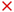
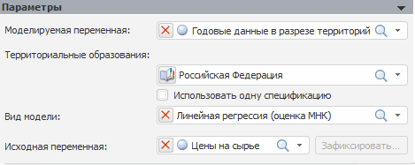

# Параметры модели, основанной на переменных

Параметры модели, основанной на переменных
-

# Параметры модели, основанной на переменных

Для настройки параметров модели предназначена панель «Параметры»:

Примечание.
 Работа с моделями на переменных доступна, если моделирование и прогнозирование
 запущено в [режиме
 на переменных](../../../../1_Modelling/Start_Modelling.htm).

На панели задайте следующие параметры модели:

[Моделируемая
 переменная](javascript:TextPopup(this))

	В поле «Моделируемая переменная»
	 укажите переменную, в которую будут выгружены результаты расчёта модели.
	 Выбор производится из раскрывающегося списка, в котором содержатся
	 все переменные, имеющиеся в контейнере. Для удаления моделируемой
	 переменной нажмите кнопку .
	 Будет запрошено подтверждение выполняемого действия. После удаления
	 моделируемой переменной все остальные параметры модели будут сброшены.

	Если наименование модели не редактировалось, то при выборе моделируемой
	 переменной наименование модели в панели «[Описание](UiModelling_Model_1.htm)»
	 будет изменено на наименование выбранной переменной.

	Если у переменной есть дополнительные [измерения](../../2_3_1_Value/UiModelling_Work_object_Value_2.htm),
	 то модель является многомерной и ниже поля «Моделируемая
	 переменная» добавляются поля в количестве, соответствующем
	 количеству имеющихся измерений у переменной, например:

	

	При установке флажка «Использовать
	 одну спецификацию» для всех элементов измерения будет использоваться
	 один метод расчёта. По умолчанию флажок снят, и для каждого элемента
	 измерения можно задать различные методы расчёта.

[Вид
 модели](javascript:TextPopup(this))

	В поле «Вид модели» укажите
	 метод расчёта модели. Выбор производится из раскрывающегося списка
	 методов. Для очистки поля нажмите кнопку . Список
	 доступных моделей приведен в описании панели «[Спецификация](../Specification/UiModelling_Model_Specification.htm)».

	В зависимости от выбранного метода отображается набор дополнительных
	 панелей, список которых приведен в разделе «[Стандартная
	 модель](Standart_Model.htm)».

	Если для выбранного метода доступен расчет с помощью пакета R, то
	 будет отображен дополнительный флажок «Использовать
	 при расчете подключение к R». Подробнее см. раздел «[Использование R при
	 расчете модели](R_Parms.htm)».

	Примечание.
	 Если в многомерной модели заданы параметры расчёта для нескольких
	 измерений, то при повторном открытии модели будет отображен метод
	 расчёта для последнего измерения, который был изменён. Если для всех
	 измерений многомерной модели не заданы методы расчёта, то при повторном
	 открытии будет отображен первое измерение модели.

[Исходная
 переменная](javascript:TextPopup(this))

	В поле «Исходная переменная»
	 укажите переменную контейнера моделирования, к данным которой будет
	 применен метод расчёта модели. По умолчанию исходной переменной является
	 моделируемая переменная.

	Если исходная переменная отличается от моделируемой переменной,
	 она используется только для идентификации модели. Выгрузка расчётных
	 значений всегда производится в моделируемую переменную.

	Размерность исходной переменной должна совпадать с размерностью
	 моделируемой переменной. Если исходная переменная содержит дополнительные
	 измерения, то их необходимо зафиксировать в окне «[Изменение
	 размерности](../../UiModelling_ChangeDimension.htm)», которое будет отображено при выборе такой переменной.
	 Также диалог «[Изменение
	 размерности](../../UiModelling_ChangeDimension.htm)» можно вызвать повторно, нажав кнопку «Фиксировать».
	 Если размерности исходной и моделируемой переменной совпадают, то
	 кнопка «Фиксировать» недоступна.

	Примечание.
	 Параметр «Исходная переменная»
	 отсутствует в моделях «[Детерминированное
	 уравнение](../Specification/4_Deterministic_equation/uimodelling_model_specification_deter.htm)» и «[R](../Specification/R.htm)».

См. также:

[Объект «Модель»](../UiModelling_Model.htm)
 | [Параметры
 модели, основанной на атрибутах](UiModelling_Panel_Param_Attr.htm)

		Справочная
		 система на версию 10.9
		 от 18/08/2025,
		 © ООО «ФОРСАЙТ»,
