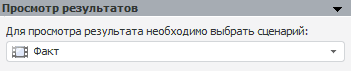
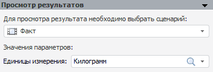
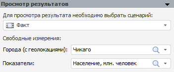

# Просмотр результатов (стандартная модель)

Просмотр результатов (стандартная модель)
-

# Просмотр результатов

Данная панель позволяет выбирать сценарий переменной, по которому будет
 производиться расчет.

По умолчанию выбран сценарий «Факт».

Если модель входит в метамодель, содержащую [параметры](../../2_3_3_MetaModel/Metamodel_params.htm),
 то в группе «Значения параметров»
 будут дополнительно отображены редакторы для ввода значений параметров,
 заданных для метамодели, например:

Для расчета модели задайте значения всех параметров.

Если внутренняя модель рассчитывается в [многомерном
 цикле](../../2_3_3_MetaModel/MultiDimIterator.htm), то измерения, входящие в цикл, будут отображены в группе «Свободные измерения», например:

Используйте раскрывающиеся списки для задания отметки по данным измерениям.
 Это необходимо для [расчёта отдельной
 модели](../UiModelling_Model.htm#calc), так как измерения, входящие в многомерный цикл, скрываются
 из всех цепочек навигации внутренней модели.

См. также:

[Объект «Модель»](../UiModelling_Model.htm)
 | [Стандартная
 модель](Standart_Model.htm)

		Справочная
		 система на версию 10.9
		 от 18/08/2025,
		 © ООО «ФОРСАЙТ»,
