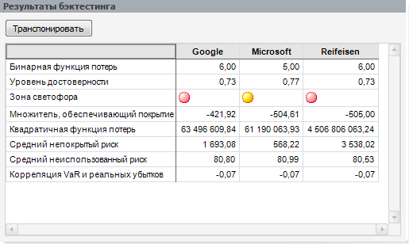

# Результаты бэктестинга

Результаты бэктестинга
-

# Результаты бэктестинга

Панель отображается, если установлен флажок «Проводить бэктестинг» на панели «[Параметры](UiModelling_VaR_Param.htm)», и содержит таблицу с результатами [бэктестинга](Lib.chm::/04_Other_models/UiModelling_ValueAtRisk.Backtesting.htm):

Таблица содержит результаты для каждой организации, выбранной на панели «[Спецификация](UiModelling_ValueAtRisk_Specification.htm)». По умолчанию названия организаций расположены в заголовках столбцов, а названия результатов расположены в заголовках строк. Для транспонирования таблицы результатов нажмите кнопку «Транспонировать».

См. также:

[Модель Value-At-Risk](UiModelling_ValueAtRisk_Main.htm)

		Справочная
		 система на версию 10.9
		 от 18/08/2025,
		 © ООО «ФОРСАЙТ»,
