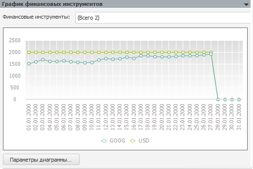
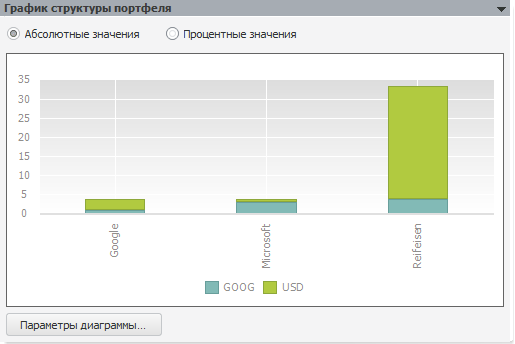
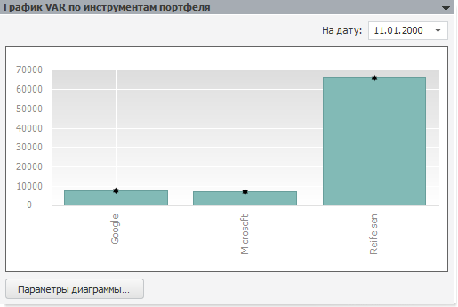

# Графики

Графики
-

# Графики

Результаты расчёта модели «[Value-At-Risk](UiModelling_ValueAtRisk_Main.htm)»
 графически представлены на различных панелях, описанных ниже. Все панели
 содержат график и кнопку «Параметры диаграммы»,
 при нажатии которой открывается диалог [настройки диаграммы](UiDiagrams.chm::/UiDiagrams_basic_concept.htm).

С помощью контекстного меню диаграммы можно:

	- настроить [формат
	 компонентов диаграммы](uidiagrams.chm::/Tuning_format/UiDiagrams_tuning_format.htm);

	- настроить [параметры
	 диаграммы](UiDiagrams.chm::/Params_diagram/UiDiagrams_params_diagram.htm);

	- выбрать [тип
	 диаграммы](UiDiagrams.chm::/Type_diagrams/UiDiagrams_Type_diagrams.htm);

	- добавить [коридоры
	 диаграммы](uidiagrams.chm::/UiDiagrams_corridors.htm);

	- [выбрать
	 объект](UiDiagrams.chm::/UiDiagrams_basic_concept.htm#select_component) в диаграмме.

## График финансовых инструментов

На графике представлены значения финансовых инструментов на всем периоде
 расчёта модели:

Из раскрывающегося списка выбираются элементы измерения финансовых инструментов,
 по которым был произведен расчёт. Измерение выбрано на панели «[Спецификация](UiModelling_ValueAtRisk_Specification.htm)». По умолчанию отмечен
 первый элемент измерения.

## График структуры портфеля

На графике отражено: какие инструменты и в каком объеме есть у организации.
 Данные представлены на первую точку прогноза.

Переключатели «Абсолютные значения»
 (выбран по умолчанию) и «Процентные значения»
 изменяют отображение графика: абсолютные и процентные значения соответственно.

## График VAR по инструментам
 портфеля

На биржевой диаграмме для каждой организации отображается стоимость
 портфеля на указанную дату. Стоимость портфеля является суммой произведений
 числа финансовых инструментов на их стоимость. Дата
 выбирается в редакторе «На дату».
 Значение по умолчанию - первая точка прогноза. Если прогноз был рассчитан
 только на одну точку, то редактор «На
 дату» не отображается.

См. также:

[Модель Value-At-Risk](UiModelling_ValueAtRisk_Main.htm)

		Справочная
		 система на версию 10.9
		 от 18/08/2025,
		 © ООО «ФОРСАЙТ»,
