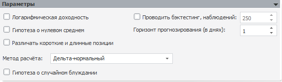
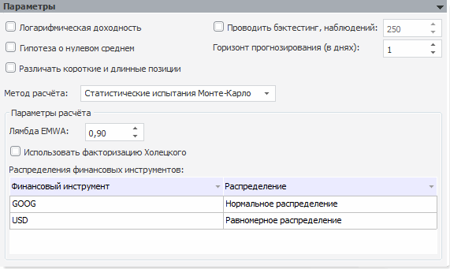

# Параметры Value-At-Risk

Параметры Value-At-Risk
-

# Параметры

На панели задаются параметры расчёта модели. Вид панели отличается в
 зависимости от метода расчёта, но присутствует ряд общих параметров. Установка
 флажка означает, что параметр будет использоваться при расчетах модели.
 По умолчанию все флажки сняты:

	- Логарифмическая доходность

	- Гипотеза о нулевом среднем

	- Различать короткие и длинные
	 позиции

	- Проводить бэктестинг, наблюдений.
	 Установка флажка позволяет в редакторе чисел задать число наблюдений,
	 по которым осуществляется [бэктестинг](Lib.chm::/04_Other_models/UiModelling_ValueAtRisk.Backtesting.htm).
	 Значение по умолчанию - 250. Количество наблюдений бэктестинга не
	 должно превышать количество точек расчета. Если бэктестинг проводится,
	 то отображается дополнительная панель «[Результаты
	 бэктестинга](UiModelling_VaR_Backtesting.htm)».

Следующие параметры не требуют установки/снятия флажков:

	- Горизонт прогнозирования (в
	 днях). Один из основных параметров модели, укажите его значение
	 в редакторе чисел. Значение по умолчанию - 1 день. Существуют
	 общепринятые горизонты прогнозирования: по базельским документам -
	 10 дней, по методике Risk Metrics - 1 день. Чаще распространен расчет
	 с временным горизонтом 1 день. 10 дней используется для расчета величины
	 капитала, покрывающего возможные убытки.

	- Метод расчёта. В раскрывающемся
	 списке выберите метод расчёта модели «VaR».
	 В зависимости от выбранного метода изменится набор параметров в панели.

	-

		- [Дельта-нормальный](Lib.chm::/04_Other_models/UiModelling_ValueAtRisk.DeltaNormal.htm).
		 Выбран по умолчанию.

	-

		-

			- Гипотеза
			 о случайном блуждании. Установка/снятие флажка определяет,
			 будет ли в расчётах использоваться гипотеза о случайном блуждании.

		- [Исторический](Lib.chm::/04_Other_models/UiModelling_ValueAtRisk.Historic.htm). Метод
		 не требует определения дополнительных параметров.

		- [Статистические
		 испытания Монте-Карло](Lib.chm::/04_Other_models/UiModelling_ValueAtRisk.MonteCarlo.htm).
		 Требуется определение дополнительных параметров:

	-

		-

			- Лямбда EMWA.
			 В редакторе чисел укажите значение лямбды EMWA. Значение по
			 умолчанию «0,90»;

			- Использовать факторизацию
			 Холецкого. Установка/снятие флажка определяет, применяется
			 ли в расчётах факторизация Холецкого. По умолчанию флажок
			 снят;

			- Распределения финансовых
			 инструментов. Необходимо каждому финансовому инструменту,
			 выбранному на панели «[Спецификация](UiModelling_ValueAtRisk_Specification.htm)»,
			 сопоставить вид распределения, выбираемого из раскрывающегося
			 списка. Для отображения данного списка дважды щёлкните
			 по выбранной ячейке.

См. также:

[Модель Value-At-Risk](UiModelling_ValueAtRisk_Main.htm)

		Справочная
		 система на версию 10.9
		 от 18/08/2025,
		 © ООО «ФОРСАЙТ»,
