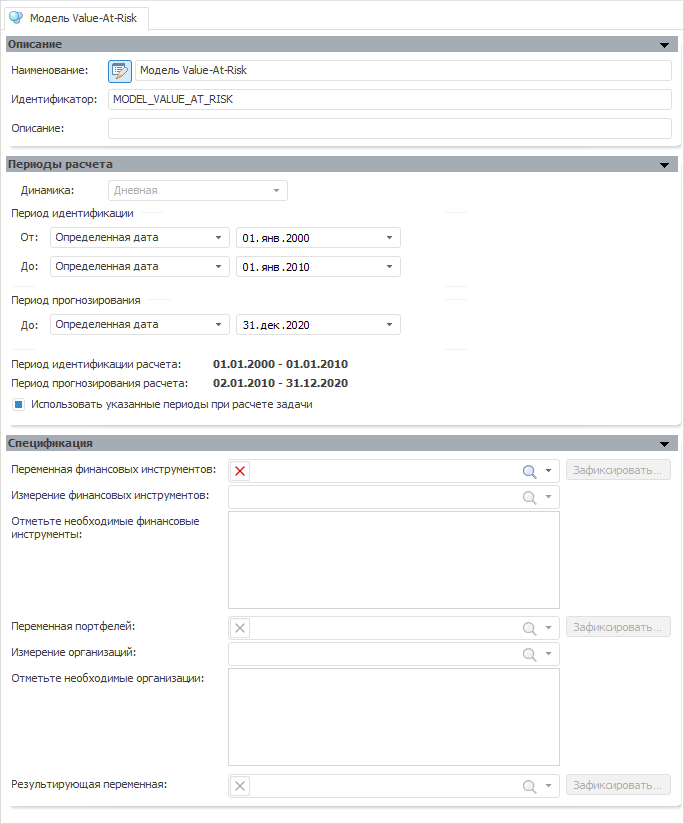

# Модель Value-At-Risk

Модель Value-At-Risk
-

# Модель Value-At-Risk

Данная модель применяется для оценки рисков. Математическое обоснование
 приведено в разделе «Value-At-Risk» в [библиотеке методов и моделей](Lib.chm::/UiModelling_Lib_Common.htm).

Модель «Value-At-Risk (VaR)»:

Изначально редактор модели содержит панели:

	- [Описание](../Standart_Model/UiModelling_Model_1.htm);

	- [Периоды
	 расчета](../Standart_Model/UiModelling_Model_2.htm). Обратите внимание, что модель «VaR»
	 рассчитывается только в дневной динамике;

	- [Спецификация](UiModelling_ValueAtRisk_Specification.htm).

После указания основных параметров модели на панели «[Спецификация](UiModelling_ValueAtRisk_Specification.htm)»
 открывается ряд дополнительных панелей:

	- [Параметры](UiModelling_VaR_Param.htm);

	- [Дополнительные
	 параметры](../Standart_Model/UiModelling_Model_Extra.htm). Аналогична стандартной панели;

	- [Просмотр
	 результатов](../Standart_Model/uimodelling_model_view.htm). Аналогична стандартной панели;

	- [Результаты бэктестинга](UiModelling_VaR_Backtesting.htm);

	- [График финансовых
	 инструментов](UiModelling_VaR_Charts.htm#fininstr);

	- [График структуры
	 портфеля](UiModelling_VaR_Charts.htm#portfolio);

	- [График VAR
	 по инструментам портфеля](UiModelling_VaR_Charts.htm#instrportfolio).

Примечание.
 Для работы с моделью «Value-At-Risk»
 требуются [переменные
 моделирования](../../2_3_1_Value/uimodelling_work_object_value.htm), являющиеся отдельными объектами репозитория.

См. также:

[Объект «Модель»](../UiModelling_Model.htm)
 | Метод расчёта модели «[Value-At-Risk](Lib.chm::/04_Other_models/UiModelling_ValueAtRisk.htm)»

		Справочная
		 система на версию 10.9
		 от 18/08/2025,
		 © ООО «ФОРСАЙТ»,
