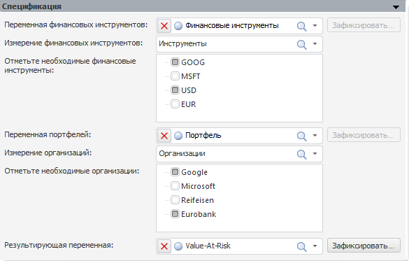

# Спецификация Value-At-Risk

Спецификация Value-At-Risk
-

# Спецификация

Панель предназначена для задания основополагающих параметров модели
 «Value-At-Risk»:

В панели определяются:

	- Переменная финансовых инструментов.
	 Укажите переменную, содержащую матрицу финансовых инструментов;

	- Измерение финансовых инструментов.
	 Укажите соответствующее измерение, принадлежащее переменной финансовых
	 инструментов. Если переменная не содержит измерений, то дальнейшая
	 работа с моделью невозможна. Если переменная содержит только одно
	 измерение, то оно выбирается автоматически. Если переменная содержит
	 несколько измерений, то после выбора измерения финансовых инструментов
	 будет открыт диалог «[Изменение размерности](../../UiModelling_ChangeDimension.htm)»
	 для фиксации оставшихся измерений. Вызвать его повторно можно нажав
	 кнопку «Зафиксировать»;

	- Отметьте необходимые финансовые
	 инструменты. Список содержит все элементы измерения, выбранного
	 в списке «Измерение финансовых инструментов».
	 Флажками отметьте те инструменты, которые будут участвовать в расчетах.
	 По умолчанию отмечен первый элемент;

	- Переменная портфелей.
	 Укажите переменную, содержащую матрицу портфелей. Переменная должна
	 содержать измерение организаций и измерение финансовых инструментов,
	 указанный выше. Если измерение финансовых инструментов отсутствует,
	 то будет отображено соответствующее предупреждение;

	- Измерение организаций.
	 Выбор измерения организаций, фиксация и выбор организаций осуществляется
	 по схеме, описанной выше для переменной финансовых инструментов;

	- Отметьте необходимые организации.
	 Список содержит все элементы измерения, выбранного в списке «Измерение организаций». Флажками
	 отметьте те организации, которые будут участвовать в расчетах. По
	 умолчанию отмечен первый элемент;

	- Результирующая переменная.
	 Укажите переменную, в которую после расчета модели будут выгружены
	 результаты. Переменная должна содержать измерение организаций, указанный
	 выше. Если измерение организаций отсутствует, то будет отображено
	 соответствующее предупреждение. Если переменная содержит дополнительные
	 измерения, то будет открыт диалог «[Изменение
	 размерности](../../UiModelling_ChangeDimension.htm)» для их фиксации. Вызвать его повторно можно нажав
	 кнопку «Зафиксировать».

Если все параметры будут указаны верно, то будет открыт ряд дополнительных
 панелей, перечисленных в разделе «[Модель
 Value-At-Risk](UiModelling_ValueAtRisk_Main.htm)».

См. также:

[Модель Value-At-Risk](UiModelling_ValueAtRisk_Main.htm)

		Справочная
		 система на версию 10.9
		 от 18/08/2025,
		 © ООО «ФОРСАЙТ»,
