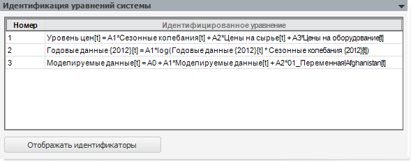

# Идентификация уравнений системы

Идентификация уравнений системы
-

# Идентификация уравнений системы

На панели отображаются идентифицированные уравнения, образующие систему.
 Порядок следования уравнений определяется порядком их следования на панели
 «[Параметры](UiModelling_Eq_set_20_Param.htm)».

Если модель содержит несколько спецификаций на разные элементы измерения,
 то на данной панели отображаются уравнения для каждого измерения. Наименование
 модели, содержащей несколько спецификаций, содержится в строке перед уравнениями.

Для таблицы идентифицированных уравнений доступно контекстное меню:

	- Копировать. Копирует
	 только выделенную область. Также для копирования данных можно использовать
	 сочетание клавиш CTRL+C или CTRL+INSERT;

	- Копировать всю таблицу.
	 Копирует таблицу целиком независимо от выделенной в ней области;

	- Отображать наименования.
	 Отображает в уравнениях наименования переменных и моделей вместо их
	 идентификаторов. Текст кнопки «Отображать
	 наименования» меняется на «Отображать
	 идентификаторы»;

	- Отображать идентификаторы.
	 Отображает в уравнениях идентификаторы переменных и моделей вместо
	 их наименований. Текст кнопки «Отображать
	 идентификаторы» меняется на «Отображать
	 наименования».

Нажатие кнопки «Отображать наименования»/«Отображать идентификаторы» аналогично
 выполнению одноименных команд контекстного меню.

После выбора уравнения отображаются
 дополнительные панели:

	- [Спецификация](UiModelling_Eq_set_20_Specification.htm)
	 (не отображается для детерминированного уравнения);

	- [Статистические
	 характеристики](../../Standart_Model/statistical_features.htm) (не отображается для детерминированного уравнения);

	- [Просмотр
	 результатов](../../Standart_Model/uimodelling_model_view.htm);

	- [Графики
	 и диаграммы](../../Standart_Model/UiModelling_Model_Fact.htm);

	- [Ряды
	 (числовые значения)](../../Standart_Model/UiModelling_Model_Serie.htm);

	- [Ошибки](../../Standart_Model/UiModelling_Model_Error.htm)
	 (отображается, если неправильно заданы параметры модели).

См. также:

[Система нелинейных уравнений](../UiModelling_eq_set_Model_20.htm)
 | [Объект
 «Модель»](../../UiModelling_Model.htm)

		Справочная
		 система на версию 10.9
		 от 18/08/2025,
		 © ООО «ФОРСАЙТ»,
