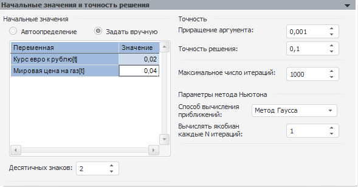

# Начальные значения и точность решения

Начальные значения и точность решения
-

# Начальные значения и точность решения

Панель «Начальные значения и точность
 решения» предназначена для задания начальных значений искомых переменных,
 точности решения и числа итераций для решения системы:

На данной панели устанавливаются следующие параметры модели:

	- Начальные значения.
	 Позволяет определить начальные значения искомых переменных. В данной
	 группе расположены переключатели, определяющие режим задания начальных
	 значений и таблица, отображающая начальные значения.

Доступные режимы:

	-

		- Автоопределение.
		 Используется по умолчанию. Начальные значения определяются автоматически.
		 В качестве начального значения искомой переменной принимается
		 последняя точка идентификационного периода. Таблица значений переменных
		 и редактор чисел «Десятичных
		 знаков» недоступны для редактирования;

		- Задать вручную.
		 Начальные значения определяются пользователем путем ввода значений
		 в таблице. Разрядность значений можно задать в редакторе чисел
		 «Десятичных знаков». Значение
		 искомых переменных по умолчанию «0,01»;

	- Точность. Группа параметров
	 определяет точность решения системы уравнений:

	-

		- Приращение
		 аргумента. Определяет приращение аргумента при расчете
		 частных производных для метода Ньютона. Минимальное значение данного
		 параметра «0,00001»;

		- Точность
		 решения. Определяет точность решения системы уравнений.
		 Минимальное значение данного параметра «0,0000001». Для каждого
		 метода решения системы задаются различные значения точности по
		 умолчанию:

		-

			- Гибридный метод: 0,0000001;

			- Минимум ошибок: 0,01;

			- Метод Ньютона: 0,1;

	- Максимальное число итераций.
	 Определяет максимальное число итераций для решения системы уравнений;

	- Параметры метода Ньютона.
	 Параметры данной группы позволяют оптимизировать скорость вычисления
	 системы нелинейных уравнений:

	-

		- Способ вычисления приближений.
		 Определяет способ вычисления следующего приближения для решения
		 линеаризованной системы уравнений. Данная система должна быть
		 вычислена при решении системы нелинейных уравнений методом Ньютона.
		 Доступные способы:

		-

			- Обратная матрица.
			 Следующее приближение вычисляется с помощью обратной матрицы.
			 Полученное решение будет более надежным;

			- Метод Гаусса.
			 Следующее приближение вычисляется методом Гаусса, состоящем
			 в постепенном понижении порядка системы и исключении неизвестных.
			 Решение будет найдено более быстро;

		- Вычислять якобиан каждые
		 N операций. Определяет частоту вычисления якобиана при
		 решении системы нелинейных уравнений. Значение по умолчанию -
		 единица, то есть якобиан вычисляется при каждой итерации.
		 Чем больше значение данного свойства, тем реже будет вычисляться
		 якобиан и тем выше будет скорость решения системы уравнений.

См. также:

[Система нелинейных уравнений](../UiModelling_eq_set_Model_20.htm)
 | [Объект
 «Модель»](../../UiModelling_Model.htm) | [Метод
 Гаусса](Lib.chm::/04_Other_models/UiModelling_GaussMethod.htm)

		Справочная
		 система на версию 10.9
		 от 18/08/2025,
		 © ООО «ФОРСАЙТ»,
