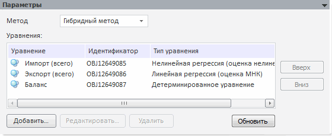

# Параметры системы нелинейных уравнений

Параметры системы нелинейных уравнений
-

# Параметры

На данной панели редактируются основные параметры системы нелинейных
 уравнений.

	- Метод решения системы.
	 В качестве метода решения системы нелинейных уравнений можно выбрать
	 следующие методы:

	-

		- Гибридный метод.
		 Для решения исходной системы используется модификация гибридного
		 алгоритма, реализованного в библиотеке математических методов
		 MINPACK-1.

		- Минимум ошибок.
		 Решается задача нахождения минимума функции с N
		 числом переменных.

		- Метод Ньютона. Решение
		 исходной системы находится путем итераций с нахождением частных
		 производных.

	- Уравнения. Определяется
	 состав входных уравнений (моделей), по которым будут произведены расчеты.
	 Календарные динамики добавляемой модели и системы уравнений должны
	 совпадать.

В системе нелинейных уравнений допускается
 добавление следующих видов уравнений:

	-

		- [Детерминированное
		 уравнение](../../Specification/4_Deterministic_equation/uimodelling_model_specification_deter.htm);

		- [Линейная
		 регрессия (оценка МНК)](../../Specification/8_Linear_regression/uimodelling_model_specification_linaer_reg.htm);

		- [Нелинейная
		 регрессия (оценка нелинейным МНК)](../../Specification/7_Nonlinear_regression/7_nonlinear_regression.htm);

		- [Модель
		 коррекции ошибок](../../Specification/UiModelling_Specification_Error_control.htm).

При добавлении модели, уравнение которой
 недопустимо, будет отображено соответствующее информационное сообщение.

[Для добавления
 модели в систему](javascript:TextPopup(this))

		- перетащите необходимую модель из окна «[Объекты
		 контейнера](../../../../2_2_Window_container/uimodelling_window_object.htm)» в список уравнений;

		- нажмите кнопку «Добавить».
		 Будет открыт диалог, в котором выберите необходимую модель.

[Для редактирования
 выбранных уравнений](javascript:TextPopup(this))

	Нажмите кнопку «Редактировать».
	 Будет открыта отдельная вкладка с редактором для каждой выбранной
	 модели.

[Для удаления
 выбранных уравнений](javascript:TextPopup(this))

	Нажмите кнопку «Удалить».
	 Будет отображен диалог подтверждения выполняемого действия.

[Для обновления
 модели](javascript:TextPopup(this))

	Нажмите кнопку «Обновить».
	 Обновление применяется, если параметры моделей, входящих в систему,
	 были изменены.

[Для изменения
 порядка следования уравнений](javascript:TextPopup(this))

	Используйте кнопки «Вверх»
	 и «Вниз».

См. также:

[Система нелинейных уравнений](../UiModelling_eq_set_Model_20.htm)
 | [Методы
 решения системы нелинейных уравнений](Lib.chm::/04_Other_models/UiModelling_LonLinearEq_method.htm) | [Объект «Модель»](../../UiModelling_Model.htm)

		Справочная
		 система на версию 10.9
		 от 18/08/2025,
		 © ООО «ФОРСАЙТ»,
