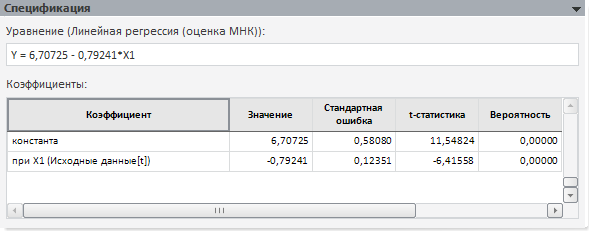

# Спецификация системы нелинейных уравнений

Спецификация системы нелинейных уравнений
-

# Спецификация

На панели отображается информация об уравнении, выделенном на панели
 «[Идентификация
 уравнений системы](UiModelling_Eq_set_20_Ident.htm)». Для детерминированного уравнения панель не отображается.

Панель «Спецификация»:

На данной панели представлены уравнение с оцененными коэффициентами
 и таблица коэффициентов, расположенная ниже.

В таблице коэффициентов, содержатся данные:

	- Коэффициент. Наименование
	 фактора, при котором оценивался коэффициент.

	- Значение. Оцененное
	 значение коэффициента.

	- Стандартная ошибка.
	 Приближённая величина отклонения (вызванного случайностью выборки)
	 оценки коэффициента от истинного значения. Чем больше значение [стандартной
	 ошибки](Lib.chm::/05_Statistics/UiModelling_StdError.htm), тем менее достоверной является оценка коэффициента.

	- t-статистика. Вычисляется
	 как отношение оценки коэффициента к его стандартной ошибке. Используется
	 для проверки нулевой гипотезы о том, что коэффициент равен нулю, то
	 есть не значим в рассматриваемой модели регрессии. Гипотеза проверяется
	 в предположении, что остатки имеют нормальное распределение. Проводить
	 интерпретацию значения [t-статистики](Lib.chm::/05_Statistics/UiModelling_t_stat.htm)
	 легче с помощью значения вероятности, которое приводится рядом.

	- Вероятность. Значение
	 вероятности для t-статистики. Нулевая гипотеза о равенстве нулю оценки
	 коэффициента отклоняется на выбранном уровне значимости (как правило,
	 «0,1», «0,05», «0,01»), если вероятность меньше, чем уровень значимости.

См. также:

[Система нелинейных уравнений](../UiModelling_eq_set_Model_20.htm)
 | [Объект
 «Модель»](../../UiModelling_Model.htm)

		Справочная
		 система на версию 10.9
		 от 18/08/2025,
		 © ООО «ФОРСАЙТ»,
