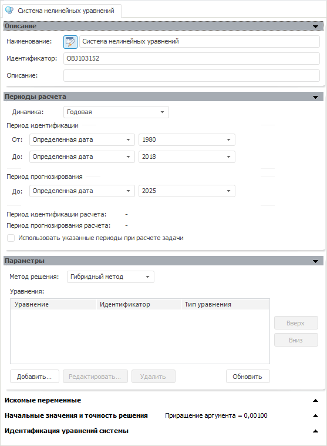

# Система нелинейных уравнений

Система нелинейных уравнений
-

# Система нелинейных уравнений

Модель «Система нелинейных уравнений»
 основывается на подготовленных заранее моделях. С помощью языка Fore возможно
 создать смешанные системы, содержащие внешние модели и внутренние уравнения.
 Такие системы невозможно редактировать в интерфейсе контейнера моделирования.
 При попытке открыть подобную систему будет отображено сообщение: «Система содержит внешние и внутренние
 уравнения и не может быть открыта».

Окно «Система нелинейных уравнений»:

Изначально окно содержит панели:

	- [Описание](../Standart_Model/UiModelling_Model_1.htm).
	 Аналогична одноименной панели в стандартной модели.

	- [Периоды
	 расчета](../Standart_Model/UiModelling_Model_2.htm). Аналогична одноименной панели в стандартной модели.

	- [Параметры](Eq_set_20/UiModelling_Eq_set_20_Param.htm)

	- [Искомые переменные](equations_set_Model_sourceEnv.htm)

	- [Начальные
	 значения и точность решения](Eq_set_20/UiModelling_Eq_set_20_InitVal.htm)

	- [Идентификация
	 уравнений системы](Eq_set_20/UiModelling_Eq_set_20_Ident.htm). На данной панели выбирается уравнение, после
	 чего отображается панель «[Спецификация](Eq_set_20/UiModelling_Eq_set_20_Specification.htm)»
	 и ряд дополнительных панелей.

См. также:

[Объект «Модель»](../UiModelling_Model.htm)
 | [Методы
 решения системы нелинейных уравнений](Lib.chm::/04_Other_models/UiModelling_LonLinearEq_method.htm)

		Справочная
		 система на версию 10.9
		 от 18/08/2025,
		 © ООО «ФОРСАЙТ»,
