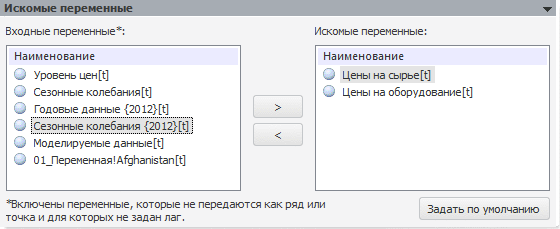

# Искомые переменные

Искомые переменные
-

# Искомые переменные

В данной панели определяются переменные, которые должны быть рассчитаны системой нелинейных уравнений.

Список «Входные переменные» содержит переменные, которые входят в [модели](Eq_set_20/UiModelling_Eq_set_20_Param.htm), составляющие систему.

Из входных переменных сформируйте список «Искомые переменные» с переменными, которые должны быть рассчитаны системой нелинейных уравнений.

Примечание. Количество искомых переменных должно совпадать с количеством уравнений в системе.

[Для перемещения переменных между списками](javascript:textpopup(this))

-
нажмите кнопку «Задать по умолчанию». Все переменные из списка «Входные переменные» будут перемещены в список «Искомые переменные»;

-
используйте кнопки  и ;

-
перетащите переменную в требуемый список;

-
дважды щёлкните по переменной.

См. также:

[Модель «Система нелинейных уравнений»](UiModelling_eq_set_Model_20.htm) | [Объект «Модель»](../UiModelling_Model.htm)

		Справочная
		 система на версию 10.9
		 от 18/08/2025,
		 © ООО «ФОРСАЙТ»,
