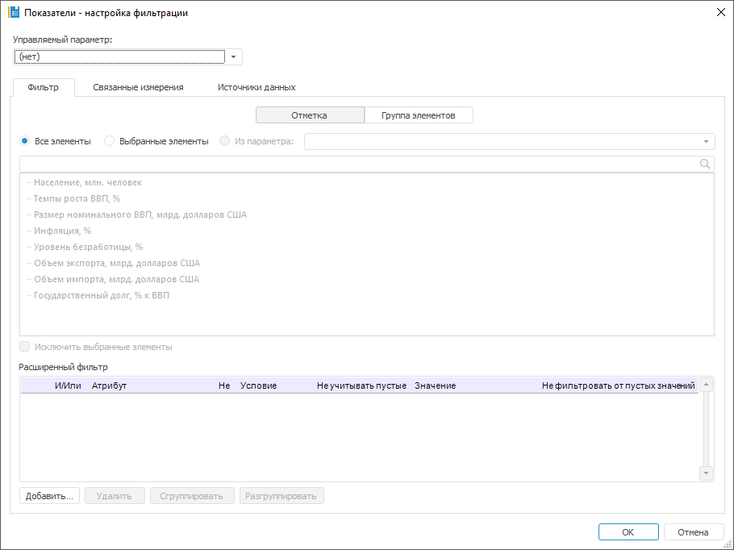
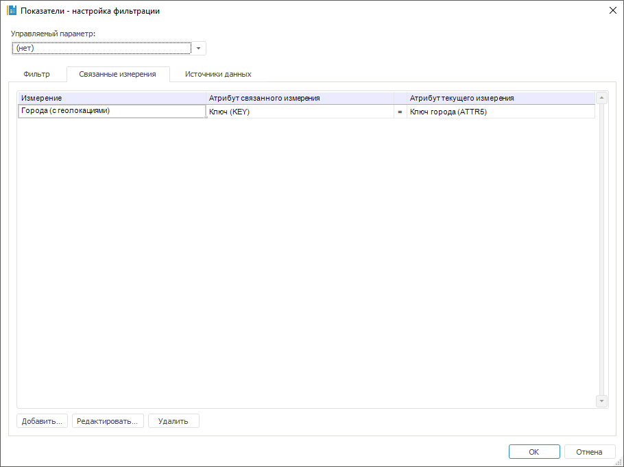
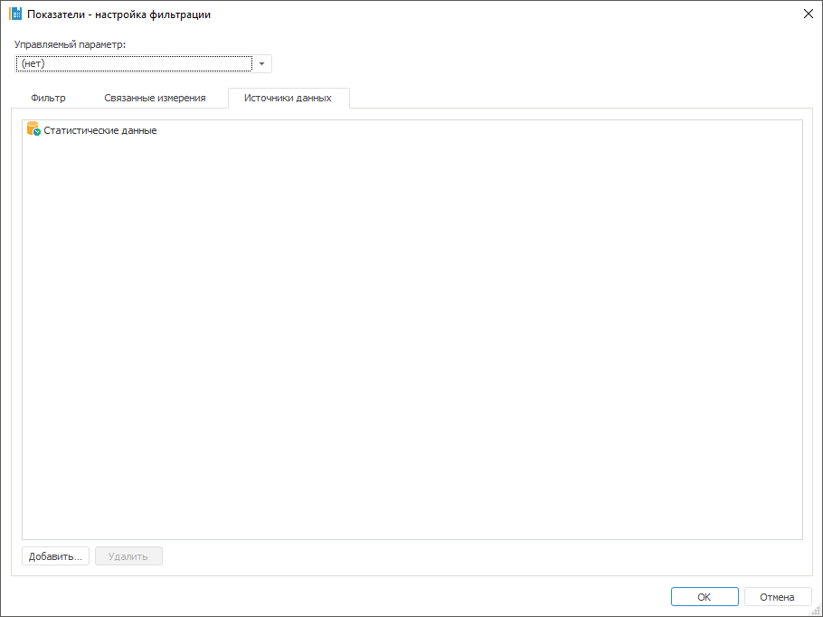

# Настройка измерений многомерного цикла: моделирование и прогнозирование (настольное приложение)

Настройка измерений многомерного цикла: моделирование и прогнозирование (настольное приложение)
-

# Настройка измерений многомерного цикла

Настройка измерений многомерного цикла выполняется в диалоге «Настройка фильтрации».

[Для отображения
 диалога](javascript:TextPopup(this))

		- Откройте диалог для настройки [многомерного
		 цикла](MultiDimIterator.htm).

		- Убедитесь, что в таблице «Набор
		 измерений для цикла» присутствуют одно или несколько измерений.

		- Выделите измерение, которое требуется настроить.

		- Нажмите кнопку «Редактировать»
		 или дважды щёлкните по выделенному измерению.

Выполните следующие настройки:

	- Если необходимо, задайте управляемый параметр. В раскрывающемся
	 списке «Управляемый параметр»
	 выберите один из параметров метамодели. Выбранный параметр будет управлять
	 данным измерением при расчёте многомерного цикла.

Примечание.
 Задание управляемого параметра обязательно только для расчёта метамодели
 в [задаче прогнозирования](../2_3_4_Problem/uimodelling_problem_2.htm).

	- Выберите элементы измерения, по которым будет рассчитываться
	 многомерный цикл. Используйте вкладку «[Фильтр](#filter)».

	- Настройте связанные измерения. Шаг необходим, если измерение
	 содержит [связанные
	 атрибуты](UiNavObj.chm::/reference_book/Master_RDS_reference_book/Link.htm). Используйте вкладку «[Связанные измерения](#linkeddims)».

	- Укажите источники данных для измерения многомерного цикла. Используйте
	 вкладку «[Источники
	 данных](#ds)».

## Выбор элементов измерения для расчёта многомерного
 цикла

Для выбора элементов измерения, по которым будет рассчитываться многомерный
 цикл, используйте вкладку «Фильтр».

	- Выберите по каким сущностям будет настроен фильтр:

		- по заданной отметке элементов.
		 Установите переключатель «Отметка».
		 На вкладке будет отображён список всех элементов измерения;

		- по выбранной группе элементов.
		 Установите переключатель «Группа
		 элементов». На вкладке будет отображён список всех групп
		 элементов измерения.

	- Выберите элементы, по которым будет рассчитываться цикл. Установите
	 один из переключателей:

		- Все элементы. Расчёт
		 многомерного цикла будет идти по всем элементам измерения. Способ
		 доступен, если фильтр настроен по отметке элементов;

		- Выбранные элементы.
		 Расчёт многомерного цикла будет идти по элементам измерения, выбранным
		 на данной вкладке. Способ доступен, если фильтр настроен по отметке
		 элементов;

		- Выбрать группу.
		 Расчёт многомерного цикла будет идти по группе элементов, выбранной
		 на данной вкладке. Способ доступен, если фильтр настроен по группе
		 элементов;

		- Из параметра. Расчёт
		 многомерного цикла будет идти по элементам, заданным [параметром](Metamodel_params.htm).
		 Способ доступен и для отметки, и для группы элементов.

Если требуется, чтобы цикл рассчитывался
 по всем элементам, кроме отмеченных, то установите флажок «Исключить
 выбранные элементы».

	- Для задания условий, которым должны соответствовать атрибуты
	 элементов, при выполнении расчёта многомерного цикла, используйте
	 группу параметров «Расширенный фильтр».
	 Работа с данной группой параметров аналогична работе с диалогом «[Расширенный
	 фильтр](uinav.chm::/GUI/UFE/AttributeFiltering.htm)».

В результате многомерный цикл будет рассчитываться только по элементам,
 соответствующих фильтру.

## Настройка связанных измерений

Настройка связанных измерений позволяет корректно рассчитывать многомерный
 цикл и необходима, если измерение содержит [связанные
 атрибуты](UiNavObj.chm::/reference_book/Master_RDS_reference_book/Link.htm). Для настройки связанных измерений используйте
 вкладку «Связанные измерения»:

Связь необходимо добавить для каждого связанного атрибута в текущем
 измерении.

Для добавления новой связи:

	- Нажмите кнопку «Добавить».

	- В отобразившемся диалоге выберите связанное измерение. В таблицу
	 будет добавлена строка для выбранного измерения.

	- В столбце «Атрибут связанного
	 измерения» выберите связанный атрибут из добавленного измерения.

	- В столбце «Атрибут текущего
	 измерения» выберите связанный атрибут из текущего измерения.

В результате будет настроена связь измерений по указанным атрибутам.

Для настройки связанного измерения выделите его в таблице и нажмите
 кнопку «Редактировать». Будет
 отображён диалог «Настройка фильтрации»,
 в котором задайте требуемые настройки измерения.

Для удаления выделенной связи измерения нажмите кнопку «Удалить».

## Указание источников данных для измерения многомерного
 цикла

Для корректного расчёта для каждого измерения многомерного цикла должен
 быть указан источник. Для этого используйте вкладку «Источники
 данных»:

Для добавления источника данных измерения нажмите кнопку «Добавить».
 В отобразившемся диалоге выберите требуемый источник данных. Добавьте
 все источники, используемые в цепочке расчёта для данного измерения.

Для удаления выбранного источника данных нажмите кнопку «Удалить».

См. также:

[Настройка многомерного цикла](MultiDimIterator.htm)

		Справочная
		 система на версию 10.9
		 от 18/08/2025,
		 © ООО «ФОРСАЙТ»,
