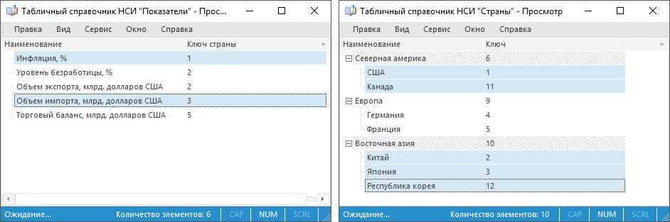
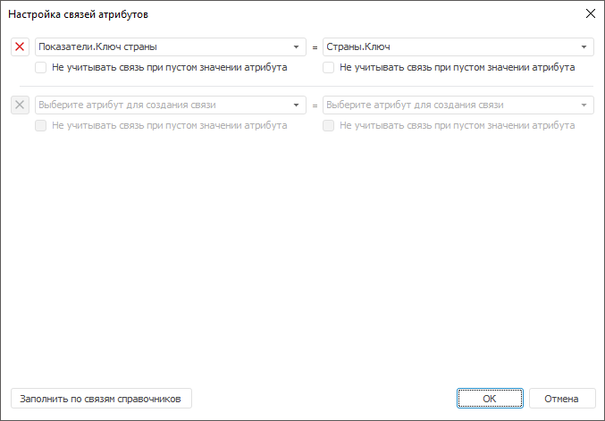

# Настройка фильтрации по связям атрибутов

Настройка фильтрации по связям атрибутов
-

# Настройка фильтрации по связям атрибутов

Фильтрация уменьшает количество элементов, по которым выполняется расчёт,
 на основе связей атрибутов.

Например, есть два измерения: «Показатели» и «Страны». Измерения содержат
 следующие элементы и в них задана следующая отметка:

Для атрибута «Ключ страны» в измерении «Показатели» добавлена связь
 с атрибутом «Ключ» в измерении «Страны». В результате в измерении «Страны»
 расчёт будет выполняться только по элементам «США» и «Япония». Если не
 добавить связь, то в измерении «Страны» расчёт будет выполняться по всем
 отмеченным элементам.

Для добавления связей используйте диалог «Настройка
 связей атрибутов».

[Для отображения
 диалога](javascript:TextPopup(this))

		- Откройте диалог для настройки [многомерного
		 цикла](MultiDimIterator.htm).

		- Убедитесь, что в таблице «Набор
		 измерений для цикла» присутствуют два или более измерения.

		- Нажмите кнопку «Связи атрибутов».

В раскрывающихся списках содержатся атрибуты, сгруппированные по измерениям.

Порядок добавления связи:

	- В левом раскрывающемся списке выберите атрибут из измерения,
	 на основе отметки которого будет выполняться фильтрация.

	- В правом раскрывающемся списке выберите атрибут из связываемого
	 измерения. Именно в этом измерении будет выполнятся фильтрация.

	- Для исключения из расчёта связей с пустыми значениями атрибутов
	 установите флажок «Не учитывать связь
	 при пустом значении атрибута» под соответствующим атрибутом.
	 В результате, если атрибут содержит пустое значение, то связь в расчёте
	 не участвует. Если не исключить данную связь, то при расчёте возникнет
	 ошибка.

[Пример
 фильтрации, не учитывающей связь при пустом значении атрибута](javascript:TextPopup(this))

	Например, есть два измерения: «Показатели»
	 и «Страны». Измерения содержат следующие элементы и в них задана следующая
	 отметка:

	

	Для атрибута «Ключ страны» в измерении
	 «Показатели» добавлена связь с атрибутом «Ключ» в измерении «Страны».
	 Для атрибута «Ключ страны» в измерении «Показатели» установлен
	 флажок «Не учитывать связь при пустом
	 значении атрибута». В результате в измерении «Показатели» расчёт
	 будет выполняться только по элементам «Инфляция, %» и «Объем импорта,
	 млрд. долларов США», а в измерении «Страны» по элементам «США» и «Япония».

Совет. Для автоматического
 добавления связей на основе информации, заданной в справочниках, на которых
 строятся измерения, нажмите кнопку «Заполнить
 по связям справочников». Возможность доступна только для измерений,
 основанных на справочниках НСИ, которые связаны между собой по [атрибутам](UiNavObj.chm::/reference_book/Master_RDS_reference_book/Link.htm).

Можно добавить одну или несколько связей. В результате будет настроена
 фильтрация по связям атрибутов.

Для удаления связи нажмите кнопку , расположенную
 рядом с ней.

См. также:

[Настройка многомерного цикла](MultiDimIterator.htm)

		Справочная
		 система на версию 10.9
		 от 18/08/2025,
		 © ООО «ФОРСАЙТ»,
