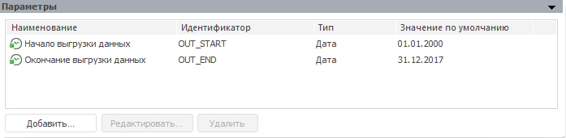
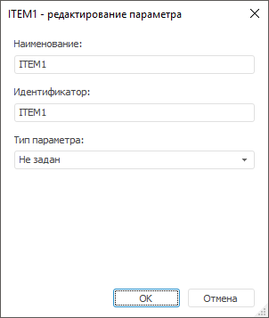
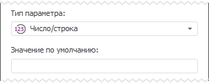
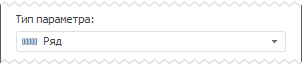
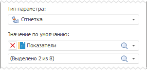
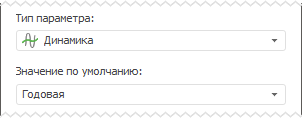
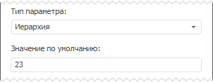

# Параметры метамодели: настольное приложение

Параметры метамодели: настольное приложение
-

# Параметры

Параметры позволяют управлять расчетом метамодели. Также их можно использовать
 в [формулах
 расчета факторов](../2_3_2_Model/Standart_Model/UiModelling_Model_Factor_work.htm#formula), в формулах расчета моделей, при задании параметров
 расширенной фильтрации измерений и т.д.

Совет. Для изменения
 значения параметров конкретной модели используйте панель «[Просмотр результатов](../2_3_2_Model/Standart_Model/uimodelling_model_view.htm)». Значения параметров,
 заданные на данной панели, не сохраняются. Они предназначены для [расчета
 модели](../2_3_2_Model/UiModelling_Model.htm#calc) без расчета всей цепочки метамодели.

Для задания параметров метамодели используйте панель «Параметры»:

Для добавления параметра нажмите кнопку «Добавить»,
 для редактирования выбранного параметра - кнопку «Редактировать»
 или используйте одноименные команды в контекстном меню панели. Будет открыт
 диалог «Редактирование параметра»,
 в котором задайте требуемые настройки параметра.

Для удаления выбранного параметра нажмите кнопку «Удалить»
 или используйте одноименную команду в контекстном меню панели.

Примечание.
 После удаления параметра из метамодели удалите его из всех мест, где он
 использовался. Например, из формул расчета факторов и т.д.

## Редактирование параметра

По умолчанию параметр создается без указания типа. Достаточно указать
 наименование и идентификатор параметра в соответствующих полях:

После выбора типа параметра будет отображено дополнительное поле для
 задания значения параметра по умолчанию.

Ниже приведены доступные типы параметров и особенности их использования
 в формулах:

[Число/строка](javascript:TextPopup(this))

	

	Значение по умолчанию определяет тип данных параметра. Например,
	 если указано какое-либо число, по параметр будет числовым, а если
	 строка - то строковым.

	Использование

	Для использования параметра в формулах расчета модели или фактора
	 укажите наименование параметра в фигурных скобках и добавьте операцию
	 приведения к требуемому типу данных:

		- целочисленное число.
		 as integer;

		- вещественное число.
		 as double;

		- строка. as string.

	Пример

	Например, есть параметр с наименованием «Корректировка»
	 и значением по умолчанию «0,69» и есть модель, входящая в цепочку
	 расчета метамодели, содержащей данный параметр. В модели есть фактор
	 «Население, млн. человек|Анкоридж».
	 Пример формулы для данного фактора с применением параметра:

	{Население, млн. человек|Анкоридж[t]} + ({Корректировка}
	 as double)

	В результате значение фактора в каждой точке будет увеличено на
	 значение параметра.

[Ряд](javascript:TextPopup(this))

	

	В качестве значения параметра используется ряд данных. Значение
	 по умолчанию отсутствует.

	Использование

	В формулах расчета модели или фактора использовать параметр
	 данного типа допускается, если операция или метод предусматривает
	 наличие одного или нескольких рядов данных, например, операции сравнения
	 или методы нахождения наибольших, наименьших значений и тому подобные.

	Пример

	Например, есть параметр с наименованием «Средние
	 значения» и есть модель, входящая в цепочку расчета метамодели,
	 содержащей данный параметр. В модели есть фактор «Население,
	 млн. человек|Анкоридж». Пример формулы для данного фактора
	 с применением параметра:

	Max({Население, млн. человек|Анкоридж[t]},{Средние
	 значения})

	В результате каждая точка фактора будет содержать максимальное значение
	 из соответствующих точек ряда «Население,
	 млн. человек|Анкоридж» и из ряда, переданного в параметре.

[Дата](javascript:TextPopup(this))

	

	В качестве значения параметра используется конкретная дата.

	Использование

	В формулах расчета модели или фактора использовать параметр
	 данного типа допускается, если операция или метод предусматривает
	 наличие одной или нескольких дат, например, метод, формирующий период,
	 и тому подобные.

	Пример

	Например, есть параметры с наименованиями «Дата
	 начала», «Дата окончания»
	 и есть модель, входящая в цепочку расчета метамодели, содержащей данный
	 параметр. В модели есть фактор «Население,
	 млн. человек|Анкоридж». Пример формулы для модели с применением
	 параметра:

	Max({Население, млн. человек|Анкоридж[t]},SetPeriod({Дата
	 начала},{Дата окончания}))

	В результате модель будет содержать максимальное значение на периоде,
	 заданном параметрами «Дата начала»
	 и «Дата окончания».

[Период](javascript:TextPopup(this))

	

	В качестве значения параметра используется период между двумя конкретными
	 датами.

	Использование

	В формулах расчета модели или фактора использовать параметр
	 данного типа допускается, если операция или метод предусматривает
	 наличие периода, например, прогнозные методы и тому подобные.

	Пример

	Например, есть параметр с наименованием «Период
	 расчета» и есть модель, входящая в цепочку расчета метамодели,
	 содержащей данный параметр. В модели есть фактор «Население,
	 млн. человек|Анкоридж». Пример формулы для модели с применением
	 параметра:

	arima({Население, млн. человек|Анкоридж[t]},
	 {Период расчета}, "1", "", 0, estimate)

	В результате модель будет рассчитывать метод «Arima»
	 на периоде, заданном параметром.

[Отметка](javascript:TextPopup(this))

	

	В качестве значения параметра используется отметка заданного справочника.

	Использование

	Параметр данного типа можно использовать для задания значений атрибутов
	 моделируемой и исходной переменных [модели](../2_3_2_Model/Standart_Model/UiModelling_Panel_Param_Attr.htm)
	 или значений атрибутов [переменных](../2_3_2_Model/Specification/UiModelling_Atributes_fix.htm).

	В формулах расчета модели или фактора использовать параметр
	 данного типа допускается, если параметр задает значение одного из
	 атрибутов фактора в следующем формате: {[<Название
	 атрибута фактора>]|{<Название
	 параметра>}|[<Название
	 атрибута фактора>]}. Например:

	{{Показатель}|Анкоридж}

	{Анкоридж|{Показатель}|A]}

	Допускается также использование отметки по выбранному атрибуту.
	 Для этого в формуле расчета фактора или модели укажите название атрибута
	 в следующем формате: {<Название
	 параметра>.<Название атрибута>}. Например:

	{Страна.Партнер}

	Также допускается использование атрибутов из связанных справочников
	 в следующем формате: {<Название
	 параметра>.<Название атрибута связанного справочника>. … .<Название
	 атрибута связанного справочника>}. Например:

	{Страна.Партнер.Наименование}

	В формулах расчета модели или фактора использовать параметр
	 данного типа допускается, если операция или метод предусматривает
	 наличие ряда, например, прогнозные методы и тому подобные.

	Пример

	Например, есть параметр с наименованием «Показатель»
	 и есть модель, входящая в цепочку расчета метамодели, содержащей данный
	 параметр. В качестве источника данных для факторов модели используется
	 база данных временных рядов, один из атрибутов которой основан на
	 справочнике, указанном в значении по умолчанию для параметра «Показатель».

	arima({{Показатель}|Анкоридж[t]}, SetPeriod("2001",
	 "2016"), "1", "", 0, estimate)

	В результате модель будет рассчитывать метод «Arima»
	 на моделируемой переменной, один из атрибутов которой задан параметром.

[Динамика](javascript:TextPopup(this))

	

	В качестве значения параметра используется указанная динамика.

	Использование

	В формулах расчета модели или фактора использовать параметр
	 данного типа допускается, если операция или метод предусматривает
	 задание динамики расчета, например, методы агрегации и тому подобные.

	Пример

	Например, есть параметр с наименованием «Динамика»
	 и есть модель, входящая в цепочку расчета метамодели, содержащей данный
	 параметр. В модели есть фактор «Население,
	 млн. человек|Анкоридж». Пример формулы для модели с применением
	 параметра:

	collapse({Население, млн. человек|Анкоридж[t]},
	 MsCollapseType.Average, {Динамика})

	В результате модель будет рассчитывать метод «Collapse»
	 на динамике, заданной параметром.

[Иерархия](javascript:TextPopup(this))

	

	В качестве значения параметра используется ключ альтернативной иерархии.

	Использование

	В [модели
	 матричной агрегации](../2_3_2_Model/MatrixAggregation/MatrixAggregation.htm) при [настройке
	 фильтрации измерений](../2_3_2_Model/MatrixAggregation/MatrixAggregationParams.htm#filtersetup).

	В результате расчёт матричной агрегации будет идти по элементам
	 альтернативной иерархии с указанным ключом.

См. также:

[Метамодель](uimodelling_metamodel.htm)

		Справочная
		 система на версию 10.9
		 от 18/08/2025,
		 © ООО «ФОРСАЙТ»,
