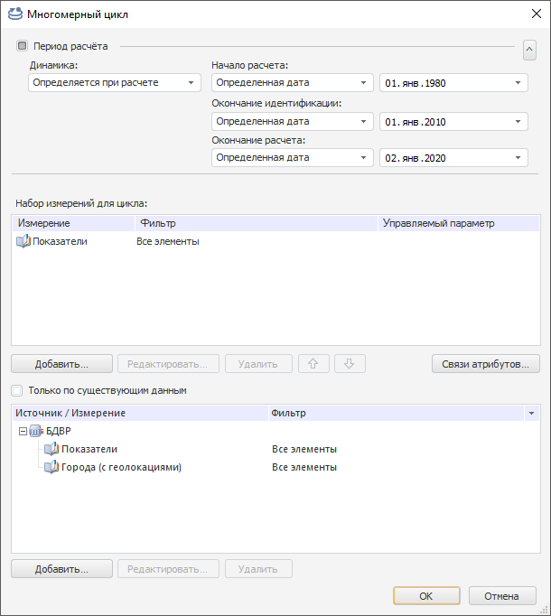

# Настройка многомерного цикла

Настройка многомерного цикла
-

# Настройка многомерного цикла

Многомерный цикл используется для расчёта моделей по всем элементам
 одного или нескольких измерений источника данных. Для настройки многомерного
 цикла используйте одноименный диалог.

Примечание.
 Если измерения входят в многомерный цикл, то они скрываются из всех цепочек
 навигации внутренних моделей, рассчитываемых данным циклом. Для управления
 отметкой по данным измерениям используйте панель «[Просмотр
 результатов](../2_3_2_Model/Standart_Model/uimodelling_model_view.htm)».

[Для отображения
 диалога](javascript:TextPopup(this))

	[Добавьте](uimodelling_metamodel_2.htm#addmultidimiterator)
	 новый многомерный цикл или откройте существующий на [редактирование](uimodelling_metamodel_2.htm).

Для настройки многомерного цикла:

	- Задайте
	 период расчёта. По умолчанию период расчёта многомерного цикла
	 отличается от периода расчёта задачи моделирования, рассчитывающей
	 метамодель. Настройка параметров расчёта многомерного цикла совпадают
	 с настройкой [параметров
	 расчёта](../2_3_2_Model/Standart_Model/UiModelling_Model_2.htm) модели.

	Для того чтобы период расчёта многомерного цикла совпадал с периодом
	 расчёта задачи моделирования, рассчитывающей метамодель, снимите флажок
	 «Период расчёта».

	- Задайте
	 набор измерений для цикла. Для этого:

		- Нажмите кнопку «Добавить»,
		 расположенную в группе параметров «Набор
		 измерений для цикла». Будет открыт диалог для выбора справочника,
		 на котором построено измерение.

		- Выберите требуемый справочник. Учтите, что выбранный справочник
		 должен использоваться источником данных моделей, рассчитываемых
		 в многомерном цикле.

Измерение будет добавлено в расчёт многомерного
 цикла.

Для удаления измерения из расчёта цикла выберите требуемое измерение и
 нажмите кнопку «Удалить».

Для изменения порядка следования измерений в цикле используйте кнопки , .

	- Настройте измерения для цикла.
	 Настройка измерений выполняется в диалоге «[Настройка фильтрации](AdvDimFilter.htm)». Для его
	 открытия выберите требуемое измерение и нажмите кнопку «Редактировать».
	 В данном диалоге задайте следующие настройки для выбранного измерения
	 цикла:

		- Выберите элементы измерения, по которым будет рассчитываться
		 многомерный цикл. Используйте вкладку «[Фильтр](AdvDimFilter.htm#filter)».

		- Настройте связанные измерения. Шаг необходим, если измерение
		 содержит [связанные
		 атрибуты](UiNavObj.chm::/reference_book/Master_RDS_reference_book/Link.htm). Используйте вкладку «[Связанные измерения](AdvDimFilter.htm#linkeddims)».

		- Укажите источники данных для измерения цикла. Используйте
		 вкладку «[Источники
		 данных](AdvDimFilter.htm#ds)».

	- Настройте
	 фильтрацию по связям атрибутов для измерений цикла. Необязательный
	 шаг. Фильтрация уменьшает количество элементов, по которым выполняется
	 расчёт, на основе связей атрибутов. Для применения данного вида фильтрации
	 нажмите кнопку «Связи атрибутов».
	 Будет отображен диалог «[Фильтрация
	 по связям атрибутов](AttrLinksDimFilter.htm)», в котором задайте требуемые настройки.

	- Задайте
	 данные для расчёта. Необязательный шаг. По умолчанию многомерный
	 цикл рассчитывается по всем возможным точкам данных. Если задана большая
	 отметка в измерениях, то это может привести к замедлению расчета цикла.
	 Для оптимизации расчёт можно выполнять только по существующим точкам
	 данных. Для этого:

		- Установите флажок «Только
		 по существующим данным».

		- Добавьте источники данных, содержащие измерения, по которым
		 выполняется расчёт. Нажмите кнопку «Добавить»,
		 расположенную ниже флажка «Только
		 по существующим данным». Будет открыт диалог для выбора
		 источников данных.

		Важно, чтобы для каждого измерения был добавлен соответствующий
		 источник данных, иначе расчёт только по существующим данным невозможен.

		- Если требуется, то настройте фильтрацию измерений в добавленных
		 источниках. Для этого выберите требуемое измерение источника данных
		 и нажмите кнопку «Редактировать».
		 Будет отображен диалог «[Настройка
		 фильтрации](AdvDimFilter.htm)», содержащий только вкладку «[Фильтр](AdvDimFilter.htm#filter)», на которой
		 задайте требуемые настройки.

В результате будет настроен расчёт многомерного цикла.

См. также:

[Метамодель](uimodelling_metamodel.htm)

		Справочная
		 система на версию 10.9
		 от 18/08/2025,
		 © ООО «ФОРСАЙТ»,
