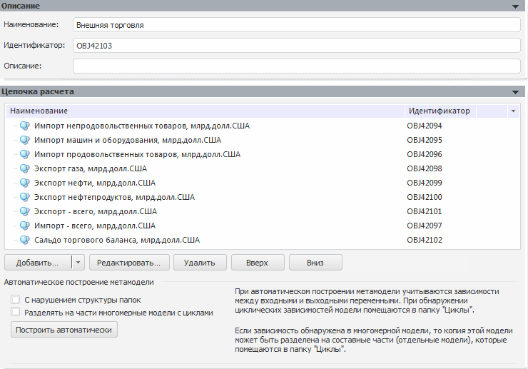

# Метамодель

Метамодель
-

# Метамодель

Метамодель - объект, объединяющий модели в последовательность, предназначенную
 для расчета с помощью задачи моделирования. Метамодель содержит иерархию
 элементов - моделей и папок. Папки необходимы для логического объединения
 групп моделей и удобного отображения последовательности.

Для создания метамодели:

	- нажмите кнопку  на панели «[Объекты
	 контейнера](../../2_2_Window_container/uimodelling_window_object.htm)»;

	- выполните команду «Объект >
	 Создать > Метамодель» в главном меню;

	- выполните команду «Создать
	 > Метамодель» в контекстном меню панели «[Объекты
	 контейнера](../../2_2_Window_container/uimodelling_window_object.htm)».

В рабочей области будут открыты панели для редактирования параметров
 метамодели:

	- [Описание](../2_3_1_Value/uimodelling_work_object_value_1.htm). Аналогична одноименной
	 панели объекта «[Переменная](../2_3_1_Value/uimodelling_work_object_value.htm)»;

	- [Параметры](Metamodel_params.htm);

	- [Цепочка
	 расчета](uimodelling_metamodel_2.htm).

См. также:

[Объект «Переменная»](../2_3_1_Value/uimodelling_work_object_value.htm)
 | [Объект
 «Модель»](../2_3_2_Model/UiModelling_Model.htm) | [Объект «Задача»](../2_3_4_Problem/uimodelling_problem.htm)

		Справочная
		 система на версию 10.9
		 от 18/08/2025,
		 © ООО «ФОРСАЙТ»,
