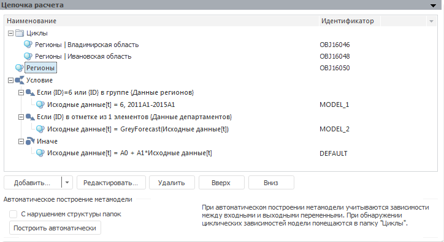

# Цепочка расчета

Цепочка расчета
-

# Цепочка расчета

Цепочка расчета предназначена для организации порядка расчета моделей:

Панель содержит список элементов цепочки, выстроенных в порядке расчета.
 Каждому элементу соответствует определенная пиктограмма. Цепочка может
 содержать:

	- 
	 [модели](../2_3_2_Model/UiModelling_Model.htm);

	- 
	 [внутренние
	 модели](../2_3_2_Model/Standart_Model/Internal_Model.htm). Модели, существующие и доступные для использования
	 только внутри метамодели;

	- 
	 [метамодели](uimodelling_metamodel.htm);

	- 
	 папки. Используются для упорядочивания
	 элементов цепочки;

	- 
	 условия. Используются для
	 расчета определенных моделей только при выполнении заданного условия.
	 Условие состоит из:

		- 
		 веток с условиями. Ветка рассчитывается, если условие выполняется;

		- 
		 ветки, которая будет рассчитана, если ни одна из веток с условием
		 не была рассчитана;

Примечание.
 С помощью интерфейса доступно только переименование и удаление условий.
 Создание и изменение условий доступно с помощью языка [Fore](KeMs.chm::/Interface/IMsCalculationChainBranch/IMsCalculationChainBranch.htm).

	- 
	 циклы. Используются для расчета
	 моделей до тех пор, пока выполняется заданное условие.

Примечание.
 Создание циклов доступно только с помощью языка [Fore](KeMs.chm::/Interface/IMsCalculationChainIterator/IMsCalculationChainIterator.htm).

	-  [многомерные
	 циклы](MultiDimIterator.htm). Используется для расчета моделей по всем элементам
	 одного или нескольких измерений источника данных.

## Операции с цепочкой расчета

[Добавление
 папки](javascript:TextPopup(this))

	Для добавления папки:

		- выполните команду «Папка»
		 в раскрывающемся меню кнопки «Добавить»;

		- выполните команду «Создать
		 папку» в контекстном меню цепочки расчета.

	Папка будет добавлена в цепочку расчета после выделенного элемента.

	Примечание.
	 Папку нельзя добавить в условие.

[Добавление
 модели/метамодели](javascript:TextPopup(this))

	Для добавления модели/метамодели:

		- перетащите модель/метамодель из панели «[Объекты
		 контейнера](../../2_2_Window_container/uimodelling_window_object.htm)»;

		- нажмите кнопку «Добавить»;

		- выполните команду «Добавить» в
		 контекстном меню цепочки расчета;

		- дважды щелкните по пустой области списка элементов цепочки
		 расчета.

	Модель будет добавлена в цепочку расчета после выделенного элемента.

	Примечание.
	 Модель/метамодель нельзя добавить в условие.

[Добавление
 внутренней модели](javascript:TextPopup(this))

	Для добавления внутренней модели выполните команду «Внутренняя
	 модель» в раскрывающемся меню кнопки «Добавить».

	[Внутренняя
	 модель](../2_3_2_Model/Standart_Model/Internal_Model.htm) будет добавлена в цепочку расчета после выделенного элемента
	 и сразу открыта для редактирования.

	Примечание.
	 Внутреннюю модель нельзя добавить в условие.

[Добавление
 многомерного цикла](javascript:TextPopup(this))

	Для добавление многомерного цикла:

		- выполните команду «Многомерный
		 цикл» в раскрывающемся меню кнопки «Добавить»;

		- выполните команду «Добавить > Многомерный
		 цикл» в контекстном меню панели.

	Будет открыт диалог «[Многомерный
	 цикл](MultiDimIterator.htm)» в котором задайте параметры цикла. После этого цикл
	 будет добавлен в цепочку расчета после выделенного элемента.

[Редактирование
 элемента цепочки](javascript:TextPopup(this))

	Для редактирования выделенного элемента цепочки:

		- нажмите кнопку «Редактировать»;

		- выполните команду «Редактировать»
		 в контекстном меню элемента;

		- дважды щёлкните по элементу.

	Выбранный элемент будет открыт для редактирования.

	Примечание.
	 Возможность доступна только для моделей, внутренних моделей, метамоделей,
	 многомерных циклов.

[Удаление
 выбранных элементов цепочки](javascript:TextPopup(this))

	Для удаления элемента из цепочки расчета нажмите кнопку «Удалить»
	 или выполните одноименную команду в контекстном меню элемента.

	Будет запрошено подтверждение выполняемого действия. Удаление объекта
	 производится вместе с его дочерними элементами.

	Примечание.
	 Условие может быть удалено только целиком. Удаление отдельных веток
	 условия недоступно.

[Изменения
 последовательности элементов](javascript:TextPopup(this))

	Для изменения последовательности элементов:

		- используйте кнопки «Вверх»
		 и «Вниз»;

		- используйте команды в контекстном меню элемента цепочки
		 расчета: «Вверх», «Вниз», «На
		 уровень вверх»;

		- перетащите элемент в требуемую позицию.

	Примечание.
	 Возможность недоступна для веток условия.

[Переименование
 элемента цепочки](javascript:TextPopup(this))

	Для переименования элемента цепочки:

		- Выделите требуемый элемент.

		- Выполните команду «Редактировать»
		 в контекстном меню элемента или щёлкните по нему. Наименование элемента будет переведено в режим редактирования.

		- Введите требуемое наименование элемента.

		- Нажмите клавишу ENTER или щёлкните по свободному пространству в цепочке расчета.

	Элемент будет переименован.

	Примечание.
	 Возможность доступна для папок, условий, веток условий, циклов.

## Автоматическое построение цепочки

Автоматическое построение позволяет определить зависимости между моделями
 и построить согласно этим зависимостям цепочку расчета. Метамодели, входящие
 в цепочку расчета, при автопостроении игнорируются.

Принципы автоматического построения цепочки:

	- объясняемые переменные моделей представляют множество Y;

	- в число факторов всех моделей входят:

	-

		- переменные из множества Y;

		- переменные из множества Y,
		 но с лагами - множество Y1;

		- переменные, для которых нет уравнений - множество X;

	- переменные в цепочку включаются в следующем порядке: X,
	 Y1, Y2.
	 Модели Y2 зависят только
	 от X и от Y1;

	- затем формируется множество Y3,
	 содержащее модели, которые можно рассчитать на основе X,
	 Y1, Y2.
	 Полученное множество будет включено в цепочку и т.д.;

	- если в цепочке присутствуют модели, содержащие переменные, зависящие
	 сами от себя, то такие модели будут размещены в отдельную папку «Циклы».

Группа «Автоматическое построение метамодели»
 предназначена для редактирования параметров автопостроения:

	- С нарушением структуры папок.
	 По умолчанию флажок снят и автопостроение выполняется по отдельности
	 для каждой папки, входящей в цепочку. Если флажок установлен, то все
	 модели из всех дочерних папок извлекаются на уровень, для которого
	 производится автопостроение, а папки удаляются. Таким образом, автопостроение
	 выполняется без учета папок;

	- Разделять на части многомерные
	 модели с циклами. По умолчанию флажок снят и многомерные модели,
	 содержащие внутренние циклы, будут помещены без изменений в папку
	 «Циклы». Если флажок установлен
	 и в цепочке расчета присутствует многомерная модель, содержащая внутренние
	 циклы, или если хотя бы одно из её уравнений образует цикл с другой
	 моделью, входящей в цепочку, то многомерная модель разбивается на
	 модели, соответствующие измерениям, для которых задан метод расчета.
	 Оставшиеся уравнения, которые не образуют циклов, помещаются в другую
	 многомерную модель. Если циклы разрешаются путём изменения порядка
	 уравнений в многомерной модели, то создается копия модели с нужным
	 порядком. Все созданные модели будут выстроены в порядке зависимости.
	 Модели, образующие циклы, будут помещены в папку «Циклы».
	 Исходные многомерные модели изменены не будут, созданные модели будут
	 иметь наименование, соответствующее исходной многомерной модели, и
	 помещены в папку рядом с ней. Наименование папки формируется следующим
	 образом: <Наименование исходной
	 модели>(<дата и время создания папки>).

Примечание.
 Разделение многомерной модели с циклами доступно, если моделирование и
 прогнозирование запущено в [режиме
 на переменных](../../../1_Modelling/Start_Modelling.htm).

Для автоматического построения цепочки по заданным параметрам нажмите
 кнопку «Построить автоматически».

Примечание.
 Если команда «Построить автоматически»
 была выполнена в контекстном меню папки, то автопостроение будет выполнено
 только для элементов в данной папке.

См. также:

[Объект «Метамодель»](uimodelling_metamodel.htm)

		Справочная
		 система на версию 10.9
		 от 18/08/2025,
		 © ООО «ФОРСАЙТ»,
