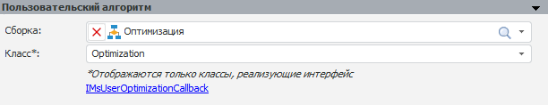

# Пользовательский алгоритм

Пользовательский алгоритм
-

# Пользовательский алгоритм

Для определения пользовательского алгоритма, по которому будет рассчитываться
 [пользовательская задача оптимизации](uimodelling_problem_2.htm),
 используйте панель «Пользовательский
 алгоритм»:

Задайте параметры:

	- Сборка.
	 В раскрывающемся списке выберите сборку/форму/модуль, содержащую
	 реализацию пользовательского алгоритма. После выбора сборки будет
	 автоматически выполнен поиск классов, которые могут использоваться
	 для расчёта;

	- Класс.
	 В раскрывающемся списке выберите класс, реализующий интерфейс
	 [IMsUserOptimizationCallback](KeMs.chm::/Interface/IMsUserOptimizationCallback/IMsUserOptimizationCallback.htm),
	 для выполнения расчёта пользовательской задачи оптимизации.

Совет. Внутри пользовательского
 класса может быть реализована интеграция с различными оптимизационными
 пакетами, например, [LPSolve](UiNav.chm::/02_Navigator/CommonSettings/Integration.htm#lpsolve),
 для расширения возможностей продукта «Форсайт. Аналитическая платформа».

См. также:

[Задача моделирования](uimodelling_problem.htm)

		Справочная
		 система на версию 10.9
		 от 18/08/2025,
		 © ООО «ФОРСАЙТ»,
