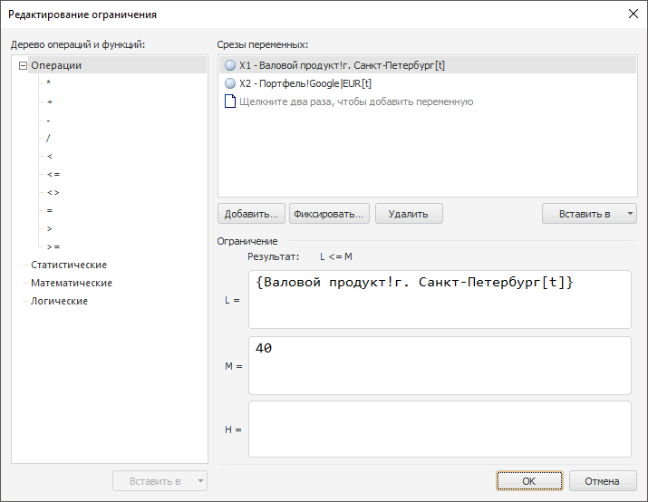

# Ограничения задачи оптимального управления

Ограничения задачи оптимального управления
-

# Ограничения задачи оптимального управления

Для работы с ограничением задачи оптимального управления используйте
 диалог «Редактирование ограничения».

[Для отображения
 диалога](javascript:TextPopup(this))

		- Перейдите на панель «[Ограничения](../UiModelling_Problem_Limitation.htm)».

		- Создайте новое ограничение нажав кнопку «Добавить»
		 или отредактируйте выбранное ограничение нажав кнопку «Редактировать».

Сформируйте список переменных, которые будут участвовать в составлении
 ограничения.

[Основные операции
 с переменными](javascript:TextPopup(this))

		- Добавление переменной.
		 Нажмите кнопку «Добавить»
		 и в открывшемся окне укажите необходимую переменную.

		- Фиксация переменной.
		 Нажмите кнопку «Фиксировать».
		 Будет открыт диалог «[Редактирование
		 переменной](../../2_3_2_Model/Specification/UiModelling_Atributes_fix.htm)».

		Если моделирование и прогнозирование работает в [режиме
		 на переменных](../../../../1_Modelling/Start_Modelling.htm), то при нажатии кнопки «Фиксировать»
		 будет открыто окно:

		-

			- Редактирование лага.
			 Открывается, если размерности переменной и моделируемой переменной
			 совпадают. В данном окне укажите значение временного лага;

			- [Изменение
			 размерности](../../UiModelling_ChangeDimension.htm). Открывается, если количество измерений не
			 совпадает. Если модель основана на [атрибутах базы
			 данных временных рядов](../../2_3_2_Model/Standart_Model/UiModelling_Panel_Param_Attr.htm), при добавлении и фиксации переменной.

		- Удаление переменной.
		 Нажмите кнопку «Удалить».
		 Будет запрошено подтверждение выполняемого действия.

Ограничение является неравенством. Вид неравенства отображается напротив
 текстовой метки «Результат». В
 формульных полях L, M,
 H формируются выражения соответствующих
 частей неравенства, которые могут состоять из возможных операций и функций,
 цифр и переменных.

Для добавления выбранной переменной в формульное поле нажмите кнопку
 «Вставить в», расположенную ниже
 списка переменных, и в раскрывающемся меню выберите название формульного
 поля.

Для добавления выбранного знака операции или функции из списка «Дерево операций и функций» нажмите
 кнопку «Вставить в», расположенную
 ниже дерева операций и функций, и в раскрывающемся меню выберите название
 формульного поля.

См. также:

[Ограничения](../UiModelling_Problem_Limitation.htm)

		Справочная
		 система на версию 10.9
		 от 18/08/2025,
		 © ООО «ФОРСАЙТ»,
