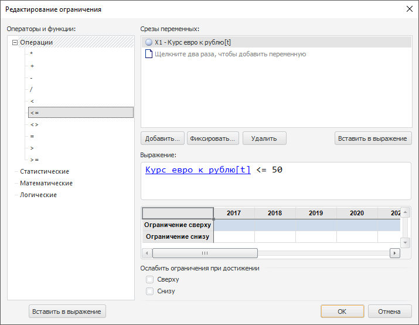

# Ограничения целевой задачи

Ограничения целевой задачи
-

# Ограничения целевой задачи

Для работы с ограничением целевой задачи используйте диалог «Редактирование
 ограничения».

[Для отображения
 диалога](javascript:TextPopup(this))

		- Перейдите на панель «[Ограничения](../UiModelling_Problem_Limitation.htm)».

		- Создайте новое ограничение нажав кнопку «Добавить»
		 или отредактируйте выбранное ограничение нажав кнопку «Редактировать».

Сформируйте список переменных, которые будут участвовать в составлении
 ограничения.

[Основные операции
 с переменными](javascript:TextPopup(this))

		- Добавление переменной.
		 Нажмите кнопку «Добавить»
		 и в открывшемся окне укажите необходимую переменную;

		- Фиксация переменной.
		 Нажмите кнопку «Фиксировать».
		 Будет открыт диалог «[Редактирование
		 переменной](../../2_3_2_Model/Specification/UiModelling_Atributes_fix.htm)», если моделирование и прогнозирование работает
		 в [режиме
		 на переменных](../../../../1_Modelling/Start_Modelling.htm), то при нажатии кнопки «Фиксировать»
		 будет открыто окно:

			- Редактирование
			 лага. Открывается, если размерности переменной и моделируемой
			 переменной совпадают. В данном окне укажите значение временного
			 лага;

			- [Изменение
			 размерности](../../UiModelling_ChangeDimension.htm). Открывается, если количество измерений переменной
			 и моделируемой переменной не совпадает;

		Примечание.
		 Окно «Изменение размерности»
		 открывается при добавлении и фиксации переменной, если модель
		 основана на [атрибутах базы
		 данных временных рядов](../../2_3_2_Model/Standart_Model/UiModelling_Panel_Param_Attr.htm).

		- Удаление переменной.
		 Нажмите кнопку «Удалить».
		 Будет запрошено подтверждение выполняемого действия.

Ограничение является неравенством, указанным в поле «Выражение».
 Для добавления в выражение:

	- переменной. Выберите
	 переменную и нажмите кнопку «Вставить
	 в выражение», расположенную ниже списка переменных;

	- знака операции или функции.
	 Выберите требуемую операцию или функцию в списке «Операторы
	 и функции» и нажмите кнопку «Вставить
	 в выражение», расположенную ниже дерева операций и функций.

Выбранный элемент будет вставлен в выражение в место расположения курсора.

Для задания значения ограничения используйте таблицу, расположенную
 ниже выражения. Если требуется ослаблять ограничение, достигнутое при
 расчете задачи, то установите флажок, соответствующий ограничению.

См. также:

[Ограничения](../UiModelling_Problem_Limitation.htm)

		Справочная
		 система на версию 10.9
		 от 18/08/2025,
		 © ООО «ФОРСАЙТ»,
