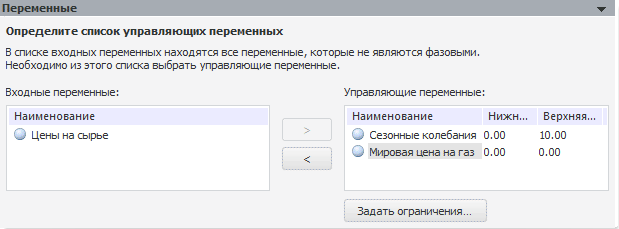
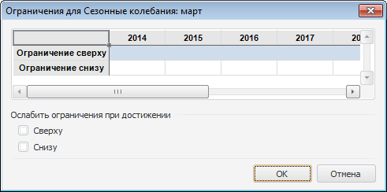

# Переменные

Переменные
-

# Переменные

Панель «Переменные» отображается
 после выбора типа решаемой задачи оптимального управления на панели «[Тип
 задачи](../uimodelling_problem_2.htm)». На данной панели сформируйте список управляющих переменных.

	- Входные переменные.
	 Список всех входных переменных моделей, которые входят в цепочку рассчитываемой
	 метамодели.

	- Управляющие переменные.
	 Список переменных, значения которых могут изменяться в процессе поиска
	 решения до тех пор, пока не будут выполнены наложенные ограничения
	 и условие оптимизации значения целевой функции.

[Для перемещения
 переменных между списками](javascript:TextPopup(this))

		- используйте кнопки  и ;

		- используйте команды контекстного
		 меню «Переместить в управляющие»
		 и «Переместить во входные».

## Ограничения на управляющую переменную

Для задания ограничений выбранной переменной:

	- нажмите кнопку «Задать ограничения»;

	- выполните команду «Задать ограничения»
	 в контекстном меню управляющей переменной;

	- дважды щёлкните по управляющей переменной.

Будет открыт диалог «Ограничения»
 для задания ограничений.

Примечание.
 В задаче оптимального управления ограничение на управляющую переменную
 можно наложить ограничение, если применяется метод «Последовательное
 квадратичное программирование» или «Перебор
 по сетке».

Вид диалога зависит от типа задачи моделирования:

	- задача
	 оптимального управления:

Задайте значения нижней и верхней границ
 управляющей переменной.

Примечание.
 Если применяется метод «Последовательное
 квадратичное программирование», то окно будет содержать флажки,
 установка которых определяет необходимость задания значений нижней и верхней
 границ управляющей переменной.

	- целевая
	 задача:

Задайте значения ограничения управляющей
 переменной сверху и снизу на периоде прогнозирования. Если требуется ослаблять
 ограничение, достигнутое при расчете задачи, то установите флажок, соответствующий
 ограничению.

См. также:

[Задача
 моделирования](../uimodelling_problem.htm)

		Справочная
		 система на версию 10.9
		 от 18/08/2025,
		 © ООО «ФОРСАЙТ»,
