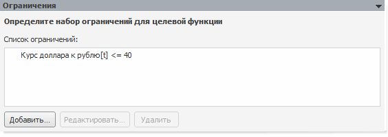

# Ограничения

Ограничения
-

# Ограничения

На панели редактируется набор ограничений для целевой функции.

Панель отсутствует, если для расчёта [задачи
 оптимального уравнения](UiModelling_Problem_CriterionFunction.htm) используется метод «Последовательный
 симплекс».

Для создания ограничения:

	- нажмите кнопку «Добавить»;

	- выполните одноименную команду контекстного меню.

Будет открыт диалог для создания ограничения.

Для редактирования выбранного ограничения

	- нажмите кнопку «Редактировать»;

	- выполните одноименную команду контекстного меню;

	- дважды щёлкните по ограничению.

Будет открыт диалог для редактирования ограничения.

Примечание.
 Вид диалога для создания и редактирования ограничения для задачи оптимального
 управления отличается от подобного диалога для целевой задачи. Подробнее
 см. разделы: «[Ограничения
 задачи оптимального управления](Environments/OptimalControl_Restriction.htm)», «[Ограничения
 целевой задачи](Environments/TargetTask_Restriction.htm)».

Для удаления выбранного ограничения:

	- нажмите кнопку «Удалить»;

	- выполните одноименную команду контекстного меню.

Будет запрошено подтверждение выполняемого действия.

См. также:

[Задача
 моделирования](uimodelling_problem.htm)

		Справочная
		 система на версию 10.9
		 от 18/08/2025,
		 © ООО «ФОРСАЙТ»,
