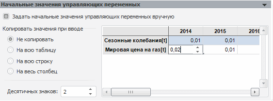

# Начальные значения управляющих переменных

Начальные значения управляющих переменных
-

# Начальные значения управляющих переменных

На данной панели можно задать начальные значения для [управляющих
 переменных](Environments/UiModelling_Problem_Variables.htm) в задаче оптимального управления:

Установка флажка «Задать начальные
 значения управляющих переменных вручную» позволяет отключить автоматическое
 определение начальных значений. После установки данного флажка становится
 доступной группа переключателей «Копировать
 значения при вводе», редактор чисел «Десятичных
 знаков» и таблица, содержащая начальные значения управляющих переменных.
 По умолчанию флажок «Задать начальные
 значения управляющих переменных вручную» не установлен, следовательно,
 начальные значения управляющих переменных определяются автоматически.

В таблице находятся значения управляющих переменных для периода прогнозирования,
 заданного на панели «[Периоды](uimodelling_problem_5.htm)».
 Значение по умолчанию во всех ячейках таблицы - «0,10». Редактирование
 значений в ячейках осуществляется несколькими способами:

	- путем ввода значения в ячейку вручную;

	- путем ввода значения в ячейку с помощью редактора вещественных
	 чисел, вызываемым двойным щелчком по ячейке, либо нажатием клавиши
	 F2.

Для ячеек таблицы доступно контекстное меню, содержащее команды:

	- Копировать
	 значение на всю таблицу. Значение выделенной ячейки будет скопировано
	 во все ячейки таблицы.

	- Копировать
	 значение на всю строку. Значение выделенной ячейки будет скопировано
	 во все ячейки текущей строки.

	- Копировать
	 значение на весь столбец. Значение выделенной ячейки будет
	 скопировано во все ячейки текущего столбца.

	- Копировать.
	 Значение выделенной ячейки будет скопировано в буфер обмена.

	- Вставить.
	 Значение из буфера обмена будет вставлено в выделенную ячейку.

	- Копировать
	 всю таблицу. Копирует всю таблицу, включая заголовки, в буфер
	 обмена.

Группа переключателей «Копировать значения
 при вводе» позволяет при вводе быстро задавать начальные значения
 для переменных. Группа содержит следующие переключатели:

	- Не
	 копировать. При установке переключателя значения для каждой
	 ячейки таблицы можно будет редактировать отдельно. Данный переключатель
	 установлен по умолчанию.

	- На
	 всю таблицу. При установке переключателя значение, введенное
	 в ячейку, будет скопировано во все ячейки таблицы.

	- На
	 всю строку. При установке переключателя значение, введенное
	 в ячейку, будет скопировано во все ячейки текущей строки.

	- На
	 весь столбец. При установке переключателя значение, введенное
	 в ячейку, будет скопировано во все ячейки текущего столбца.

Для начальных значений управляющих переменных можно настроить количество
 отображаемых в таблице десятичных знаков. Для этого следует определить
 число знаков после запятой в редакторе чисел «Десятичных
 знаков». Минимальное число десятичных знаков: 0. Максимальное число
 десятичных знаков: 9. Значение по умолчанию: 2.

См. также:

[Задача
 моделирования](uimodelling_problem.htm)

		Справочная
		 система на версию 10.9
		 от 18/08/2025,
		 © ООО «ФОРСАЙТ»,
