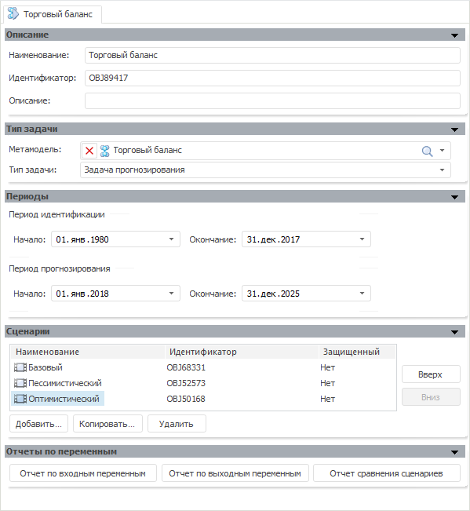

# Задача моделирования (настольное приложение)

Задача моделирования (настольное приложение)
-

# Задача моделирования

Задача моделирования - объект, выполняющий последовательный расчёт моделей
 из указанной метамодели с целью получения выходных данных в моделируемых
 переменных. По окончании расчета результаты расчета моделей выгружаются
 в переменные. Эти данные можно просмотреть в совокупности, открыв [отчет](uimodelling_problem_4.htm)
 по выходным переменным.

После сохранения задачи моделирования у неё создаются дочерние кубы,
 которые могут использоваться в качестве источников данных в следующих
 инструментах: «Аналитические панели»,
 «Аналитические запросы (OLAP)»
 и «Отчеты». Набор кубов для всех
 задач одинаковый. Наименования кубов формируются по следующему принципу:

	- «<Наименование задачи>. Входные переменные». Содержит
	 данные входных переменных задачи моделирования;

	- «<Наименование задачи>. Выходные переменные». Содержит
	 данные выходных переменных задачи моделирования;

	- «<Наименование задачи>. Сравнение сценариев». Содержит
	 данные всех переменных с возможностью сравнения по всем сценариям,
	 присутствующим в задаче моделирования.

Например, «Сальдо торгового баланса.
 Выходные переменные» - это куб, содержащий данные выходных переменных
 для задачи «Сальдо торгового баланса».

[Для создания
 задачи моделирования](javascript:TextPopup(this))

		- Нажмите кнопку  на панели
		 «[Объекты контейнера](../../2_2_Window_container/uimodelling_window_object.htm)».

		- Выполните команду «Объект
		 > Создать > Задача» в главном меню.

		- Выполните команду «Создать
		 > Задача» в контекстном меню панели «[Объекты
		 контейнера](../../2_2_Window_container/uimodelling_window_object.htm)».

Порядок работы с задачей моделирования:

	- Выберите [тип задачи](uimodelling_problem_2.htm).

	- Настройте [периоды расчёта](uimodelling_problem_5.htm).

	- Добавьте [сценарии расчёта](uimodelling_problem_3.htm).

	- Если настраиваете задачу оптимального управления, пользовательскую
	 задачу оптимизации или целевую задачу, то:

		- Задайте [пользовательский алгоритм](CustomAlgorithm.htm).
		 Только для пользовательской задачи оптимизации.

		- Задайте параметры [целевой
		 функции](UiModelling_Problem_CriterionFunction.htm).

		- Определите список [управляющих
		 переменных](Environments/UiModelling_Problem_Variables.htm).

		- Задайте [начальные
		 значения](UiModelling_problem_InitApproximation.htm) управляющих переменных.

		- Определите [набор
		 ограничений](UiModelling_Problem_Limitation.htm) для целевой функции.

	- Наполните входные [переменные
	 задачи](uimodelling_problem_4.htm) данными по необходимым сценариям. Учитывайте [особенности
	 сценарного моделирования](uimodelling_problem_3.htm#scenario_specific).

	- Выполните [расчёт задачи](uimodelling_problem_run.htm).

Пример панелей для редактирования параметров задачи:

См. также:

[Объект «Модель»](../2_3_2_Model/UiModelling_Model.htm)
 | [Объект
 «Метамодель»](../2_3_3_MetaModel/uimodelling_metamodel.htm) |
 [История
 расчета](../2_3_6_History/uimodelling_work_object_History.htm)

		Справочная
		 система на версию 10.9
		 от 18/08/2025,
		 © ООО «ФОРСАЙТ»,
